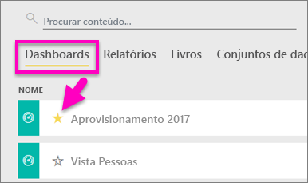
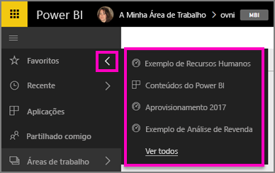

# Marcar dashboards, relatórios e aplicações como favoritos no serviço Power BI
Ao marcar conteúdos como *favoritos*, poderá aceder aos mesmos em todas as suas áreas de trabalho.  Normalmente, os favoritos são os conteúdos que visita com mais frequência.

> [!NOTE]
> Este tópico aplica-se ao serviço Power BI e não ao Power BI Desktop.
> 
> 

Também pode selecionar um único dashboard como um [dashboard em destaque](end-user-featured.md) no serviço Power BI.

## Adicionar um dashboard ou relatório como *favorito*
Veja a Amanda a adicionar favoritos à sua área de trabalho e, em seguida, siga as instruções passo a passo abaixo do vídeo para experimentar.

<iframe width="560" height="315" src="https://www.youtube.com/embed/G26dr2PsEpk" frameborder="0" allowfullscreen></iframe>

1. Abra um dashboard ou relatório que utiliza frequentemente. Até os conteúdos que foram partilhados consigo podem ser marcados como *favoritos*.
2. No canto superior direito do serviço Power BI, selecione **Favorito** ou o .
   
   
   
   Também pode marcar um dashboard ou relatório como favorito a partir do separador **Dashboards** ou **Relatórios** da vista de conteúdos da sua área de trabalho.
   
   

## Adicionar uma aplicação como *favorita*

1. No painel de navegação esquerdo, selecione **Aplicações**.

   

2. Paire o rato sobre uma aplicação para apresentar mais detalhes.  Selecione o ícone de estrela   para definir como favorito.
   
   

## Trabalhar com *favoritos*
1. Para aceder aos favoritos, em qualquer área de trabalho, selecione a seta de lista de opções à direita de **Favoritos**.  Aqui pode selecionar um item favorito para o abrir. São listados apenas cinco favoritos (por ordem alfabética). Se tiver mais de cinco, selecione **Ver todos** para abrir o ecrã de favoritos (veja o passo 2, abaixo). 
   
   
2. Para ver **todos** os conteúdos adicionados aos favoritos, no painel de navegação esquerdo, selecione **Favoritos** ou o .  
   
    
   
   Aqui pode realizar várias ações: abrir, identificar os proprietários e até partilhar com os seus colegas.

## Remover conteúdos dos favoritos
Já não precisa de utilizar um relatório com tanta frequência?  Pode anulá-lo como favorito. Ao remover conteúdos dos favoritos, estes são removidos da sua lista Favoritos, mas não do Power BI.

1. No painel de navegação esquerdo, selecione **Favoritos** para abrir o ecrã **Favoritos**.
   
   
2. Selecione a estrela amarela junto aos conteúdos que pretende remover dos favoritos.

> **NOTA**: também pode remover um dashboard, relatório ou até uma aplicação dos favoritos. Basta abrir e desselecionar o ícone amarelo.   
> 
> 

## Próximos passos
[O que é o Power BI?](../power-bi-overview.md)

[Power BI - Conceitos Básicos](end-user-basic-concepts.md)

Mais perguntas? [Pergunte à Comunidade do Power BI](http://community.powerbi.com/)

