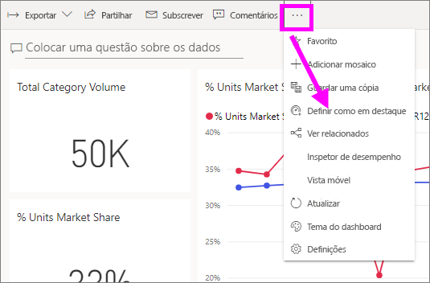
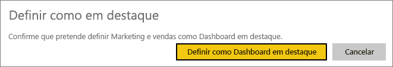
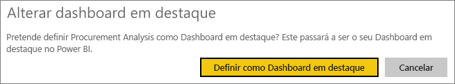
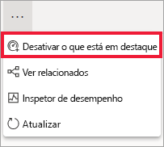

# Dashboards em destaque no serviço Power BI

[!INCLUDE [power-bi-service-new-look-include](../includes/power-bi-service-new-look-include.md)]

Muitos utilizadores têm um dashboard ao qual acedem com mais frequência. Poderá ser o dashboard utilizado para gerir a empresa. Em alternativa, poderá ser um dashboard que contém uma agregação de mosaicos de vários dashboards e relatórios.

## Criar um dashboard em destaque
Ao selecionar um dashboard como *em destaque*, esse dashboard é apresentado sempre que abrir o serviço Power BI. 

Também pode selecionar alguns dashboards e defini-los como favoritos. Veja [Favoritos do dashboard](end-user-favorite.md).

Se não tiver definido um dashboard em destaque, o Power BI abre o último dashboard que utilizou ou a **Home Page** do Power BI. 

### Definir um dashboard como em destaque

1. Abra o dashboard que pretende definir como em destaque. 
2. Na barra de menus superior, selecione **Mais opções** (...) e selecione **Definir como em destaque**. 
   
    
3. Confirme a sua seleção.
   
    

## Alterar o dashboard em destaque
Se mudar de ideias mais tarde, pode definir outro dashboard como o dashboard em destaque.

1. Siga os passos 1 e 2 anteriores.
   
2. Selecione **Definir como dashboard em destaque**. Anular o destaque de um dashboard não o remove do Power BI. 
   
    

## Remover o dashboard em destaque
Se decidir que não quer nenhum dashboard em destaque, eis como anular a funcionalidade em destaque de um dashboard.

1. Abra o dashboard atualmente em destaque.
2. Na barra de menus superior, selecione **Mais opções** (...) e selecione **Desativar o que está em destaque**.

    
   
## Próximas etapas
- [Adicionar um dashboard como favorito](end-user-favorite.md)    
- Mais perguntas? Experimente perguntar à [Comunidade do Power BI](https://community.powerbi.com/).

