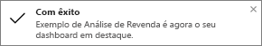

# Dashboards em destaque no serviço Power BI
## Criar um Dashboard Em Destaque
Muitos utilizadores têm um dashboard ao qual acedem com mais frequência.  Poderá ser o dashboard utilizado para gerir o negócio ou poderá ser um dashboard que contém uma agregação de mosaicos de vários dashboards e relatórios.

Quando seleciona um dashboard como *em destaque*, sempre que abrir o serviço Power BI, será aberto com esse dashboard apresentado.  

Também pode selecionar alguns dashboards e defini-los como *favoritos*. Veja [Favoritos do dashboard](end-user-favorite.md).

> [!NOTE] 
>Este tópico aplica-se ao serviço Power BI e não ao Power BI Desktop.

Se ainda não tiver definido um dashboard em destaque, o Power BI irá abrir o último dashboard que utilizou.  

### Para definir um dashboard como **em destaque**
Veja a Amanda a criar um dashboard em destaque e siga as instruções por baixo do vídeo para experimentar.

<iframe width="560" height="315" src="https://www.youtube.com/embed/G26dr2PsEpk" frameborder="0" allowfullscreen></iframe>

1. Abra o dashboard que pretende definir como *Em Destaque*. 
2. Na barra de menu principal, verá **Definir como dashboard em destaque** ou apenas o . Selecione um deles.
   
    
3. Confirme a sua seleção.
   
    

## Alterar o dashboard em destaque
Obviamente, se mudar de ideias mais tarde, pode definir outro dashboard como o dashboard em destaque.

1. Siga os passos 1 e 2 acima.
   
    
2. Selecione **Definir como em destaque**. Anular o destaque de um dashboard não o remove da sua área de trabalho.  
   
    

## Remover o dashboard em destaque
Se decidir que não pretende qualquer dashboard em destaque, eis como anular a funcionalidade em destaque de um dashboard.

1. Abra o dashboard atualmente em destaque.
2. Na barra de menus superior, selecione **Desativar o que está em destaque**.
   
    

Agora, o Power BI irá abrir o último dashboard que utilizou.  

## Próximos passos
[Adicionar um dashboard como favorito](end-user-favorite.md)

Mais perguntas? [Pergunte à Comunidade do Power BI](http://community.powerbi.com/)

