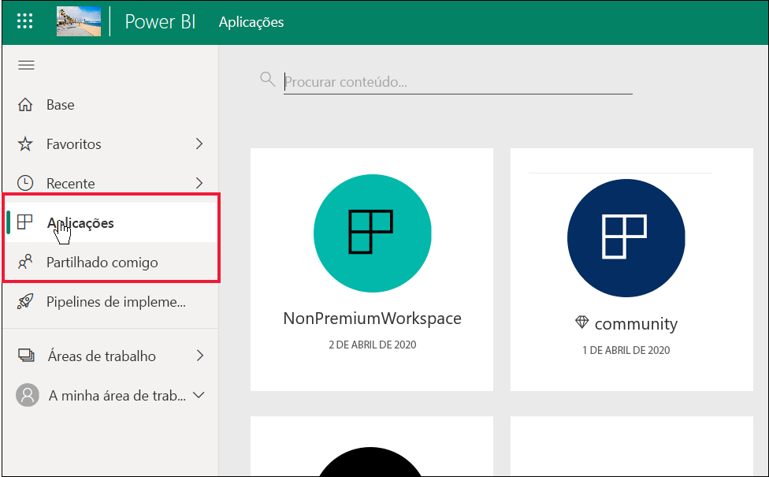

# Lista de funcionalidades do Power BI para *consumidores* e outros utilizadores gratuitos

[!INCLUDE[consumer-appliesto-ynnn](../includes/consumer-appliesto-ynnn.md)]

Como *consumidor*, utiliza o serviço Power BI para explorar relatórios e dashboards para tomar decisões empresariais. Esses relatórios e dashboards são criados por *designers* que têm licenças do Power BI *Pro*. Os utilizadores Pro têm a capacidade de partilhar conteúdos com colegas e controlar o que estes podem ou não fazer com esses conteúdos. Por vezes, os designers partilham conteúdos ao enviar ligações e, por vezes, os conteúdos são instalados automaticamente e são apresentados no Power BI em **Aplicações** ou **Partilhado comigo**.

Existem diferentes formas de os designers partilharem conteúdos. No entanto, este artigo é para *consumidores* do Power BI e, portanto, só descreve como os consumidores recebem e interagem com os conteúdos. Para obter mais informações sobre outras formas de partilhar conteúdos, veja [Formas de partilhar o seu trabalho no Power BI](../service-how-to-collaborate-distribute-dashboards-reports.md).

O [artigo anterior](end-user-license.md) descreveu os diferentes tipos de licenças (gratuito e Pro) e subscrições (Premium) do Power BI e indicou como procurar a licença e subscrição que está a utilizar. Este artigo indica que funcionalidades do Power BI estão disponíveis para si, com base na sua licença e subscrição.   

<art>

## Revisão rápida de terminologia
Vamos rever alguns conceitos do Power BI antes de chegarmos à lista. Será uma revisão rápida e se precisar de mais detalhes, visite [Licenças e subscrições para consumidores](end-user-license.md) ou [Conceitos básicos do Power BI](end-user-basic-concepts.md).

### Áreas de trabalho e funções
Existem dois tipos de áreas de trabalho: **A minha área de trabalho** e as áreas de trabalho da aplicação. Só o utilizador tem acesso à opção **A minha área de trabalho**. A colaboração e partilha requer que o designer de conteúdos utilize uma área de trabalho da aplicação. 

As *funções* da área de trabalho são utilizadas pelos designers do Power BI para gerir as ações de cada utilizador numa área de trabalho. Os *consumidores* têm a função **Visualizador**. 

### Subscrição de capacidade Premium
Quando uma organização tem uma subscrição de capacidade Premium, os administradores e utilizadores Pro podem atribuir áreas de trabalho à *capacidade Premium*. Uma área de trabalho com capacidade Premium é um espaço onde os utilizadores Pro podem partilhar e colaborar com os utilizadores gratuitos, sem que os utilizadores gratuitos precisem ter licenças Pro. Nessas áreas de trabalho, os utilizadores gratuitos têm permissões elevadas (ver lista abaixo). 

### Licenças 
Cada utilizador do serviço Power BI tem uma licença gratuita ou uma licença Pro. Algumas funcionalidades estão reservadas aos utilizadores com licenças Pro.

- **Licença gratuita** – normalmente atribuída a *consumidores* numa organização. Também utilizada por qualquer pessoa que se inscreva no Power BI a título pessoal e pretenda experimentar o [serviço Power BI no modo autónomo](../service-self-service-signup-for-power-bi.md).  
- **Licença Pro** – normalmente atribuída a designers, analistas e programadores numa organização.   
- **Licença gratuita + capacidade Premium** – permite que os utilizadores gratuitos (*consumidores*) vejam e interajam com conteúdos que os utilizadores Pro criaram na capacidade Premium e partilharam. Desta forma, os utilizadores Pro podem colaborar com utilizadores gratuitos na área de trabalho ou com a opção **Partilhado comigo**.

Para utilizadores gratuitos, ser membro de uma organização que tem uma subscrição de capacidade Premium é o que lhe dá super poderes. Desde que os seus colegas com a versão Pro utilizem áreas de trabalho de capacidade Premium para partilhar conteúdos, os utilizadores gratuitos podem ver e partilhar com esses colegas com a versão Pro.  **Desta forma, o utilizador gratuito torna-se um *consumidor* do Power BI, com a capacidade de receber e partilhar conteúdos para tomar decisões empresariais.** 

## Lista de funcionalidades do Power BI para *consumidores* e utilizadores gratuitos
O gráfico seguinte identifica que tarefas podem ser efetuadas por um *consumidor* numa organização que tem uma subscrição Premium.    

A primeira coluna representa um utilizador gratuito a trabalhar com conteúdos em **A minha área de trabalho**. Este utilizador não pode colaborar com colegas em áreas de trabalho. Os colegas não podem partilhar diretamente conteúdos com este utilizador e este utilizador não pode partilhar a partir de **A minha área de trabalho**. 

A segunda coluna representa um *consumidor*.  Um consumidor:

- tem uma licença de utilizador gratuito.
- faz parte de uma organização que tem uma subscrição de capacidade Premium.
- obtém conteúdos (aplicações, dashboards, relatórios) de utilizadores Pro que partilham esses conteúdos com áreas de trabalho da aplicação na capacidade Premium.
- tem a função **Visualizador** para essas áreas de trabalho da aplicação. 

### Legenda
 a funcionalidade está disponível no cenário atual    
 a funcionalidade não está disponível no cenário atual    
 **** a disponibilidade da funcionalidade está limitada à opção **A minha área de trabalho**. Os conteúdos em **A minha área de trabalho** são para utilização pessoal do proprietário e não podem ser partilhados ou vistos por qualquer outra pessoa no Power BI.    
 \* o acesso a esta funcionalidade pode ser ativado ou desativado por um administrador ou utilizador Pro.    
   

### Lista de funcionalidades

|Funcionalidades   | Cenário 1: utilizador gratuito do Power BI que não tem acesso aos conteúdos alojados na capacidade Premium.    | Cenário 2: utilizador gratuito do Power BI com permissões de **visualizador** para conteúdos alojados na capacidade Premium. Esta pessoa é um *consumidor* do Power BI. |
|---|---|---|
|**Aplicações** 
|Instalar automaticamente |  | *| 
|Abrir |  |   | 
|Favorito |  |   |
 |Editar, atualizar, voltar a partilhar, voltar a publicar |  |   |
 |Criar uma nova aplicação |  |   |
 |AppSource: transferir e abrir |   | | 
|Arquivo da organização: transferir e abrir|  |  |
 |**Áreas de trabalho da aplicação**
| Criar, editar ou eliminar área de trabalho ou conteúdos  |   | |
|Adicionar endossamento |   | | 
|Abrir e ver  |   |    | 
| Ler dados armazenados nos fluxos de dados da área de trabalho | ||
|**Dashboards**
|Receber, ver e interagir com dashboards de colegas |  |    | 
| Adicionar alertas a mosaicos  |   |    | 
| Ver e responder a comentários de outras pessoas: adicionar os seus próprios comentários  |   |  *  | 
| Guardar uma cópia |  | | 
|Copiar elemento visual como imagem? | ||
|Criar, editar, atualizar, eliminar |  | | 
|Exportar mosaico para o Excel | | |
|Favorito || |
|Funcionalidade | ||
|Modos de ecrã inteiro e de concentração | | |
|Pesquisa global |* |* |
|Informações sobre mosaicos |     | *|
|  Perguntas e Respostas: utilizar no dashboard  |* |* |
|Perguntas e Respostas: adicionar perguntas em destaque e guardadas |   | |
|Perguntas e Respostas: rever perguntas |   | |  
|Inspetor de desempenho |  | |
|Afixar mosaicos das Perguntas e Respostas ou relatórios |  | | 
|Imprimir |* |* |
|Atualizar |  | | 
|Voltar a partilhar |   | | 
|Subscrever |* |*  |
|Subscrever outras pessoas |   | | 
|**Conjuntos de dados**
|  Adicionar, eliminar, editar  |    |   |   
| Criar um relatório noutra área de trabalho com base num conjunto de dados desta área de trabalho |   | |  
|  Informações sobre conjuntos de dados  |   || 
|Agendar atualização |  || 
|**Relatórios**
|Receber relatórios de colegas |  |    | 
| Colaborar com colegas na mesma versão de um relatório | |    | 
| Analisar um relatório no Excel  |*  |*  | 
| Ver marcadores criados por outras pessoas e adicionar os seus próprios marcadores  | |  |
| Ver e responder a comentários de outras pessoas: adicionar novos comentários  | |  |
|Alterar as dimensões de apresentação   |  |   | 
| Guardar uma cópia | |*  
|Copiar elemento visual como imagem* |
| Realçar e filtrar de forma cruzada elementos visuais do relatório   | |  |
|  Pormenorização   |  |  |
| Pormenorização |* |* |
|  Incorporar (publicar na Web, público) | * | |  
|  Exportar dados resumidos de elementos visuais de relatório*  | | |
|Exportar dados subjacentes de elementos visuais de relatório* |  |  | 
|  Adicionar relatório aos favoritos  | | |
|  Filtros: alterar tipos  |* |* |
|  Filtros: interagir   || |
|  Filtros: persistentes  |* |* |
| Procurar no painel Filtros |* |* |
| Modos de ecrã inteiro e de concentração   | | |
|  Informações sobre relatórios1  |   || 
| Vista de linhagem  | | |
|PDF: criar a partir de páginas do relatório | |  |
|Inspetor de Desempenho || |
| PowerPoint: criar a partir de páginas do relatório*   | | |
|  Promover conteúdos para a Home Page  |   | | 
| Imprimir páginas do relatório* | | |
|Interagir com elemento visual das Perguntas e Respostas | | |
|Código QR | | |
|  Atualizar  | | |
|  Partilhar conteúdo com utilizadores externos  |   | | 
| Partilhar: permitir que outras pessoas voltem a partilhar itens |   | | 
|Mostrar como tabela (mostrar dados)| | |
|  Segmentações de dados: adicionar ou eliminar  | | |
| Interagir com segmentações de dados | | |
|  Ordenar elementos visuais do relatório  | | |
|  Subscrever relatórios* | | |
|  Subscrever relatórios para outras pessoas  |   | | 
|  Ver relacionados | | |
|  Elementos visuais: alterar tipos em relatórios  |* |* |
|  Alterar interações de elementos visuais  |  | |
|  Elementos visuais: adicionar novo  |  | |
|  Elementos visuais: adicionar novos campos  |   | |
|Elementos visuais: alterar tipo |  | |
| Elementos visuais: pairar para revelar detalhes e descrições  |  | |

1. Apenas disponível a partir da vista de conteúdo **Partilhado comigo**. 

## Próximos passos
[Power BI para *consumidores*](end-user-consumer.md)    
