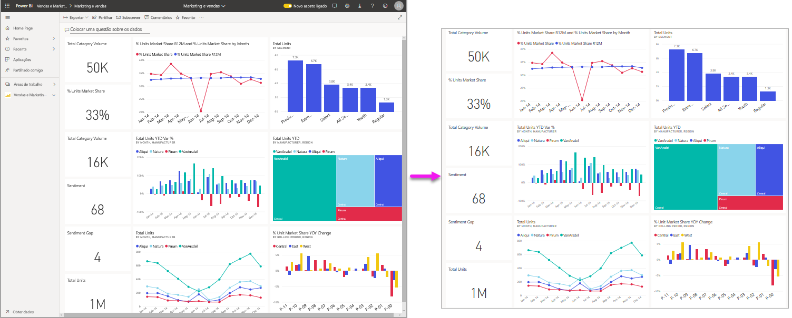
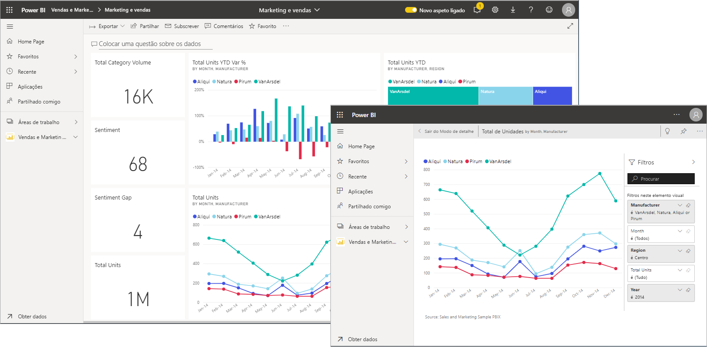
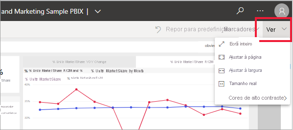
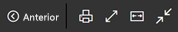
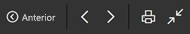
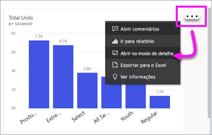
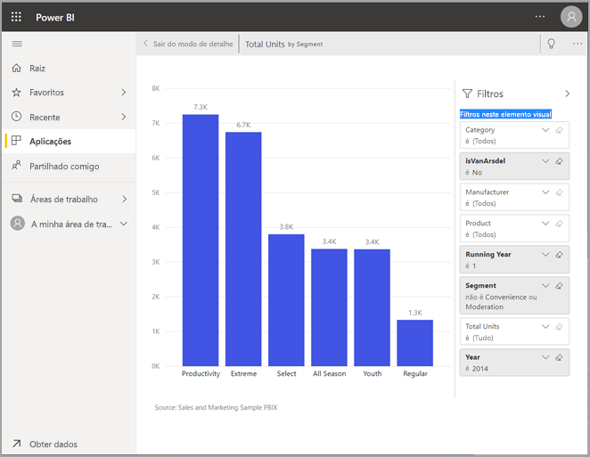
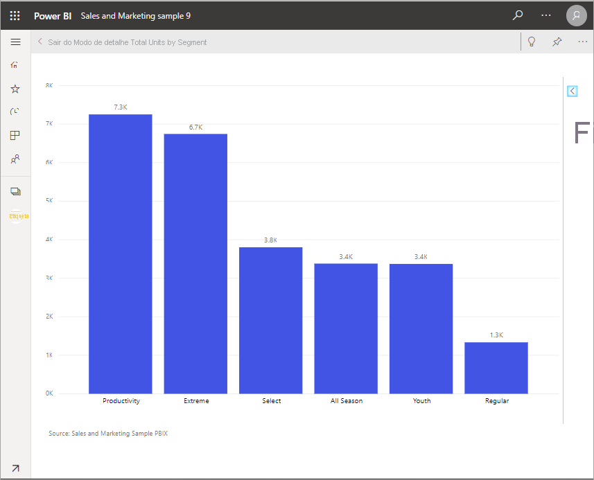
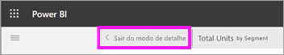
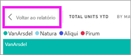

# Apresentar conteúdo mais detalhadamente: modo de detalhe e modo de ecrã inteiro

[!INCLUDE [consumer-appliesto-yynn](../includes/consumer-appliesto-yynn.md)]

[!INCLUDE [power-bi-service-new-look-include](../includes/power-bi-service-new-look-include.md)]    

<iframe width="560" height="315" src="https://www.youtube.com/embed/dtdLul6otYE" frameborder="0" allowfullscreen></iframe>

O modo de detalhe e o modo de ecrã inteiro são duas formas diferentes de ver mais detalhes nos elementos visuais, relatórios e dashboards.  A principal diferença é que esse ecrã inteiro remove todos os painéis que envolvem o conteúdo enquanto o modo de detalhe permite ainda interagir com os elementos visuais. Vamos ver mais atentamente as semelhanças e as diferenças.  

|Conteúdo    | Modo de detalhe  |Modo de ecrã inteiro  |
|---------|---------|----------------------|
|Dashboard     |   Não é possível     | sim |
|Página de relatório   | Não é possível  | sim|
|Elemento visual de relatório | sim    | sim |
|Mosaico do dashboard | sim    | Não é possível |
|Windows 10 mobile | Não é possível | Sim |

## O que é o modo de ecrã inteiro?

Mostre os conteúdos do serviço Power BI (dashboards, páginas e elementos visuais de relatórios) sem a distração dos menus e dos painéis de navegação.  Obtém uma visão completa e não adulterada dos seus conteúdos de relance e a qualquer altura. Por vezes, esta vista é denominada Modo de TV.   

Se estiver a utilizar o Power BI móvel, o [ecrã inteiro está disponível para as aplicações móveis do Windows 10](./mobile/mobile-windows-10-app-presentation-mode.md). 

Alguns usos do modo de ecrã inteiro:

* apresentar o seu dashboard, elemento visual ou relatório numa reunião ou conferência
* apresentar num escritório, num ecrã grande ou projetor dedicado
* ver num ecrã pequeno
* rever no modo bloqueado: pode tocar no ecrã ou passar o cursor sobre os mosaicos sem abrir o relatório ou dashboard subjacente

## O que é o modo de detalhe?

O ***Modo de detalhe*** permite-lhe expandir (destacar) um elemento visual ou um mosaico para ver mais detalhes.  Talvez tenha um dashboard ou relatório que esteja algo cheio e queira ampliar apenas um elemento visual.  Esta é uma utilização perfeita do modo de detalhe.  

No modo de detalhe, um *consumidor* do Power BI pode interagir com quaisquer filtros que tenham sido aplicados quando o elemento visual foi criado.  No serviço Power BI, pode utilizar o modo de detalhe num mosaico do dashboard ou num elemento visual do relatório.

## Trabalhar no modo de ecrã inteiro

O modo de ecrã inteiro está disponível para dashboards, páginas de relatórios e elementos visuais de relatórios. 

- Para abrir um dashboard no modo de ecrã inteiro, selecione o ícone de ecrã inteiro  na barra de menus superior. 

- Para abrir uma página de relatório em ecrã inteiro, selecione **Ver** > **Ecrã inteiro**.

    

- Para ver um elemento visual em modo de ecrã inteiro, abra-o primeiro em modo de detalhe e, em seguida, selecione **Ver** > **Ecrã inteiro**.  

O conteúdo selecionado ocupa o ecrã inteiro.    Assim que estiver no modo de ecrã inteiro, mover o rato ou cursor apresenta um menu contextual. Como o ecrã inteiro está disponível para uma grande variedade de conteúdos, as opções do menu contextual são todas um pouco diferentes, mas bastante explícitas.  Basta pairar o cursor sobre um ícone para obter uma definição.

Menu para dashboards    
    

Menu para páginas de relatórios e elementos visuais de relatórios    
    

  *     
  Utilize o botão **Voltar** para navegar para a página anterior no seu browser. Se a página anterior era uma página do Power BI, esta também será apresentada no modo de ecrã inteiro.  O modo de ecrã inteiro continuará ativo até sair.

  *     
  Utilize este botão para imprimir o dashboard ou a página de relatório no modo de ecrã inteiro.

  *     
    Utilize o botão **Ajustar ao ecrã** para mostrar o seu dashboard no maior tamanho possível sem incluir barras de deslocamento.  

    

  *        
    Há alturas em que não se quer ter barras de deslocamento, mas procura-se fazer com que o dashboard preencha toda a largura do espaço disponível. Selecione o botão **Ajustar à largura**.    

    

  *        
    Nos relatórios no modo de ecrã inteiro, utilize estas setas para se deslocar entre as páginas do relatório.    
  *      
  Para sair do modo de ecrã inteiro, selecione o ícone **Sair do modo de ecrã inteiro**.

      

## Trabalhar no modo de detalhe

O modo de detalhe está disponível para dashboards, mosaicos e elementos visuais de relatórios. 

- Para abrir um mosaico de dashboard em modo de detalhe, paire o cursor sobre um mosaico do dashboard ou sobre um elemento visual do relatório, selecione **Mais opções** (…) e selecione **Abrir no modo de detalhe**.

    ... 

- Para abrir um elemento visual de relatório em modo de detalhe, paire o cursor sobre o elemento visual e selecione o ícone de **modo de detalhe** .  

   

O elemento visual é aberto e ocupa toda a tela. Repare que continuará a poder utilizar o painel **Filtros** para interagir com o elemento visual. O painel **Filtros** e o painel de navegação podem ser reduzidos.

   

     

Explore mais ao [modificar os filtros](end-user-report-filter.md) e ao procurar novidades interessantes nos seus dados.  

Explore os dados em busca de novas informações e respostas a perguntas. Enquanto *consumidor*, não pode adicionar novos filtros, alterar os campos utilizados nos elementos visuais nem criar novos elementos visuais.  No entanto, pode interagir com os filtros existentes. 

No caso de mosaicos de dashboard, as suas alterações não podem ser guardadas. No caso de elementos visuais de relatórios, todas as alterações feitas nos filtros existentes são guardadas quando sair do Power BI. Se não quiser que o Power BI se lembre das suas modificações, selecione **Repor para predefinição**.   

Saia do modo de detalhe e regresse ao dashboard ao selecionar **Sair do modo de detalhe** ou **Voltar ao relatório** (no canto superior esquerdo do elemento visual).

    

  

## Considerações e resolução de problemas

* Ao utilizar o modo de detalhe com um elemento visual num relatório, poderá ver e interagir com todos os filtros: ao nível do Elemento Visual, da Página, da Pormenorização e do Relatório.    
* Ao utilizar o modo de detalhe com um elemento visual num dashboard, poderá ver e interagir apenas com o filtro ao nível do Elemento Visual.

## Próximos passos

[Definições de vista dos relatórios](end-user-report-view.md)