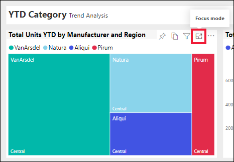

# Apresentar conteúdo mais detalhadamente: modo de detalhe e modo de ecrã inteiro

<iframe width="560" height="315" src="https://www.youtube.com/embed/dtdLul6otYE" frameborder="0" allowfullscreen></iframe>

O modo de detalhe e o modo de ecrã inteiro são duas formas diferentes de ver mais detalhes nos elementos visuais, relatórios e dashboards.  A principal diferença é que esse ecrã inteiro remove todos os painéis que envolvem o conteúdo enquanto o modo de detalhe permite ainda interagir com os elementos visuais. Vamos ver mais atentamente as semelhanças e as diferenças.  

|Conteúdo    | Modo de detalhe  |Modo de ecrã inteiro  |
|---------|---------|----------------------|
|Dashboard     |   Não é possível     | sim |
|Página de relatório   | Não é possível  | sim|
|Visualização de relatório | sim    | sim |
|Mosaico do dashboard | sim    | sim |
|Windows 10 mobile | Não é possível | Sim |

## O que é o modo de ecrã inteiro?

Mostre os seus conteúdos do serviço Power BI (dashboards, relatórios, páginas, mosaicos e visualizações) sem a distração dos menus e das barras de navegação.  Obtém uma visão completa e não adulterada dos seus conteúdos de relance e a qualquer altura. Por vezes, esta vista é denominada Modo de TV.   

Para abrir o modo de ecrã inteiro, selecione o ícone **ecrã inteiro**  na barra de menus do serviço Power BI acima do dashboard, do relatório, do mosaico no modo de detalhe ou do elemento visual no modo de detalhe.  O conteúdo selecionado ocupa o ecrã inteiro.
Se estiver a utilizar o Power BI móvel, o [ecrã inteiro está disponível para as aplicações móveis do Windows 10](./mobile/mobile-windows-10-app-presentation-mode.md). 

Alguns usos do modo de ecrã inteiro:

* apresentar o seu dashboard, mosaico, visual ou relatório numa reunião ou conferência
* apresentar num escritório, num ecrã grande ou projetor dedicado
* ver num ecrã pequeno
* rever no modo bloqueado: pode tocar no ecrã ou passar o cursor sobre os mosaicos sem abrir o relatório ou dashboard subjacente

## O que é o modo de detalhe?
O ***Modo de detalhe*** permite-lhe expandir (destacar) um elemento visual ou um mosaico para ver mais detalhes.  Talvez tenha um dashboard ou relatório que esteja algo cheio e queira ampliar apenas um elemento visual.  Esta é uma utilização perfeita do modo de detalhe.  

No modo de detalhe, um *consumidor* do Power BI pode interagir com quaisquer filtros que tenham sido aplicados quando o elemento visual foi criado.  No serviço Power BI, pode utilizar o modo de detalhe num mosaico do dashboard ou num elemento visual do relatório.

## Trabalhar no modo de ecrã inteiro
Para abrir a página de um dashboard ou relatório no modo de ecrã inteiro, selecione o ícone de ecrã inteiro  na barra de navegação superior. Assim que estiver no modo de ecrã inteiro, mover o rato ou cursor apresenta um menu contextual. Como o ecrã inteiro está disponível para uma grande variedade de conteúdos, as opções do menu contextual são todas um pouco diferentes, mas bastante explícitas.  Basta pairar o cursor sobre um ícone para obter uma definição.

Menu para dashboards    
    

Menu para páginas de relatório    
    

  *     
  Utilize o botão **Voltar** para navegar para a página anterior no seu browser. Se a página anterior era uma página do Power BI, esta também será apresentada no modo de ecrã inteiro.  O modo de ecrã inteiro continuará ativo até sair.

  *     
  Utilize este botão para imprimir o dashboard ou a página de relatório no modo de ecrã inteiro.

  *     
    Utilize o botão **Ajustar ao ecrã** para mostrar o seu dashboard no maior tamanho possível sem incluir barras de deslocamento.  

    

  *        
    Há alturas em que não se quer ter barras de deslocamento, mas procura-se fazer com que o dashboard preencha toda a largura do espaço disponível. Selecione o botão **Ajustar à largura**.    

    

  *        
    Nos relatórios no modo de ecrã inteiro, utilize estas setas para se deslocar entre as páginas do relatório.    
  * Para sair do modo de ecrã inteiro, selecione o ícone **Sair do modo de ecrã inteiro**.

      

## Trabalhar no modo de detalhe
Existem duas formas de abrir o modo de detalhe; uma para os mosaicos do dashboard e outra para as visualizações de relatório.

### Modo de detalhe nos dashboards
1. Abra um dashboard no serviço Power BI.

2. Paire o cursor sobre um mosaico do dashboard ou sobre uma visualização de mosaico, selecione as reticências (…) e escolha **Abrir no modo de detalhe**.

    .

2. O mosaico é aberto e ocupa toda a tela do relatório.

   

3. Expanda o painel Filtros para ver todos os filtros aplicados a este visual.

   

4. Explore mais ao [modificar os filtros](end-user-report-filter.md) e ao procurar novidades interessantes nos seus dados.  

5. Saia do modo de detalhe e regresse ao dashboard ao selecionar **Sair do modo de detalhe** (no canto superior esquerdo do elemento visual).

        

## Modo de detalhe para visualizações de relatório
1. Abra um relatório no serviço Power BI.  Neste exemplo, vamos demonstrar através do exemplo de Análise de Revenda.

1. Depois de o relatório abrir, selecione o separador **Vendas Mensais Distritais**.

2. Paire o cursor sobre o gráfico de área no canto inferior esquerdo e selecione o ícone **modo de detalhe** .  

   
2. A visualização é aberta e ocupa toda a tela.

   
3. Como alternativa, expanda o painel Filtros para interagir com todos os filtros aplicados a este elemento visual. Explore os dados em busca de novas informações e respostas a perguntas. Como *consumidor*, não pode adicionar novos filtros, alterar os campos utilizados nas visualizações nem criar novas visualizações.  No entanto, todas as alterações feitas nos filtros existentes são guardadas quando sair do Power BI. Se não quiser que o Power BI se lembre das suas modificações, selecione **Repor para predefinição**.   

   

5. Saia do modo de detalhe e regresse ao relatório ao selecionar **Regressar ao relatório** (no canto superior esquerdo do elemento visual).

      

## Considerações e resolução de problemas
* Ao utilizar o modo de detalhe com uma visualização num relatório, poderá ver e interagir com todos os filtros: ao nível do Elemento Visual, da Página, da Pormenorização e do Relatório.    
* Ao utilizar o modo de detalhe com uma visualização num dashboard, poderá ver e interagir apenas com o filtro ao nível do Elemento Visual.

## Próximos passos
[Definições de vista dos relatórios](end-user-report-view.md)