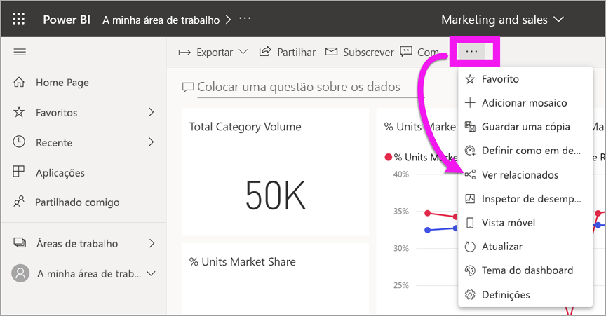

# Os seus conteúdos estão atualizados

[!INCLUDE[consumer-appliesto-ynny](../includes/consumer-appliesto-ynny.md)]

[!INCLUDE [power-bi-service-new-look-include](../includes/power-bi-service-new-look-include.md)]

Enquanto *consumidor*, interage com conteúdos que são feitos por *criadores* e partilhados consigo. Poderá perguntar-se se esses conteúdos estarão atualizados ou talvez queira saber quando foi a última atualização dos mesmos. O conhecimento de que está a trabalhar com os conteúdos mais recentes transmite-lhe confiança.  
 

Certificar-se de que está a utilizar os dados mais recentes é muitas vezes fundamental para tomar as decisões certas. O que pode fazer para garantir que está a utilizar os conteúdos mais recentes? Na maioria dos casos, não precisa de fazer absolutamente nada. As aplicações que foram partilhadas consigo são atualizadas automaticamente de acordo com um agendamento definido pelo criador da aplicação. O mesmo se aplica a dashboard e relatórios que forma partilhados consigo. O criador garante que os conteúdos estão atualizados de forma manual ou através de um agendamento de atualização automatizado.  

Se tiver mais perguntas sobre o quão recentes são os dados, contacte o criador.

## Como localizar o nome do criador ou proprietário

### Dashboard ou relatório

O nome do proprietário está disponível na barra de título de dashboards e relatórios. Selecione o nome do relatório ou do dashboard para revelar detalhes adicionais, incluindo o **Proprietário**.

### Apps

O ecrã da aplicação apresenta o nome do criador e a data em que a aplicação foi atualizada pela última vez.  

1. No painel de navegação, selecione **Aplicações**.

    

2. Passe o rato sobre a aplicação para apresentar o título, a data de atualização e o nome do criador. 

    

### Shared with me (Partilhado comigo)
O ecrã **Partilhado comigo** mostra-lhe o nome do proprietário dos conteúdos, bem como a data na qual o mesmo foi partilhado consigo da última vez.

 

## Como encontrar a última data de atualização
Se quiser, pode encontrar a última data de atualização de grande parte dos conteúdos. 

### Mosaicos de dashboard
Para os mosaicos do dashboard, consulte o mosaico em modo de Detalhe para ver o carimbo de data/hora da Última atualização.

1. No mosaico do dashboard, selecione **Mais opções** (...) e, em seguida, **Abrir no modo de Detalhe**.

    

2. É apresentada a data da última atualização no canto superior direito. Se não a conseguir ver, expanda o browser para o tornar mais largo. 

    

### Dashboards e relatórios
Outra forma de pesquisar a data da última atualização é ao utilizar a opção **Ver relacionados**.  A opção **Ver relacionados** está disponível ao selecionar **Mais opções** (…) na barra de menus superior do Power BI.

O painel **Conteúdo relacionado** apresenta as informações da última atualização para o conjunto de dados subjacente do relatório ou dashboard.

## O que acontece se uma aplicação for eliminada pelo criador

Se um criador eliminar uma aplicação, os dashboard e os relatórios associados com a mesma serão removidos automaticamente da sua área de trabalho do Power BI. Deixarão de estar disponíveis e a aplicação não aparecerá no contentor Aplicações nem em qualquer outro lugar no painel de navegação.

## Subscrever para ver alterações
Outra forma de se manter atualizado é ao subscrever um relatório ou dashboard. Em vez de ter de iniciar sessão e abrir um relatório ou dashboard, indica ao Power BI que lhe envie um instantâneo com base num agendamento definido por si.  Para obter mais informações, consulte [subscrever dashboards e relatórios](end-user-subscribe.md).

## Definir alertas de dados
Quer receber notificações se os dados forem alterados para além de um limite definido por si? [Crie um alerta de dados](end-user-alerts.md).  É fácil manter-se atualizado com os alertas de dados. Com os alertas de dados, indica ao Power BI que lhe envie um e-mail se um valor num relatório ultrapassar um patamar específico.  Por exemplo, se o inventário tiver menos de 25 unidades ou se as vendas ultrapassarem os objetivos.  

## Próximas etapas
[Criar um alerta de dados](end-user-alerts.md)    
[Subscrever dashboards e relatórios](end-user-subscribe.md)    
[Ver conteúdos relacionados](end-user-related.md)    
