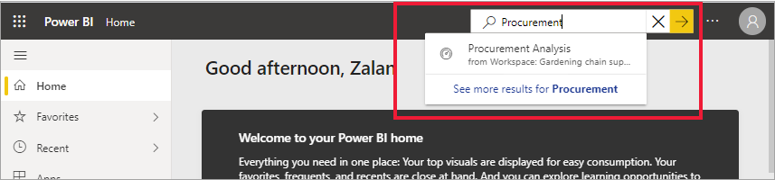

# Localizar os seus dashboards, relatórios e aplicações

[!INCLUDE[consumer-appliesto-yynn](../includes/consumer-appliesto-yynn.md)]
No Power BI, o termo *conteúdo* refere-se a aplicações, dashboards e relatórios. Os conteúdos são criados por *designers* do Power BI que os partilham com colegas e consigo. O conteúdo pode ser acedido e visto no serviço Power BI, e o melhor local para começar a trabalhar no Power BI é na sua **Home Page**.

## Explorar a Home Page do Power BI
Após iniciar sessão no serviço Power BI, selecione **Home Page** no painel de navegação. 

O Power BI apresenta a tela Base, conforme mostrado na seguinte imagem. O esquema e os conteúdos da Base são diferentes para cada utilizador. Mais à frente neste artigo, iremos ver a Base de um utilizador novo e a Base de um utilizador experiente. 
 

A Home Page do Power BI fornece três formas diferentes de localizar e visualizar os seus conteúdos. Todas estas formas permitem aceder ao mesmo conjunto de conteúdos, sendo simplesmente diferentes na forma como acede. Ocasionalmente, a pesquisa será a forma mais fácil e rápida de localizar algo, enquanto noutras vezes, selecionar um *cartão* na tela Home Page será a melhor opção.

- A tela Base apresenta e organiza os seus conteúdos favoritos, frequentes, recentes e recomendados, juntamente com aplicações e áreas de trabalho.  Se for um novo utilizador do serviço Power BI, também terá uma secção de Introdução. Selecione um cartão ou item numa lista para o abrir.
- No lado esquerdo, existe um painel de navegação. Selecione  para expandir o painel de navegação. No painel de navegação, os mesmos conteúdos são organizados de forma um pouco diferente, ou seja, por Favoritos, Recente, Aplicações e Partilhado comigo. Aqui, pode ver listas de conteúdos e selecionar o que pretende abrir.
- No canto superior direito, a caixa de pesquisa global permite procurar conteúdos por título, nome ou palavra-chave.

Os seguintes tópicos analisam cada uma destas opções para localizar e visualizar conteúdos.

## Tela Home Page
Na tela Home Page, pode ver todos os conteúdos que tem permissão para utilizar. A sua tela Home Page também é atualizada com conteúdos recomendados e recursos de aprendizagem. Inicialmente, poderá não ter muitos conteúdos na sua tela Base, mas isso irá mudar quando começar a utilizar o Power BI com os seus colegas.

 
À medida que trabalha no serviço Power BI, receberá dashboards, relatórios e aplicações de colegas e, nessa altura, a Home Page do Power BI acabará por ficar preenchida. Ao longo do tempo, poderá assemelhar-se à seguinte.

 
Os tópicos seguintes analisam melhor a Base do ponto de vista de um utilizador experiente.

## Os conteúdos mais importantes ao seu alcance

### Favoritos + frequentes
A secção superior contém ligações para os conteúdos a que acede com mais frequência ou que marcou como [em destaque ou favoritos](end-user-favorite.md). Note que vários cartões têm estrelas pretas, o que significa que foram marcados como favoritos. 

Além disso, pode sinalizar conteúdo como [em destaque](end-user-featured.md). Escolha o dashboard ou o relatório que espera ver com mais frequência e defina-o como o conteúdo *em destaque*. Sempre que abrir o serviço Power BI, o dashboard em destaque será apresentado primeiro. 

### Destaques
A secção **Destaques** apresenta o conteúdo que o administrador *promoveu* na Home Page. Normalmente, este conteúdo é importante ou útil para fazer o trabalho. Neste exemplo, o conteúdo destacado inclui métricas para acompanhar o sucesso.

### Recente, Partilhado comigo e As minhas aplicações
A secção seguinte é uma lista com marcas. 
- O separador **Recente** inclui os conteúdos acedidos mais recentemente. Repare no carimbo de data/hora de cada item. 
- Os colegas partilham aplicações consigo, mas também podem partilhar dashboards e relatórios individuais. A secção **Partilhado comigo** inclui os dashboards e relatórios que os seus colegas partilharam consigo. 
- A secção **As minhas aplicações** apresenta as aplicações partilhadas consigo ou que [transferiu do AppSource](end-user-apps.md). As aplicações mais recentes também são apresentadas aqui. 

### Áreas de trabalho
Todos os utilizadores do serviço Power BI têm uma **A minha área de trabalho**. **A minha área de trabalho** só terá conteúdos se já tiver transferido exemplos da Microsoft ou se já tiver criado os seus próprios dashboards, relatórios ou aplicações. Para muitos *utilizadores empresariais*, **A minha área de trabalho** estará vazia e permanecerá vazia. Se for um utilizador totalmente novo, terá apenas uma área de trabalho, **A minha área de trabalho** 

E, se selecionar essa área de trabalho, será apresentada vazia.

Sempre que [transferir uma aplicação](end-user-app-marketing.md) ou que uma [aplicação for partilhada consigo](end-user-apps.md), é criada uma nova área de trabalho. Ao longo do tempo, terá mais do que uma área de trabalho. Para abrir uma *área de trabalho da aplicação*, selecione a tela Home Page. 

A aplicação é aberta na tela e poderá ver o nome da área de trabalho listado no painel de navegação. Nas áreas de trabalho, o serviço Power BI separa os conteúdos por tipo: dashboards e relatórios. Em alguns casos, também terá livros e conjuntos de dados. Verá esta organização quando seleciona uma área de trabalho. Neste exemplo, a área de trabalho **Cadeia de fornecedores de jardinagem** contém quatro dashboards e dois relatórios.

### Aplicações recomendadas
Com base na sua atividade e nas definições da conta, o Power BI apresenta um conjunto de aplicações recomendadas. Selecionar um cartão de aplicação abre essa aplicação. As aplicações com o ícone azul são [aplicações de modelo](../connect-data/service-template-apps-overview.md).

 
### Introdução aos recursos de aprendizagem
Os recursos específicos apresentados dependem da sua atividade, das definições e do administrador do Power BI. Se for um novo utilizador, a secção Introdução encontra-se na parte superior da Base. Se for um novo utilizador e já não quiser ver a secção Introdução na parte superior da Base, selecione **Afixar à parte inferior**.
 
## Explorar o painel de navegação

O painel de navegação classifica os conteúdos de forma a ajudá-lo a encontrar rapidamente o que precisa.  

Utilize o painel de navegação para localizar e alternar entre dashboards, relatórios e aplicações. Ocasionalmente, utilizar o painel de navegação será a forma mais rápida de aceder aos conteúdos. O painel de navegação é apresentado ao abrir a Home Page de destino e permanece na página à medida que abre outras áreas do serviço Power BI. Para o fechar, selecione o ícone Ocultar  .
  
O painel de navegação organiza os conteúdos em contentores semelhantes aos apresentados na tela Home Page: Favoritos, Recentes, Aplicações, Partilhado comigo e áreas de trabalho. Ao utilizar as listas de opções, pode ver apenas os conteúdos mais recentes em cada um desses contentores ou pode navegar até às listas de conteúdos para ver todos os conteúdos de cada categoria de contentor.
 
- Para abrir uma destas secções de conteúdo e apresentar uma lista de todos os itens, selecione o cabeçalho.
- Para ver os conteúdos mais recentes em cada contentor, selecione a lista de opções ( **>** ).

    

 
O painel de navegação é outra forma de localizar rapidamente os conteúdos que pretende. Os conteúdos são organizados de forma semelhante à tela Home Page, mas são apresentados em listas em vez de cartões. 

## Pesquisar todo o conteúdo
Por vezes, a forma mais rápida para localizar o conteúdo é procurá-lo. Por exemplo, talvez tenha reparado que um dashboard que não utiliza há algum tempo não é apresentado na tela Home Page. Talvez se lembre de que o seu colega Artur partilhou algo consigo, embora não se lembre do nome que lhe atribuiu ou que tipo de conteúdo foi partilhado ou se se tratava de um dashboard ou de um relatório. Ou pode ter tanto conteúdo que é mais fácil pesquisar do que deslocar-se ou ordenar. 
 
O campo de pesquisa está localizado na secção superior direita da barra de menus da Home Page. Pode introduzir o nome completo ou parcial desse dashboard e procurá-lo. Além disso, pode introduzir o nome do seu colega e procurar o conteúdo que o mesmo partilhou consigo. A pesquisa tem como objetivo procurar correspondências em todo o conteúdo que detém ou a que tem acesso.

## Passos seguintes
Descrição geral dos [conceitos básicos do Power BI](end-user-basic-concepts.md)

O conteúdo é apresentado como um *cartão* ou uma lista. Os cartões têm um título e um ícone. Selecionar um cartão abre esse conteúdo.