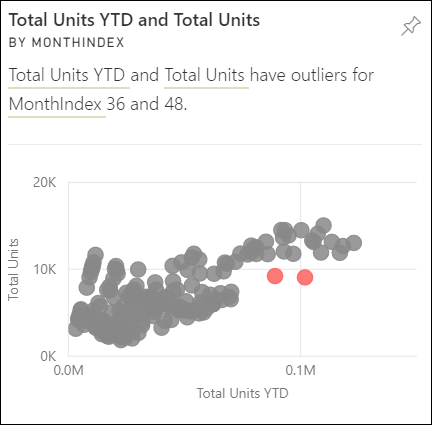
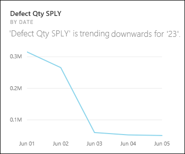

# Tipos de informações suportados pelo Power BI

[!INCLUDE[consumer-appliesto-yyny](../includes/consumer-appliesto-yyny.md)]

Pode pedir ao Power BI que analise os seus dados e encontre tendências e padrões interessantes. Estas tendências e padrões são apresentados sob a forma de elementos visuais que são denominados de *Informações*. 

Para saber como utilizar as Informações, veja [Informações do Power BI](end-user-insights.md)

## Como funcionam as Informações?
O Power BI procura rapidamente vários subconjuntos do seu conjunto de dados. À medida que procura, o Power BI aplica um conjunto de algoritmos sofisticados para obter informações potencialmente interessantes. Os *utilizadores comerciais* do Power BI podem executar Informações nos mosaicos do dashboard.

## Alguma terminologia
O Power BI recorre a algoritmos estatísticos para descobrir informações. Os algoritmos encontram-se listados e descritos na próxima secção deste artigo. Antes de abordarmos os algoritmos, eis as definições de alguns termos que pode não conhecer. 

* **Measure** (Medida) – uma medida é um campo quantitativo (numérico) que pode ser utilizado para fazer cálculos. Os cálculos comuns são soma, média e mínimo. Por exemplo, se a nossa empresa construir e vender skates, as nossas medidas podem ser o número de skates vendidos e o lucro médio por ano.  
* **Dimension** (Dimensão) – as dimensões são dados categóricos (texto). Uma dimensão descreve uma pessoa, objeto, item, produtos, local e hora. Num conjunto de dados, as dimensões são a forma de agrupar *medidas* em categorias úteis. Para a nossa empresa de skates, algumas dimensões podem incluir a análise das vendas (uma medida) por modelo, país ou campanha de marketing.   
* **Correlation** (Correlação) – uma correlação diz-nos como os comportamentos das coisas estão relacionados.  Se os seus padrões de aumento e diminuição forem semelhantes, significa que estão positivamente correlacionados. E se os seus padrões forem opostos, significa que estão negativamente correlacionados. Por exemplo, se as vendas do nosso skate vermelho aumentarem sempre que fizermos uma campanha de marketing televisivo, então, as vendas do skate vermelho e a campanha televisiva estão positivamente correlacionadas.
* **Time series** (Série temporal) – uma série temporal é uma forma de apresentar o tempo como pontos de dados sucessivos. Esses pontos de dados podem ser incrementos tais como segundos, horas, meses ou anos.  
* **Continuous variable** (Variável contínua) – uma variável contínua pode ser qualquer valor entre os seus limites mínimos e máximos, caso contrário, é uma variável discreta. Os exemplos são a temperatura, peso, idade e hora. As variáveis contínuas podem incluir frações ou porções do valor. O número total de skates azuis vendidos é uma variável discreta, uma vez que não podemos vender metade de um skate.  

## Que tipos de informações é possível encontrar?
Estes são os algoritmos que o Power BI utiliza. 

### Valores Atípicos das Categorias (superior/inferior)
Destaca os casos em que uma ou duas categorias têm valores muito maiores do que outras categorias.  

### Alterar os pontos numa série de tempo
Realça os casos em que há alterações significativas nas tendências numa série de tempo de dados.

### Correlação
Deteta casos em que múltiplas medidas mostram um padrão ou tendência semelhante quando desenhadas em relação a uma categoria ou um valor no conjunto de dados.

### Desvio Baixo
Deteta casos nos quais os pontos de dados de uma dimensão não estão longe da média, pelo que o “desvio” é baixo. Digamos que tem a medida “vendas” e uma dimensão “região”. E, se analisar toda a região, poderá ver que a diferença entre os pontos de dados e a média (dos pontos de dados) é pequena. As informações são acionadas quando o desvio das vendas em todas as regiões está abaixo de um limiar. Por outras palavras, quando as vendas são bastante semelhantes em todas as regiões.

### Maioria (Principais fatores)
Encontra casos em que a maioria de um valor total pode ser atribuída a um único fator quando dividida por outra dimensão.  

### Valores atípicos
Este tipo de informações utiliza um modelo de clustering para encontrar valores atípicos em dados de série não temporal. Os valores atípicos detetam quando há categorias específicas com valores significativamente diferentes dos valores das outras categorias.

### Tendências gerais na série de tempo
Deteta as tendências ascendentes ou descendentes em dados de série de tempo.

### Sazonalidade na série de tempo
Encontra padrões periódicos nos dados de série de tempo, como a sazonalidade semanal, mensal ou anual.

### Partilha constante
Realça os casos em que há uma correlação de pai-filho entre a partilha de um valor do filho em relação ao valor geral do pai numa variável contínua. As informações de partilha constante aplicam-se ao contexto de uma medida, uma dimensão e outra dimensão de data/hora. Estas informações são acionadas quando um valor específico de dimensão (por exemplo, “a região leste”) possui uma percentagem estável das vendas gerais ao longo dessa dimensão de data/hora.

As informações de partilha constante são semelhantes às informações de desvio baixo, dado que ambas estão relacionadas com a falta de desvio de um valor ao longo do tempo. No entanto, as informações de partilha constante medem a falta de desvio da **percentagem geral** ao longo do tempo, enquanto as informações de desvio baixo medem a falta de desvio dos valores absolutos da medida ao longo de uma dimensão.

### Valores atípicos de série de tempo
Para dados numa série de tempo, deteta quando há datas ou horas específicas com valores significativamente diferentes dos outros valores de data/hora.

## Próximas etapas
[Informações do Power BI](end-user-insights.md)

Mais perguntas? [Pergunte à Comunidade do Power BI](https://community.powerbi.com/)

