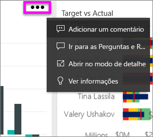
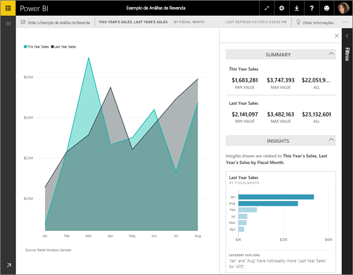
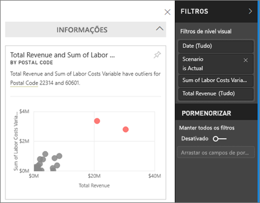
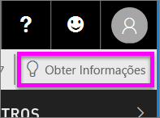
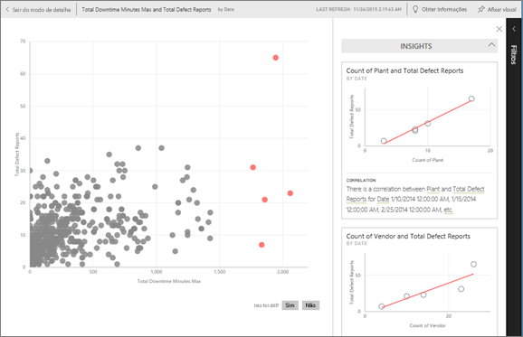

# Gerar automaticamente as informações de dados com o Power BI
Cada mosaico de visualização no dashboard é uma porta para a exploração de dados. Quando seleciona um mosaico, é aberto um relatório onde pode filtrar e ordenar e aprofundar o conjunto de dados associado ao relatório. E quando executa as informações, o Power BI faz a exploração de dados por si.

Execute as informações rápidas para gerar visualizações interativas e interessantes com base nos seus dados. As informações rápidas podem ser executadas num mosaico específico do dashboard e até pode executar as informações numa informação!

A funcionalidade de informações é criada com base num [conjunto de algoritmos de análise avançados](end-user-insight-types.md) crescente, desenvolvido em conjunto com o Microsoft Research, que continuaremos a utilizar para permitir que mais pessoas descubram informações nos dados de formas novas e intuitivas.

## Executar as informações num mosaico do dashboard
Quando executa as informações num mosaico do dashboard, o Power BI procura apenas os dados utilizados para criar esse único mosaico do dashboard. 

1. [Abra um dashboard](end-user-dashboards.md).
2. Coloque o cursor sobre um mosaico, selecione as reticências (...) e escolha **Ver informações**. 

    

3. O mosaico abre-se no [Modo de detalhe](end-user-focus.md) com os cartões de informações apresentados no lado direito.    
   
        
4. Há alguma informação que desperte o seu interesse? Selecione esse cartão de informação para investigar melhor. A informação selecionada é apresentada à esquerda e os cartões de informações novos, com base apenas nos dados dessa informação, são apresentados à direita.    

 ## Interagir com os cartões das informações
   * Filtrar as visualizações.  Para mostrar os filtros, no canto superior direito, selecione a seta para expandir o painel Filtros.

     
   
   * Executar as informações no próprio cartão de informação. Esta operação é muitas vezes denominada **informações relacionadas**. No canto superior direito, selecione o ícone da lâmpada  ou **Obter informações**.
     
     
     
     A informação é apresentada à esquerda e os cartões novos, com base apenas nos dados dessa informação, são apresentados à direita.
     
     

Para voltar à tela original das informações, no canto superior direito, selecione **Sair do Modo de detalhe**.

## Considerações e resolução de problemas
- **Visualizar informações**: não trabalha com o DirectQuery. Só funciona com dados carregados para o Power BI.
- **Ver informações** não funciona com todos os tipos de mosaicos do dashboard. Por exemplo, não está disponível para os elementos visuais personalizados.<!--[custom visuals](end-user-custom-visuals.md)-->

## Próximos passos
Saiba mais sobre os [tipos de Informações Rápidas disponíveis](end-user-insight-types.md)

