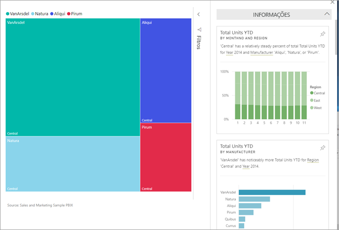

# Ver informações de dados nos mosaicos do dashboard com o Power BI

[!INCLUDE[consumer-appliesto-yyny](../includes/consumer-appliesto-yyny.md)]

Cada [mosaico](end-user-tiles.md) de elemento visual no dashboard é uma porta para a exploração de dados. Ao selecionar um mosaico, é aberto um relatório ou uma página de [Perguntas e Respostas](end-user-q-and-a.md) onde pode filtrar e ordenar, bem como aprofundar o conjunto de dados associado ao relatório. E quando executa as informações, o Power BI faz a exploração de dados por si.

Execute as informações para gerar elementos visuais interessantes com base nos seus dados. As informações podem ser executadas num mosaico específico do dashboard e até pode executá-las com base numa informação!

A funcionalidade de informações é criada com base num [conjunto de algoritmos de análise avançados](end-user-insight-types.md) crescente, desenvolvido em conjunto com o Microsoft Research, que continuaremos a utilizar para permitir que mais pessoas descubram informações nos dados de formas novas e intuitivas.

## Executar as informações num mosaico do dashboard
Quando executa as informações num mosaico do dashboard, o Power BI procura apenas os dados utilizados para criar esse único mosaico do dashboard. 

1. [Abra um dashboard](end-user-dashboards.md).
2. Coloque o cursor sobre um mosaico, selecione **Mais opções** (...) e selecione **Ver informações**. 

    

3. O mosaico abre-se no [Modo de detalhe](end-user-focus.md) com os cartões de informações apresentados no lado direito.    
   
        
4. Há alguma informação que desperte o seu interesse? Selecione esse cartão de informação para investigar melhor. A informação selecionada é apresentada à esquerda e os cartões de informações novos, com base apenas nos dados dessa informação, são apresentados à direita.    

 ## Interagir com os cartões das informações
Depois de abrir uma informação, continue a explorar.

   * Filtre o elemento visual na tela.  Para mostrar os filtros, no canto superior direito, selecione a seta para expandir o painel Filtros.

      
   
   * Executar as informações no próprio cartão de informação. Esta operação é muitas vezes denominada **informações relacionadas**. Selecione um cartão de informações para torná-lo ativo. Este será apresentado na tela do seu relatório.
   
      
   
   * No canto superior direito, selecione o ícone da lâmpada  ou **Obter informações**. A informação é apresentada à esquerda e os cartões novos, com base apenas nos dados dessa informação, são apresentados à direita.
     
     
     
Para voltar ao seu relatório, selecione **Sair do Modo de detalhe** no canto superior esquerdo.

## Considerações e resolução de problemas
- **Ver informações** não funciona com todos os tipos de mosaicos do dashboard. Por exemplo, não está disponível para elementos visuais personalizados do Power BI.<!--[Power BI visuals](end-user-custom-visuals.md)-->

## Próximos passos

Executar informações em elementos visuais de relatório [com a funcionalidade Analisar](end-user-analyze-visuals.md)    
Saiba mais sobre os [tipos de Informações Rápidas disponíveis](end-user-insight-types.md)

