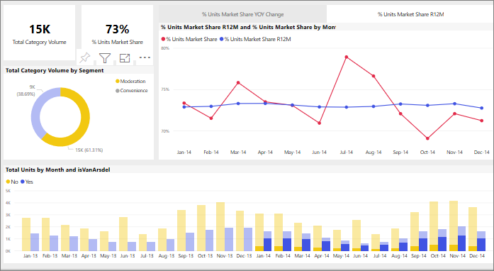

# Forma como os elementos visuais efetuam a filtragem cruzada entre si num relatório do Power BI
Um dos recursos incríveis do Power BI é a forma como estão interligados todos os elementos visuais numa página de relatório. Se selecionar um ponto de dados num dos elementos visuais, serão alterados todos os outros elementos visuais na página que contêm esses dados, com base nessa seleção. 

Por predefinição, selecionar um ponto de dados numa visualização numa página de relatório irá executar a filtragem cruzada, realçar de forma cruzada e explorar as outras visualizações na página. 

Isto pode ser útil para identificar como é que um valor nos seus dados contribui para outro. Por exemplo, selecionar o segmento Moderação no gráfico em anel realça a contribuição desse segmento para cada coluna no gráfico Total de Unidades por Mês e filtra o gráfico de linhas à direita.

Consulte [Sobre filtragem e realce](../power-bi-reports-filters-and-highlighting.md). 

O modo exato como interagem os elementos visuais numa página é definido pelo *designer* do relatório. Os designers têm opções para ativar e desativar interações visuais e para alterar o comportamento de filtragem cruzada, realce cruzado e exploração predefinidos. 
  
> [!NOTE]
> Os termos *filtro cruzado* e *realce cruzado* são utilizados para distinguir o comportamento descrito aqui do que acontece quando utiliza o painel **Filtros** para filtrar e realçar visualizações.  

## Considerações e resolução de problemas
- Se o seu relatório tiver uma visualização que suporte a [exploração](../power-bi-visualization-drill-down.md) por predefinição, a exploração de uma visualização não tem impacto nas outras visualizações na página de relatório.     
- Se utilizar o elemento visual A para interagir com o elemento visual B, os filtros ao nível do elemento visual A serão aplicados ao elemento visual B.

## Próximos passos
[Como utilizar filtros de relatório](../power-bi-how-to-report-filter.md)
