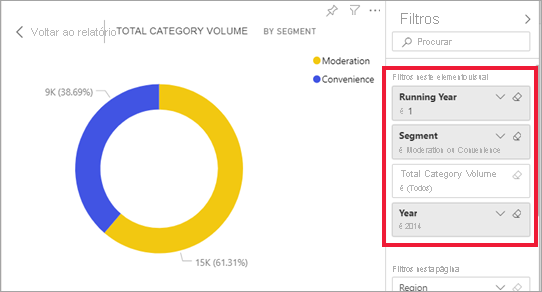

# Forma como os elementos visuais efetuam a filtragem cruzada entre si num relatório do Power BI

[!INCLUDE[consumer-appliesto-yyny](../includes/consumer-appliesto-yyny.md)]

Um dos recursos incríveis do Power BI é a forma como estão interligados todos os elementos visuais numa página de relatório. Se selecionar um ponto de dados num dos elementos visuais, serão alterados todos os outros elementos visuais na página que contêm esses dados, com base nessa seleção. 

## Como os elementos visuais interagem entre si

Por predefinição, selecionar um ponto de dados num elemento visual numa página de relatório irá efetuar a filtragem cruzada ou o realce cruzado dos restantes elementos visuais na página. O modo exato como interagem os elementos visuais numa página é definido pelo *designer* do relatório. Os *designers* têm opções para ativar e desativar interações visuais e para alterar o comportamento de filtragem cruzada, realce cruzado e [exploração](end-user-drill.md) predefinidos. 

Caso ainda não se tenha deparado com hierarquias ou com a exploração, pode saber tudo sobre as mesmas ao ler este artigo sobre a [desagregação no Power BI](end-user-drill.md). 

### Filtragem cruzada e realce cruzado

A filtragem cruzada e o realce cruzado podem ser úteis para identificar como um valor dos seus dados contribui para outro valor. Os termos *filtro cruzado* e *realce cruzado* são utilizados para distinguir o comportamento descrito aqui sobre o que acontece quando utiliza o painel **Filtros** para filtrar e realçar elementos visuais.  

Vamos definir estes termos ao analisar as páginas de relatório abaixo. O gráfico em anel "Volume de categoria total por segmento" tem dois valores: "Moderação" e "Conveniência". 

1. Vejamos o que acontece quando selecionamos **Moderação**.

    

2. A **filtragem cruzada** remove dados que não se aplicam. A seleção de **Moderação** no gráfico em anel permite filtrar o gráfico de linhas de forma cruzada. Agora o gráfico de linhas só mostra pontos de dados do segmento Moderação. 

3. O **realce cruzado** retém todos os pontos de dados originais, mas escurece a parte que não se aplica à sua seleção. A seleção de **Moderação** no gráfico em anel permite realçar o gráfico de colunas de forma cruzada. O gráfico de colunas escurece todos os dados que se aplicam ao segmento Conveniência e realça todos os dados que se aplicam ao segmento Moderação. 

## Considerações e resolução de problemas
- Se o seu relatório tiver um elemento visual que suporte a [exploração](end-user-drill.md) por predefinição, a exploração de um elemento visual não tem impacto nos restantes elementos visuais na página de relatório. No entanto, o *designer* de relatórios pode alterar este comportamento. Assim, verifique os elementos visuais desagregáveis para ver se **os outros elementos visuais dos filtros de desagregação** foram ativados pelo *designer* de relatórios.
    
- Os filtros de nível visual são mantidos quando se faz a filtragem cruzada e o realce cruzado de outros elementos visuais na página do relatório. Assim, se o Elemento Visual A tiver filtros de nível visual aplicados pelo designer de relatórios ou por si e utilizar o Elemento Visual A para interagir com o Elemento Visual B, serão aplicados filtros de nível visual do Elemento Visual A ao Elemento Visual B.

    

## Próximos passos
[Como utilizar filtros de relatório](../consumer/end-user-report-filter.md)

[Sobre a filtragem e o realce](end-user-report-filter.md).
