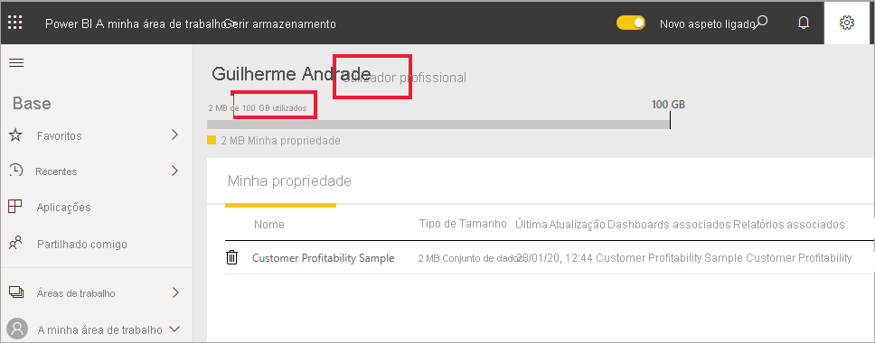

# Tipos de licenças do Power BI
Como *consumidor*, utiliza o serviço Power BI para explorar relatórios e dashboards para tomar decisões empresariais. Se já utiliza o Power BI há algum tempo ou tem conversado com os seus colegas *designers*, provavelmente descobriu que existem algumas funcionalidades que só funcionam se tiver um determinado tipo de licença. 

Este artigo explica as diferenças entre os tipos de licença: gratuito, Pro, gratuito com capacidade Premium e Pro com capacidade Premium. Também irá aprender a descobrir qual é a licença que está a utilizar.  

Vamos começar por analisar as duas categorias de licenças; licenças de utilizador e licenças organizacionais. 

## Licenças de utilizador
O primeiro tipo de licença é uma licença de **utilizador**. Cada utilizador do Power BI tem uma licença gratuita ou uma licença Pro. Algumas funcionalidades estão limitadas a utilizadores com licença Pro.  

- Uma licença Power BI Pro permite que um utilizador colabore com outros utilizadores Pro ao criar e partilhar conteúdos. Apenas os utilizadores com licença Pro podem publicar relatórios, subscrever dashboards e relatórios e colaborar com colegas em áreas de trabalho. As licenças Pro são normalmente utilizadas por *designers* de relatórios, programadores, analistas e administradores.

- Uma licença gratuita do Power BI, embora ainda útil, destina-se aos utilizadores que estejam a começar a utilizar o Power BI ou aos utilizadores que criam conteúdos por si próprios. Uma licença de utilizador gratuita é perfeita para alguém que utiliza as amostras da Microsoft para aprender a utilizar o Power BI. Os utilizadores com licenças gratuitas não podem ver conteúdos partilhados por outros ou partilhar os seus próprios conteúdos com outros utilizadores do Power BI.  

Tudo claro até agora?  OK. Vamos adicionar outra camada, **capacidade Premium**.

## O que faz o Power BI Premium? Como funciona?
A capacidade Premium é uma licença **organizacional**. Considere-a como uma adição de uma camada de funções, que funciona sobre todas as licenças de **utilizador** do Power BI numa organização. Um dos muitos benefícios para os *consumidores* é que a experiência para os membros da organização, que têm uma licença de utilizador *gratuita*, torna-se mais rica em termos de funcionalidades. Se a sua empresa tiver uma licença de capacidade Premium, os utilizadores Pro podem partilhar conteúdos com todos os membros da organização, sem exigir que os utilizadores que veem os conteúdos tenham licenças Power BI Pro.   

Quando uma organização adquire uma licença de capacidade Premium, o administrador atribui normalmente licenças Pro aos colaboradores que irão criar e partilhar conteúdos. E o administrador atribui licenças gratuitas a todos os que irão consumir esses conteúdos.  

Quer saber mais detalhes sobre o Premium? Continue a ler. Caso contrário, avance para [Descobrir quais as licenças que tem](#find-out-which-license-you-have), abaixo.

Quando uma organização adquire uma licença de capacidade Premium, recebe capacidade no serviço Power BI exclusivamente atribuída a si. Não é partilhada. A capacidade é suportada pelo hardware dedicado totalmente gerido pela Microsoft. As organizações podem optar por aplicar a respetiva capacidade dedicada amplamente ou atribui-la às áreas de trabalho atribuídas com base no número de utilizadores, necessidades de carga de trabalho ou outros fatores – e aumentar ou reduzir verticalmente, à medida que os requisitos mudam.

O Power BI Premium oferece uma capacidade dedicada para um desempenho mais consistente e suporte de maiores volumes de dados no Power BI. 

## Descobrir quais as licenças que tem
Existem várias formas de procurar informações sobre a sua licença do Power BI. 

Em primeiro lugar, determine que licença de **utilizador** tem.

- Algumas versões do Microsoft Office incluem uma licença Power BI Pro.  Para ver se a sua versão do Office inclui o Power BI, visite o [portal do Office](https://portal.office.com/account) e selecione **Subscrições**.

    Este primeiro utilizador, Rita, tem o Office 365 E5, que inclui uma licença Power BI Pro.

    

    Este segundo utilizador, Guilherme, tem uma licença gratuita do Power BI. 

    

Em seguida, verifique se a sua conta também tem uma licença de capacidade Premium. Qualquer um dos utilizadores acima, Pro ou gratuito, poderia pertencer a uma organização que tem uma licença de capacidade Premium.  Vamos ver qual é a situação do nosso segundo utilizador, Guilherme.  

- No serviço Power BI, selecione **A minha área de trabalho** e, em seguida, selecione o ícone de engrenagem no canto superior direito. Selecione **Gerir armazenamento pessoal**.

    

    As licenças de **utilizador**, Pro ou gratuitas, fornecem 10 GB de armazenamento na cloud que podem ser utilizados para alojar relatórios do Power BI ou livros do Excel. Se vir mais de 10 GB, é porque é membro de uma conta organizacional com uma licença de capacidade Premium.

    Lembre-se que na página do portal do Office, a subscrição de utilizador de Guilherme era para Power BI (gratuito). No entanto, uma vez que a sua organização adquiriu uma licença de capacidade Premium, no serviço Power BI, Guilherme é um **utilizador Pro**. Enquanto *consumidor* numa organização com licença de capacidade Premium, pode ver conteúdos partilhados, colaborar com colegas, trabalhar com aplicações e mais. A extensão das suas permissões é definida pelo seu administrador do Power BI. A maioria dos *consumidores* tem permissão para fazer coisas como: utilizar as Perguntas e Respostas, exportar conteúdos, repartilhar aplicações e criar subscrições.  No entanto, a capacidade de criar e publicar novos conteúdos limita-se a colegas que sejam *designers*, analistas, programadores e administradores.   <!-- how can he be Pro if I assigned him a Free account in the O365 portal?  Is he a Pro user with consumer permissions? -->

    
