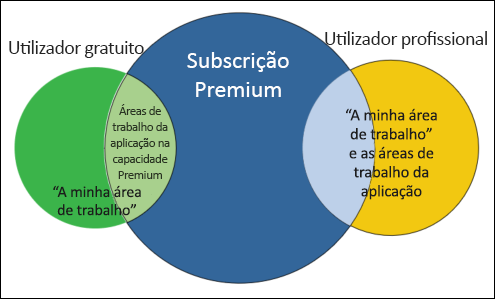
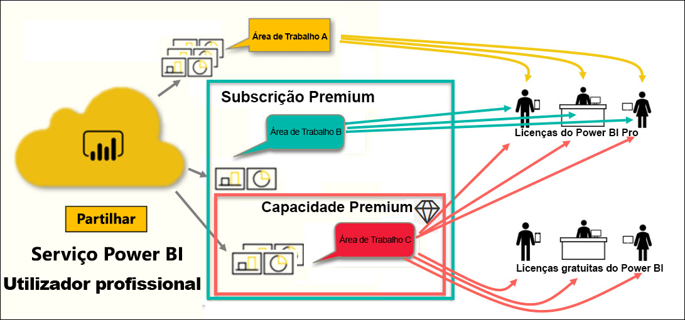
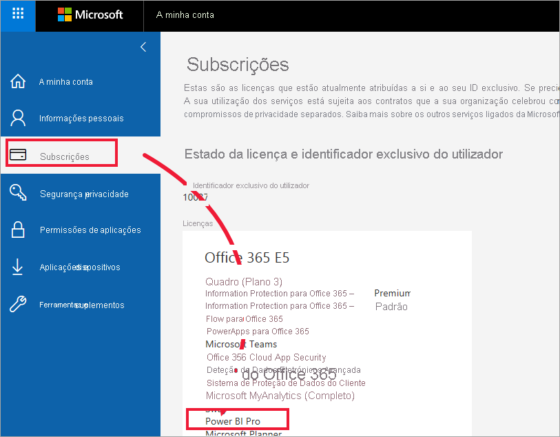
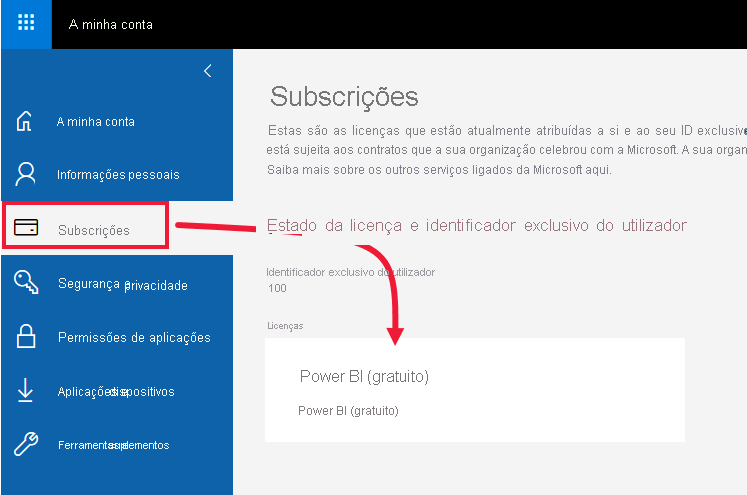
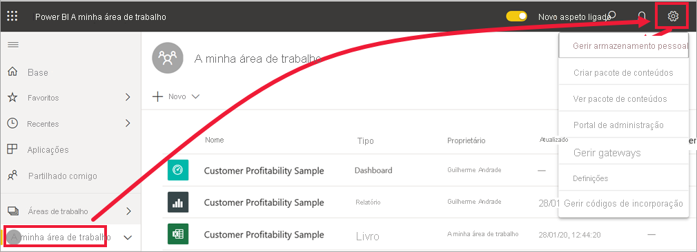
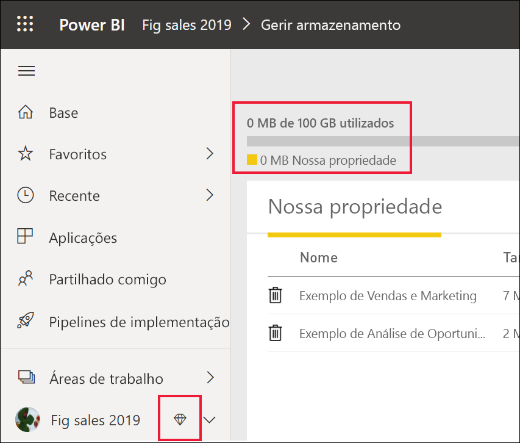

# Tipos de licenças do Power BI

[!INCLUDE[consumer-appliesto-ynnn](../includes/consumer-appliesto-ynnn.md)]

Como *consumidor*, utiliza o serviço Power BI para explorar relatórios e dashboards para tomar decisões empresariais. Se já utiliza o Power BI há algum tempo ou tem conversado com os seus colegas *designers*, provavelmente descobriu que existem algumas funcionalidades que só funcionam se tiver um determinado tipo de licença ou subscrição. 

Este artigo explica as diferenças entre licenças de utilizador e subscrições da organização e como funcionam em conjunto: gratuitas, Pro, Premium e capacidade Premium. Também ficará a saber como descobrir qual é a combinação de licença e subscrição que está a utilizar.  

Vamos começar por analisar as duas categorias de licenças: subscrições por utilizador e organizacionais. Vamos começar com as capacidades predefinidas disponíveis em cada uma delas. Em seguida, vamos ver como o administrador do Power BI e os proprietários de conteúdos podem utilizar as funções e as permissões para modificar as capacidades das licenças e subscrições predefinidas. 

Por exemplo, mesmo que a licença o permita, o administrador pode limitar a capacidade de fazer coisas como exportar dados, utilizar as consultas em linguagem natural das Perguntas e Respostas ou publicar na Web. E, quando um *designer* de relatório atribui conteúdo a uma [área de trabalho](end-user-workspaces.md), pode atribuir-lhe uma função na área de trabalho. As funções determinam o que pode ou não fazer nessa área de trabalho. O *designer* pode ajustar ainda mais os limites da sua licença com as definições de permissão. Por outras palavras, é bastante complicado. Esperamos que este artigo esclareça a maior parte dessa “confusão”, se não toda.

## Licenças por utilizador
O primeiro tipo de licença é a licença **por utilizador**. Cada utilizador do serviço Power BI tem uma licença gratuita ou uma licença Pro. Algumas funcionalidades estão reservadas aos utilizadores com licenças Pro.  

- Uma **licença do Power BI Pro (sem uma subscrição Premium)** permite a um utilizador colaborar com outros utilizadores Pro através da criação e partilha de conteúdos. Apenas os utilizadores com licença Pro podem publicar relatórios, subscrever dashboards e relatórios e colaborar com colegas em áreas de trabalho. 

    

    O Power BI Pro é uma licença de utilizador individual que permite que os utilizadores leiam e interajam com relatórios e dashboards que outras pessoas publicaram no serviço Power BI. Os utilizadores com este tipo de licença podem partilhar conteúdos e colaborar com outros utilizadores do Power BI Pro. Apenas os utilizadores do Power BI Pro podem publicar ou partilhar conteúdos com outros utilizadores ou consumir conteúdos criados por outros. A exceção é o conteúdo hospedado na [capacidade Power BI Premium](#understanding-premium-and-premium-capacity). Para obter mais informações, veja [Capacidade Power BI Premium](#understanding-premium-and-premium-capacity) abaixo. As licenças Pro são normalmente utilizadas por *designers* de relatórios e programadores. 

- Uma **licença gratuita do Power BI autónoma (sem uma subscrição Premium)** , embora ainda útil, destina-se aos utilizadores que estejam a começar a utilizar o Power BI ou aos utilizadores que criam conteúdos por si próprios. Veja [Inscrever-se no serviço Power BI como um indivíduo](../service-self-service-signup-for-power-bi.md).   

    A licença de utilizador autónoma gratuita é perfeita para alguém que utiliza as amostras da Microsoft para aprender a utilizar o Power BI. Os utilizadores com licenças autónomas gratuitas não podem ver conteúdos partilhados por outros utilizadores nem partilhar os seus próprios conteúdos com outros utilizadores do Power BI. 

    

    Todos os clientes com licença autónoma gratuita podem atualizar para uma [avaliação gratuita da licença do Power BI Pro](../service-self-service-signup-for-power-bi.md). A avaliação gratuita oferece-lhe todo o controlo e funcionalidades de um utilizador do Power BI Pro.

    

- **Uma licença gratuita do Power BI com uma subscrição Premium**. quando uma organização tem uma subscrição Premium, os administradores e os utilizadores Pro podem atribuir áreas de trabalho à *capacidade Premium* e conceder acesso gratuito aos utilizadores a essas áreas de trabalho. Uma área de trabalho com capacidade Premium é um espaço onde os utilizadores Pro podem partilhar e colaborar com os utilizadores gratuitos, sem que os utilizadores gratuitos precisem ter contas Pro. Dentro dessas áreas de trabalho, os utilizadores gratuitos têm permissões elevadas; podem colaborar e partilhar, exportar dados, subscrever, interagir com filtros e muito mais. 

Tudo claro até agora?  OK. Vamos examinar mais detalhadamente a **capacidade Premium**.

## Compreender a licença Premium e a capacidade Premium
A licença Premium é uma subscrição **organizacional**. Considere-a como a adição de uma camada de funções, que funciona sobre todas as licenças por **utilizador** do Power BI numa organização. 

Quando uma organização compra uma licença Premium, o administrador atribui normalmente licenças Pro aos colaboradores que irão criar e partilhar conteúdos. E o administrador atribui licenças gratuitas a todos os que irão consumir esses conteúdos. Os utilizadores Pro criam [áreas de trabalho de aplicações](end-user-workspaces.md) e adicionam conteúdos (dashboards, relatórios e aplicações) a essas áreas de trabalho. Para permitir que os utilizadores gratuitos colaborem nessas áreas de trabalho, o administrador ou utilizador Pro guarda as áreas de trabalho na *capacidade Premium*. 

Quando uma organização compra uma licença Premium, recebe capacidade no serviço Power BI exclusivamente atribuída a si. Não é partilhada por outras organizações. A capacidade é suportada pelo hardware dedicado totalmente gerido pela Microsoft. As organizações podem optar por aplicar a capacidade dedicada em geral ou alocá-la a áreas de trabalho específicas. Uma organização pode ter todas as áreas de trabalho nesta capacidade ou apenas algumas. Pode identificar uma área de trabalho na capacidade Premium pelo ícone de diamante .  Uma área de trabalho com capacidade Premium é um espaço onde os utilizadores Pro podem partilhar e colaborar com os utilizadores gratuitos, sem que os utilizadores gratuitos precisem ter contas Pro. 

Na capacidade Premium, as licenças Pro ainda são necessárias para os designers de conteúdo. Os designers criam áreas de trabalho das aplicações, ligam-se às origens de dados, modelam dados e criam relatórios e dashboards que são partilhados diretamente ou empacotados e partilhados como aplicações. Os utilizadores sem licenças Pro ainda podem aceder à área de trabalho de uma aplicação que se encontre no Power BI Premium, desde que essa área de trabalho esteja na *capacidade* Premium e desde que o proprietário da mesma lhes dê permissão.

No diagrama abaixo, o lado esquerdo representa os utilizadores Pro que criam e partilham conteúdo nas áreas de trabalho de aplicações. 

- A **Área de Trabalho A** foi criada numa organização que não possui uma subscrição Premium. 

- A **Área de Trabalho B** foi criada numa organização que possui uma subscrição Premium, embora esta área de trabalho em particular não tenha sido guardada na capacidade Premium. A área de trabalho não tem o ícone de diamante.

- A **Área de Trabalho C** foi criada numa organização que possui uma subscrição Premium e foi guardada na capacidade Premium. A área de trabalho tem um ícone de diamante.  

O *designer* do Power BI Pro pode partilhar e colaborar com outros utilizadores Pro em qualquer uma das três áreas de trabalho. Desde que o designer partilhe a área de trabalho com toda a organização ou atribua funções nas áreas de trabalhos aos utilizadores Pro. 

O utilizador do Power BI Pro só pode partilhar e colaborar com utilizadores gratuitos que utilizam a Área de Trabalho C. A área de trabalho deve ser atribuída à capacidade Premium para que os utilizadores gratuitos sejam capazes de aceder à área de trabalho. Dentro da área de trabalho, o designer atribui funções aos colaboradores: *Administrador*, *Membro*, *Contribuidor* ou *Visualizador*. A função determina as ações pode realizar na área de trabalho. Os *consumidores* do Power BI possuem normalmente a função *Visualizador*. Para saber mais, veja [Áreas de trabalho dos consumidores do Power BI](end-user-workspaces.md).

## Descubra qual é a licença e subscrição que tem
Existem várias formas de procurar informações sobre a sua licença e subscrição do Power BI. 

Em primeiro lugar, determine que licença de **utilizador** tem.

- Algumas versões do Microsoft Office incluem uma licença Power BI Pro.  Para ver se a sua versão do Office inclui o Power BI, visite o [portal do Office](https://portal.office.com/account) e selecione **Subscrições**.

    Este primeiro utilizador, Rita, tem o Office 365 E5, que inclui uma licença Power BI Pro.

    

    Este segundo utilizador, Guilherme, tem uma licença gratuita do Power BI. 

    

Em seguida, verifique se a sua conta também faz parte de uma subscrição Premium. Qualquer um dos utilizadores acima, Pro ou gratuito, poderia pertencer a uma organização que tem uma licença Premium.  Vamos ver qual é a situação do nosso segundo utilizador, Guilherme.  

- No serviço Power BI, selecione **A minha área de trabalho** e, em seguida, selecione o ícone de engrenagem no canto superior direito. Selecione **Gerir armazenamento pessoal**.

    

    As licenças **por utilizador**, Pro ou gratuitas oferecem 10 GB de armazenamento na cloud que podem ser utilizados para alojar relatórios do Power BI ou livros do Excel. Se vir mais de 10 GB, significa que é membro de uma conta profissional com uma licença Premium.

    

    Lembre-se de que, na página do portal do Office, a licença de utilizador de Guilherme era para o Power BI (gratuito). Mas dado que a organização comprou uma subscrição Premium, no serviço Power BI, o Guilherme não ficará limitado aos 10 GB de armazenamento. Terá 100 GB disponíveis. Como *consumidor* numa organização com uma licença Premium, desde que o *designer* coloque a área de trabalho na capacidade Premium, o Guilherme tem a capacidade de visualizar conteúdos partilhados, colaborar com colegas, trabalhar com aplicações e muito mais. A extensão das permissões do Guilherme é definida pelo administrador do Power BI e pelo designer de conteúdos. Note que um utilizador Pro já partilhou uma área de trabalho com o Guilherme. O ícone de diamante permite-lhe saber que esta área de trabalho está armazenada na capacidade Premium. 

   
## Compreender as funções da área de trabalho
Até agora, analisámos as licenças por utilizador, as subscrições Premium, as áreas de trabalho de aplicações e a capacidade Premium. Agora, vamos ver as *funções* da área de trabalho.

Uma vez que este artigo se destina aos *consumidores* do Power BI, temos o seguinte cenário:

-  É um utilizador *gratuito* numa organização que tem uma subscrição Power BI Premium. 
- Um utilizador do Power BI Pro criou uma coleção de dashboards e relatórios e publicou esta coleção como uma *aplicação* para toda a organização.  
- Existem aplicações dentro das *áreas de trabalho* e esta área de trabalho está na capacidade Premium.    
- Esta área de trabalho de aplicação possui um dashboard e dois relatórios.
- O utilizador Pro atribuiu-nos a função de **Visualizador**.

### A função de Visualizador
As funções permitem aos *designers* do Power BI gerir as ações de cada utilizador numa área de trabalho, para que as equipas possam colaborar. Uma dessas funções é a de **Visualizador**. 

Quando a área de trabalho está numa capacidade do Power BI Premium, os utilizadores com a função Visualizador podem aceder à área de trabalho, mesmo que não tenham uma licença do Power BI Pro. E como a função de Visualizador não pode aceder nem exportar os dados subjacentes, é uma forma segura de interagir com os dashboards, os relatórios e as aplicações.

> [!TIP]
> Para saber mais sobre as outras funções (Administrador, Membro e Contribuidor) veja [criar uma nova área de trabalho](../service-new-workspaces.md).

## Próximos passos
[Sou um *consumidor* do Power BI?](end-user-consumer.md)    
[Saiba mais sobre as áreas de trabalho](end-user-workspaces.md)    
<!--[View Power BI features by license type](end-user-features.md) -->

