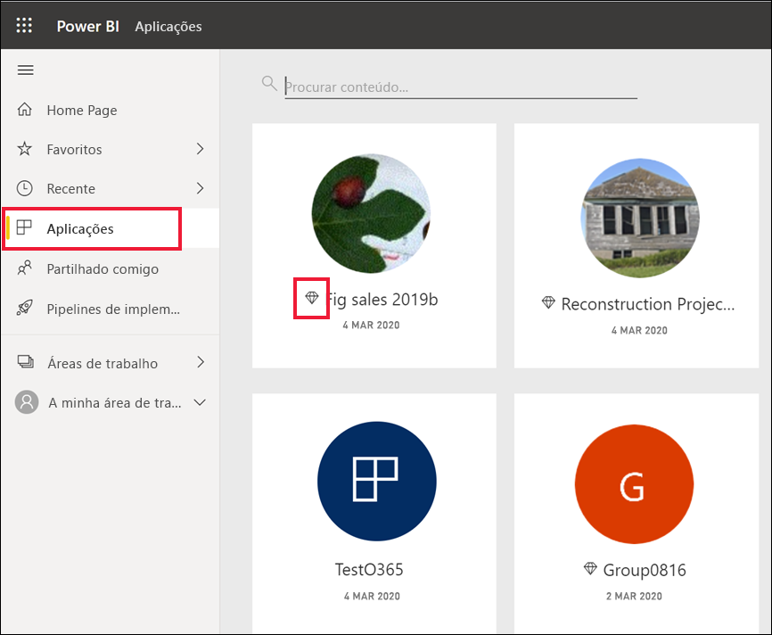
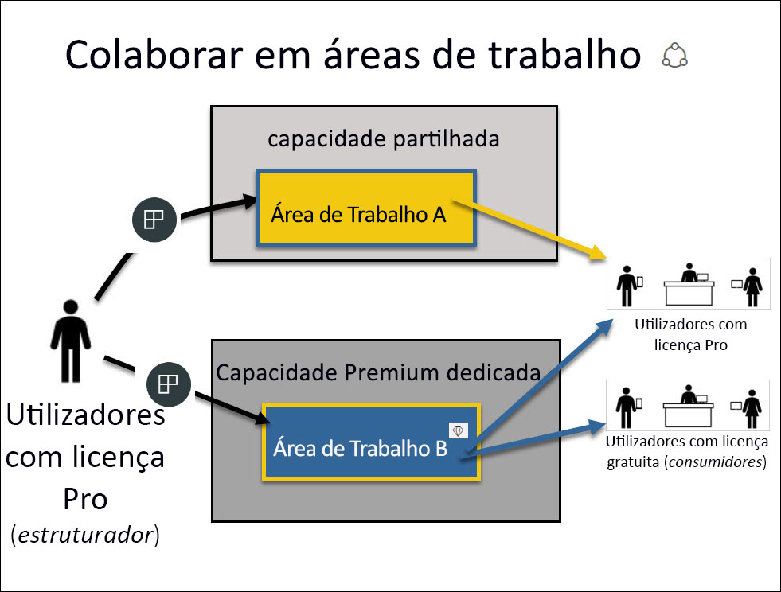

# Licenças e subscrições para *consumidores*

[!INCLUDE[consumer-appliesto-ynnn](../includes/consumer-appliesto-ynnn.md)]

Enquanto [*consumidor*](end-user-consumer.md), utiliza o serviço Power BI para explorar relatórios e dashboards para tomar decisões empresariais fundamentadas por dados. Se já utiliza o Power BI há algum tempo ou tem conversado com os seus colegas *designers*, provavelmente descobriu que existem algumas funcionalidades que só funcionarão se tiver um determinado tipo de licença, subscrição ou permissões. 

Aquilo que pode fazer no serviço Power BI depende de três coisas:
-    o tipo de licença e subscrição que está a utilizar
-    onde o conteúdo é armazenado
-    as funções e permissões que lhe são atribuídas

Neste artigo, vamos descrever as capacidades de cada tipo de licença e como *o local onde o conteúdo é armazenado* pode afetar *o que pode fazer com ele*. Também ficará a saber como procurar a licença e a subscrição e descobrir onde o conteúdo está armazenado. Para obter mais informações sobre as funções e as permissões, veja as [funções das áreas de trabalho](end-user-workspaces.md).

## Licenças

Cada utilizador do serviço Power BI está a utilizar uma licença *gratuita* ou uma licença *Pro*. Se for *consumidor* do Power BI, provavelmente estará a utilizar uma licença gerida pelo administrador de inquilinos do Power BI. 

É possível ter mais do que uma licença ao mesmo tempo.  O serviço oferece-lhe sempre a experiência equivalente à melhor licença que possui atualmente. 

## Capacidade Power BI Premium

A capacidade Premium corresponde a uma subscrição organizacional que proporciona uma forma diferente de armazenar o conteúdo – na capacidade dedicada. Com a capacidade Premium, qualquer pessoa com permissões, quer seja da sua organização ou não, pode ver os seus conteúdos do Power BI sem precisar de comprar licenças individuais do Power BI Pro. 

O Premium permite uma distribuição alargada de conteúdos por utilizadores do Power BI Pro e os destinatários que veem os conteúdos sem necessitarem de licenças Pro. As licenças Pro são necessárias para designers de conteúdo. Os designers ligam-se às origens de dados, modelam dados e criam relatórios e dashboards que são empacotados como aplicações de área de trabalho. Um utilizador sem uma licença Pro ainda poderá aceder a uma área de trabalho que se encontre na capacidade do Power BI Premium, desde que tenha uma [função nessa área de trabalho](end-user-workspaces.md).

Nessas áreas de trabalho, os designers atribuem funções, como **Visualizador**, **Contribuidor**, **Membro** e **Administrador**, que determinam em que extensão os colegas conseguem interagir com o conteúdo. Para obter mais informações, veja [permissões e funções das áreas de trabalho.](end-user-workspaces.md) 

Para obter mais informações sobre a capacidade Premium, veja [O que é o Microsoft Power BI Premium?](../admin/service-premium-what-is.md)

## Descubra quais as licenças que possui

Visite a [página **A minha conta** da Microsoft](https://portal.office.com/account) para ver quais as licenças que lhe estão atribuídas.  Selecione o separador **Subscrições**.

Este primeiro utilizador, Rita, tem o Office 365 E5, que inclui uma licença Power BI Pro.

Este segundo utilizador, Guilherme, tem uma licença gratuita do Power BI. 

## Determinar se tem acesso à capacidade Premium

Em seguida, verifique se faz parte de uma organização que tem a capacidade Premium. Qualquer um dos utilizadores acima, Pro ou gratuito, poderia pertencer a uma organização que tem a capacidade Premium.  Vamos ver qual é a situação do nosso segundo utilizador, Guilherme.  

Podemos determinar se a organização do Guilherme tem a capacidade Premium ao procurar a quantidade de armazenamento disponível. 

- No serviço Power BI, selecione **A minha área de trabalho** e, em seguida, selecione o ícone de engrenagem no canto superior direito. Selecione **Gerir armazenamento pessoal**.

    

    Se vir mais de 10 GB, significa que é membro de uma organização que tem uma subscrição Premium. A imagem abaixo mostra que a organização do Guilherme tem até 100 GB de armazenamento.  

    

Note que um utilizador Pro já partilhou uma área de trabalho com o Guilherme. O ícone de diamante indica que esta área de trabalho está armazenada na capacidade Premium. 

## Identificar conteúdo hospedado na capacidade Premium

Outra forma de descobrir se a sua organização tem capacidade Premium é procurar aplicações e áreas de trabalho de aplicações com um ícone de diamante. O diamante indica que este conteúdo está armazenado na capacidade Premium. 

Na imagem abaixo, três das aplicações estão armazenadas na capacidade Premium.

    
Enquanto utilizador com uma licença gratuita, desde que o *designer* coloque a área de trabalho na capacidade Premium dedicada, terá a possibilidade, **dentro dessa área de trabalho**, de visualizar conteúdo partilhado, colaborar com colegas, trabalhar com os dashboards e os relatórios da aplicação e muito mais. A extensão das permissões é definida pelo administrador do Power BI e pelo designer de conteúdos. 

   

## Juntar tudo

Quando uma organização compra uma subscrição Premium, o administrador atribui normalmente licenças Pro aos colaboradores que irão trabalhar na capacidade Premium, ao criar e partilhar conteúdos. Os utilizadores Pro criam [áreas de trabalho](end-user-workspaces.md) e adicionam conteúdos (dashboards, relatórios e aplicações) a essas áreas de trabalho. Para permitir que os utilizadores gratuitos colaborem nessas áreas de trabalho, o administrador ou utilizador Pro atribui as áreas de trabalho à *capacidade dedicada*.    
 

|Tipo de licença  |Capacidade partilhada  |Capacidade dedicada  |
|---------|---------|---------|
|**Gratuito**     |  Para utilização como sandbox pessoal onde cria conteúdo para si e interage com esse conteúdo. Esta é uma excelente forma para experimentar o serviço Power BI. Não pode consumir conteúdo de outros utilizadores nem partilhar o seu conteúdo com outros utilizadores 1     |   Interaja com o conteúdo atribuído à capacidade dedicada e partilhado consigo. Os utilizadores Gratuitos e Pro podem colaborar sem ser preciso que os utilizadores gratuitos possuam contas Pro.      |
|**Pro**     |  Colabora com outros utilizadores Pro através da criação e partilha de conteúdos.        |  Colabora com utilizadores gratuitos e Pro através da criação e partilha de conteúdos.       |

1 Veja [Considerações e resolução de problemas](#considerations-and-troubleshooting). 

No diagrama abaixo, o lado esquerdo representa os utilizadores Pro que criam e partilham conteúdo nas áreas de trabalho de aplicações. 

- A **Área de Trabalho A** foi criada numa organização que não possui capacidade Premium. 

- A **Área de Trabalho B** foi criada numa organização que possui uma subscrição Premium e a área de trabalho foi guardada na capacidade dedicada. Esta área de trabalho tem um ícone de diamante.  

    

O *designer* do Power BI Pro pode partilhar e colaborar com outros utilizadores Pro em qualquer uma das áreas de trabalho. Mas, a única forma de um utilizador do Power BI Pro poder partilhar e colaborar com utilizadores gratuitos é com a Área de Trabalho B, que se encontra na capacidade dedicada Premium.  Na área de trabalho, o designer atribui funções aos colaboradores. A função determina as ações pode realizar na área de trabalho. Os *consumidores* do Power BI possuem normalmente a função *Visualizador*. Para saber mais sobre as funções, veja [Áreas de trabalho para consumidores do Power BI](end-user-workspaces.md).

## Considerações e resolução de problemas
- É possível ter mais do que uma licença do Power BI. O serviço Power BI irá sempre proporcionar uma experiência igual à melhor licença que possui atualmente. Por exemplo, se tiver uma licença Pro e uma gratuita, o serviço Power BI utilizará a licença Pro.

- Se quiser partilhar e criar conteúdo (dashboards, relatórios, aplicações), não poderá ser um *consumidor* do Power BI, mas sim ser um *designer*. Verifique se tem uma licença de utilizador Pro. Pode inscrever-se para uma avaliação individual de 60 dias gratuita do Power BI Pro ao selecionar a caixa de diálogo de atualização que aparece no serviço Power BI sempre que tenta utilizar uma funcionalidade Pro.

    

  Quando esta avaliação de 60 dias expirar, a licença mudará novamente para uma licença gratuita do Power BI. Depois disto acontecer, já não terá acesso a funcionalidades que exigem uma licença do Power BI Pro. Se quiser continuar a utilizar a licença Pro, contacte o seu administrador ou o Suporte Técnico de TI para a compra de uma licença do Power BI Pro. Se não tiver um administrador ou Suporte Técnico de TI, visite a [página de preços do Power BI](https://powerbi.microsoft.com/pricing/).     

- Se se tiver inscrito para obter uma licença gratuita ao selecionar um tipo de botão *Experimentar gratuitamente*, esta nunca expirará. Assim, se atualizar para uma avaliação Pro ou se a sua organização lhe proporcionar uma licença Pro e, em seguida, a avaliação terminar ou a sua organização remover a licença Pro, ainda poderá voltar à licença gratuita, exceto se a cancelar. 

- 1 Uma licença de utilizador gratuita do serviço Power BI é perfeita para alguém que o explore ou utilize para análise de dados pessoais e visualizações com **A minha área de trabalho**. Um utilizador autónomo gratuito não está a utilizar o Power BI para colaborar com os colegas. Os utilizadores autónomos com licenças gratuitas não podem ver conteúdos partilhados por outros utilizadores nem partilhar os seus próprios conteúdos com outros utilizadores do Power BI. 

    

## Próximos passos
- [Sou um *consumidor* do Power BI?](end-user-consumer.md)    
- [Saiba mais sobre as áreas de trabalho](end-user-workspaces.md)    
- [Visualizar as funcionalidades de consumidor do Power BI por tipo de licença](end-user-features.md)
