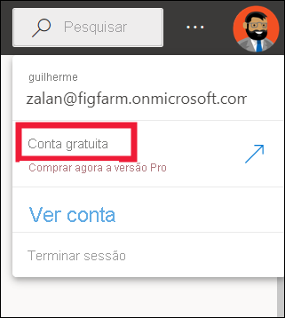
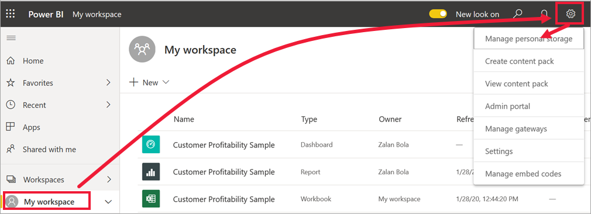

# Licenças e subscrições para *utilizadores empresariais*

[!INCLUDE[consumer-appliesto-ynnn](../includes/consumer-appliesto-ynnn.md)]

Enquanto [*utilizador empresarial*](end-user-consumer.md), utiliza o serviço Power BI para explorar relatórios e dashboards para tomar decisões empresariais fundamentadas por dados. Se já utiliza o Power BI há algum tempo ou tem conversado com os seus colegas *designers*, provavelmente descobriu que existem algumas funcionalidades que só funcionarão se tiver um determinado tipo de licença, subscrição ou permissões.

Aquilo que pode fazer no serviço Power BI depende de três coisas:
-    o tipo de licença e subscrição que está a utilizar,
-    onde o conteúdo é armazenado e
-    as funções e permissões que lhe são atribuídas.

Neste artigo, vamos descrever as capacidades de cada tipo de licença e como *o local onde o conteúdo é armazenado* pode afetar *o que pode fazer com o mesmo*. Também ficará a saber como procurar a licença e a subscrição e descobrir onde o conteúdo está armazenado. Para obter mais informações sobre as funções e as permissões, veja as [funções das áreas de trabalho](end-user-workspaces.md).

## Licenças

Cada utilizador do serviço Power BI tem uma licença *gratuita,* uma licença *Pro* ou uma licença *Premium por utilizador** Se for um *utilizador empresarial* do Power BI, provavelmente estará a utilizar uma licença gratuita gerida pelo administrador do Power BI.

É possível ter mais do que uma licença ao mesmo tempo.  O serviço oferece-lhe sempre a experiência equivalente à licença mais permissiva que possui atualmente.

## Assinatura de capacidade power BI Premium

Premium é uma *subscrição* organizacional que fornece uma forma diferente de armazenar conteúdo -- num recipiente virtual chamado *capacidade*. Com capacidade Premium, qualquer pessoa com permissões, quer esteja dentro ou fora da sua organização, pode ver os conteúdos armazenados nesta capacidade Premium, sem adquirir licenças individuais power BI Pro ou Premium por utilizador. 

A capacidade premium permite uma distribuição generalizada de conteúdos por utilizadores Pro sem exigir licenças Pro para os destinatários que visualizam o conteúdo. A pessoa que está a criar o conteúdo na capacidade Premium utiliza uma licença Pro para ligar a fontes de dados, dados de modelos e criar relatórios e dashboards que são guardados num espaço de trabalho na capacidade Premium. Um utilizador sem uma licença Pro ainda poderá aceder a uma área de trabalho que se encontre na capacidade do Power BI Premium, desde que tenha uma [função nessa área de trabalho](end-user-workspaces.md). Se o proprietário do espaço de trabalho criar uma aplicação baseada em conteúdos nesse espaço de trabalho, os utilizadores sem licença Pro ainda podem ver essa aplicação na capacidade Premium, desde que lhes tenham sido dadas permissões para essa aplicação. 

Dentro dessas áreas de trabalho, os designers atribuem funções, como **Visualizador**, **Contribuidor**, **Membro** e **Administrador**. Estas funções determinam até que ponto os colegas podem interagir com o conteúdo. Para obter mais informações, veja [permissões e funções das áreas de trabalho.](end-user-workspaces.md) 

Quando um designer cria e publica uma app, concede acesso a organizações ou indivíduos inteiros. A medida em que pode interagir com o conteúdo da aplicação depende das permissões de acesso específicas que lhe são dadas. Por exemplo, pode ter acesso a visualizar a app, ligar-se aos conjuntos de dados subjacentes, fazer cópias de relatórios ou partilhar o conteúdo.

Para obter mais informações sobre a capacidade Premium, veja [O que é o Microsoft Power BI Premium?](../admin/service-premium-what-is.md)

## Descubra quais as licenças que possui
Selecione a imagem do seu perfil para apresentar informações da conta. O Zalan está a utilizar uma licença gratuita. Outros tipos de licenças são: **Pro** e **Premium por utilizador.** 

Para ver detalhes adicionais sobre a sua conta, selecione **Ver conta**. 

<!-- [Your Microsoft **My account** page](https://portal.office.com/account) opens in a new browser tab.  To see what licenses are assigned to you.  Select the tab for  **Subscriptions**.

This first user, Pradtanna, has Office 365 E5, which includes a Power BI Pro license.

This second user, Zalan, has a Power BI free license. 

 

## Find out if you have access to Premium capacity

Next, check to see if you're part of an organization that has Premium capacity. Either of the users above, Pro or free, could belong to an organization that has Premium capacity.  Let's check for our second user, Zalan.  

We can determine whether Zalan's organization has Premium capacity by looking up the amount of storage available. 

- In the Power BI service, select **My workspace** and then select the cog icon from the upper right corner. Choose **Manage personal storage**.

    

    If you see more than 10 GB, then you're a member of an organization that has a Premium subscription. The image below shows that Zalan's organization has up to 100 GB of storage. Zalan, personally, doesn't own 100GB as indicated by the heading **Owned by us**.  

    

    Notice that a Pro user has already shared a workspace with Zalan. The diamond icon shows that this workspace is stored in Premium capacity. 

    If you see any amount of storage, the words **Pro user** next to your name, and the heading **Owned by me**, then you have a Premium per-user license.  

    -->

## Identificar conteúdo hospedado na capacidade Premium

Existem algumas formas de identificar conteúdos que são armazenados na capacidade Premium. Uma maneira é procurar apps e espaços de trabalho de aplicativos com um ícone de diamante. O diamante indica que este conteúdo está armazenado na capacidade Premium. 

Na imagem abaixo, três das aplicações estão armazenadas na capacidade Premium.

Se for um utilizador com uma licença gratuita, desde que o *designer* coloque a área de trabalho numa capacidade Premium, terá a possibilidade, **dentro dessa área de trabalho**, de visualizar conteúdo partilhado, colaborar com colegas, trabalhar com os dashboards e os relatórios da aplicação e mais. A extensão das permissões é definida pelo administrador do Power BI e pelo designer de conteúdos.

## Juntar tudo

Existem muitas maneiras diferentes de organizações organizarem as suas subscrições e licenças power bi. Do ponto de vista dos *utilizadores* empresariais, um dos cenários mais comuns é quando uma organização compra uma subscrição Premium, o administrador atribui licenças Pro a um pequeno grupo de utilizadores, e todos os outros utilizadores trabalham com licenças gratuitas. Normalmente, o administrador atribui as licenças Pro aos colaboradores que irão criar e partilhar conteúdos. Os utilizadores Pro criam [espaços de trabalho](end-user-workspaces.md) e adicionam conteúdo (dashboards, relatórios, conjuntos de dados, aplicações) a esses espaços de trabalho. Para permitir que os utilizadores gratuitos colaborem nesses espaços de trabalho, o administrador ou utilizador Pro atribui então os espaços de trabalho a uma *capacidade Premium.*  

|Tipo de licença  |Não na capacidade Premium | Capacidade Premium  |
|---------|---------|---------|
|**Gratuito**     |  Use como caixa de areia pessoal onde cria conteúdo para si mesmo e interaja com esse conteúdo. Uma licença gratuita é uma excelente forma para experimentar o serviço Power BI. Não pode consumir conteúdo de outros utilizadores nem partilhar o seu conteúdo com outros utilizadores 1     |   Interaja com o conteúdo atribuído à capacidade Premium e partilhado consigo. Os utilizadores gratuitos, Premium por utilizador e Pro podem colaborar sem exigir que os utilizadores gratuitos tenham contas Pro.      |
|**Pro**     |  Colabore com utilizadores Premium por utilizador e Pro criando e partilhando conteúdos.        |  Colabore com utilizadores gratuitos, Premium por utilizador e Pro, criando e partilhando conteúdos.       |

1 Veja [Considerações e resolução de problemas](#considerations-and-troubleshooting).

No diagrama abaixo, o lado esquerdo representa os utilizadores Pro que criam e partilham conteúdo nas áreas de trabalho de aplicações.

- **O espaço de trabalho A** não foi criado numa capacidade Premium.

- **O espaço de trabalho B** foi criado e guardado numa capacidade Premium. Esta área de trabalho tem um ícone de diamante.  

    

O *designer* do Power BI Pro pode partilhar e colaborar com outros utilizadores Pro em qualquer uma das áreas de trabalho. Porém, a única forma de um utilizador do Power BI Pro poder partilhar e colaborar com utilizadores gratuitos é com a Área de Trabalho B, que se encontra numa capacidade Premium.  Na área de trabalho, o designer atribui funções aos colaboradores. A função determina as ações pode realizar na área de trabalho. Os *utilizadores empresariais* do Power BI possuem normalmente a função *Visualizador*. Para saber mais sobre as funções, veja [Áreas de trabalho para utilizadores empresariais do Power BI](end-user-workspaces.md).

## Considerações e resolução de problemas

- É possível ter mais do que uma licença do Power BI. O serviço Power BI irá sempre proporcionar uma experiência igual à melhor licença que possui atualmente. Por exemplo, se tiver uma licença Pro e uma gratuita, o serviço Power BI utilizará a licença Pro.

- Se pretender criar e partilhar conteúdos (dashboards, relatórios, apps) ou abrir conteúdos que alguém partilhou consigo, então precisa de ter uma licença de utilizador Pro ou um Premium por licença de utilizador. Pode inscrever-se numa avaliação gratuita individual de 60 dias do Power BI Pro. Selecione a caixa de diálogo de atualização que aparece no serviço Power BI sempre que tenta utilizar uma funcionalidade Pro.

    

  Quando esta avaliação de 60 dias expirar, a licença mudará novamente para uma licença gratuita do Power BI. Depois de a licença ser revertida, já não terá acesso a funcionalidades que exigem uma licença do Power BI Pro. Se quiser continuar a utilizar a licença Pro, contacte o seu administrador ou o Suporte Técnico de TI para a compra de uma licença do Power BI Pro. Se não tiver um administrador ou Suporte Técnico de TI, visite a [página de preços do Power BI](https://powerbi.microsoft.com/pricing/).

- Se se tiver inscrito para obter uma licença gratuita ao selecionar um tipo de botão *Experimentar gratuitamente*, esta nunca expirará. Assim, se atualizar para uma avaliação Pro ou se a sua organização lhe proporcionar uma licença Pro e, em seguida, a avaliação terminar ou a sua organização remover a licença Pro, ainda poderá voltar à licença gratuita, exceto se a cancelar.

- 1 Uma licença de utilizador gratuita do serviço Power BI é perfeita para alguém que o explore ou utilize para análise de dados pessoais e visualizações com **A minha área de trabalho**. Um utilizador autónomo gratuito não está a utilizar o Power BI para colaborar com os colegas. Os utilizadores autónomos com licenças gratuitas não podem ver conteúdos partilhados por outros utilizadores nem partilhar os seus próprios conteúdos com outros utilizadores do Power BI.

## Próximos passos

- [Sou um *utilizador empresarial* do Power BI?](end-user-consumer.md)    
- [Saiba mais sobre as áreas de trabalho](end-user-workspaces.md)    
- [Visualizar as funcionalidades de utilizador empresarial do Power BI por tipo de licença](end-user-features.md)
