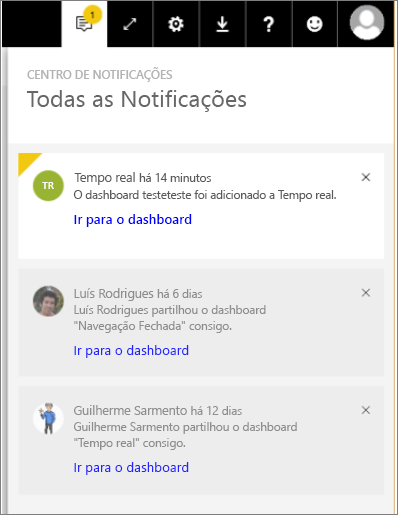

# Ver notificações do Power BI
O Centro de Notificações é um feed sequencial de informações relacionadas com a sua experiência do Power BI. Abra-o para ver mensagens sobre novos dashboards que foram partilhados consigo, alterações ao seu espaço de Grupo, informações sobre eventos e reuniões do Power BI, alertas definidos e muito mais. Pode [definir alertas no serviço Power BI](../service-set-data-alerts.md) e também nas aplicações móveis do Power BI.

Veja Amanda a rever as notificações que recebeu, a gerir as notificações e a responder-lhes. Em seguida, siga as instruções abaixo do vídeo para experimentar.

<iframe width="560" height="315" src="https://www.youtube.com/embed/bZMSv5KAlcE" frameborder="0" allowfullscreen></iframe>

1. Quando iniciar sessão no Power BI, quaisquer novas notificações enviadas para si enquanto esteve offline são adicionadas ao feed. Se tiver novas notificações, o Power BI apresenta uma bolha amarela com o número de novos itens.
   
   
2. Na barra de menus do Power BI, selecione o ícone Notificações.
   
   
3. As notificações são apresentadas com as mais recentes na parte superior e as mensagens não lidas realçadas. As notificações são mantidas durante 90 dias, a menos que as elimine ou atinja o limite máximo de 100.
   
   
4. Para dispensar uma notificação, selecione o ícone X.

### Próximos passos
* [Alertas de dados no serviço Power BI](../service-set-data-alerts.md)
* [Criar um Microsoft Flow acionado por um alerta de dados do Power BI](../service-flow-integration.md)
* [Definir alertas de dados na aplicação do iPhone (Power BI para iOS)](mobile/mobile-set-data-alerts-in-the-mobile-apps.md)
* [Definir alertas de dados na aplicação móvel do Power BI para Windows 10](mobile/mobile-set-data-alerts-in-the-mobile-apps.md)
* Mais perguntas? [Pergunte à Comunidade do Power BI](http://community.powerbi.com/)

