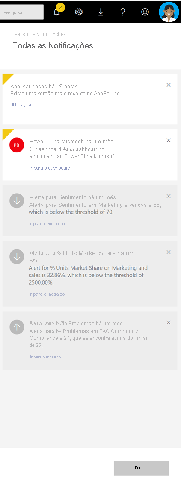

# Ver notificações do Power BI

[!INCLUDE[consumer-appliesto-yynn](../includes/consumer-appliesto-yynn.md)]

O serviço Power BI acompanha os eventos ocorridos desde a última vez que fez login. Isto inclui atualizações para apps, alertas que foram desencadeados em dashboards, informações sobre eventos e reuniões do Power BI e novos conteúdos adicionados aos espaços de trabalho. Uma lista sequencial destes eventos é guardada no seu *centro de notificação.* 

Quando estiver pronto para rever as suas notificações, selecione o ícone da campainha  . As suas notificações estão listadas com a mais recente no topo. Os itens visualizados são mostrados em itens cinzentos e não vistos são realçados e têm um canto amarelo.   

Veja a Margarida a analisar, gerir e responder a notificações. Em seguida, siga as instruções abaixo do vídeo para experimentar.    

> [!NOTE]
> Este vídeo mostra uma versão mais antiga do serviço Power BI. 

<iframe width="560" height="315" src="https://www.youtube.com/embed/bZMSv5KAlcE" frameborder="0" allowfullscreen></iframe>

## Ver as suas notificações
Quando inicia sessão no Power BI, quaisquer novas notificações que tenha recebido enquanto esteve offline são adicionadas ao seu feed. Se tiver novas notificações, o Power BI apresenta uma bolha amarela com o número de novos itens acima do ícone do centro de notificação. Uma vez que o centro de notificações faz parte da barra de menu superior do power BI, pode abrir as suas notificações da maioria das áreas do serviço Power BI, incluindo: Home, Recents, dashboards, reportagens, apps, espaços de trabalho e o Power BI Q&ecrã A.

As notificações são enviadas por uma variedade de razões, e muitas vezes a mesma notificação também lhe é enviada por e-mail. 
- quando uma aplicação foi atualizada e a versão mais recente está disponível
- quando novos conteúdos (por exemplo, dashboard, relatório) foram adicionados a um espaço de trabalho
- quando [um alerta](end-user-alerts.md) foi desencadeado (os alertas podem ser definidos no serviço Power BI e também nas aplicações móveis Power BI.) )
- e muito mais

   
1. Na barra de menu de serviço Power BI, selecione o ícone da campainha. Neste exemplo, o utilizador conta com duas novas notificações desde a última vez que abriu o centro de notificação.
   
   
2. As notificações são apresentadas com as mais recentes na parte superior e as mensagens não lidas realçadas. As notificações são mantidas durante 90 dias, a menos que as elimine ou atinja o limite máximo de 100.
   
   

3. Leia a notificação e tome medidas. A maioria das notificações contém uma ou mais ligações ativas.  O exemplo abaixo contém uma ligação a um dashboard.

   

1. Quando já não precisar de uma notificação, desprete-a selecionando o ícone X.    

 
## Como cancelar uma notificação
Algumas notificações são enviadas automaticamente pelo serviço Power BI. Outras notificações são criadas pelos seus colegas ou por si. Todas as notificações podem ser eliminadas do centro de notificação antes de as ler. Mas, se estiver a receber determinadas notificações com demasiada frequência, ou simplesmente não precisar mais da informação, existem formas de cancelar a entrega. 

Para notificações criadas por si ou pelos seus colegas, pode cancelar as notificações sem eliminar o conteúdo que refere. Por exemplo, para parar de receber um alerta cada vez que as suas "vendas diárias totais" sobem acima de $100, [edite ou cancele o alerta](end-user-alerts.md) do painel de instrumentos. Se o seu colega criou a notificação de alerta, contacte-os e peça para ser removido.

## Próximos passos
* [Alertas de dados no serviço Power BI](end-user-alerts.md)
* [Definir alertas de dados na aplicação para iPhone (Power BI para iOS)](mobile/mobile-set-data-alerts-in-the-mobile-apps.md)
* [Definir alertas de dados na aplicação móvel do Power BI para Windows 10](mobile/mobile-set-data-alerts-in-the-mobile-apps.md)
* Mais perguntas? [Pergunte à Comunidade do Power BI](https://community.powerbi.com/)

