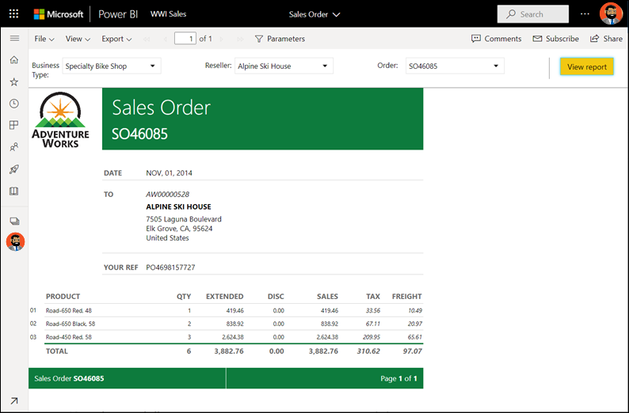
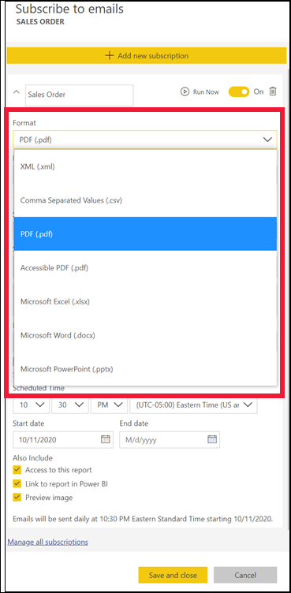

# Relatórios paginados no serviço Power BI

[!INCLUDE[consumer-appliesto-yyny](../includes/consumer-appliesto-yyny.md)]

Aprendeu sobre os [relatórios do Power BI](end-user-reports.md) e esses são os tipos de relatórios que provavelmente irá encontrar. Os relatórios do Power BI estão otimizados para a exploração e a interatividade. Os relatórios do Power BI constituiriam uma melhor solução no caso dos relatórios de vendas em que os diferentes vendedores pretendem segmentar os dados no mesmo relatório pela sua região/indústria/cliente específicos e ver como os números se alteram.

No entanto, existe outro tipo de relatório chamado *relatório paginado* . Para receber e ver relatórios paginados, precisa de uma licença do Power BI Pro para o relatório a guardar na capacidade Premium.  [Saiba mais sobre as licenças](end-user-license.md).  

## Identificar um relatório paginado

Nas listas de conteúdos e na Home Page de destino, os relatórios paginados podem ser identificados pelo ícone .  Um relatório paginado pode ser partilhado consigo diretamente ou como parte de uma [aplicação do Power BI](end-user-apps.md). Se o *designer* de relatórios lhe tiver concedido permissões, poderá partilhar novamente o relatório paginado e subscrever-se, e subscrever outras pessoas.

## O que é um relatório paginado?

Estes relatórios são designados *paginados* porque são formatados para se ajustarem a uma página impressa. Uma vantagem é que apresentam todos os dados numa tabela, mesmo que a tabela ocupe múltiplas páginas. Às vezes, os relatórios paginados são chamados “imagem perfeita”, uma vez que os *designers* de relatórios controlam o esquema de página do relatório com exatidão.

Os relatórios paginados são melhores para os cenários que exigem uma saída de imagem perfeita, altamente formatada e otimizada para impressão ou geração de PDFs. Uma demonstração de resultados é um bom exemplo do tipo de relatório que provavelmente desejaria ver como relatório paginado.

## Como funcionam os relatórios paginados?

Quando os *designers* de relatórios criam um relatório paginado, estão na realidade a criar uma *definição do relatório* . ou seja, não contém os dados, especifica onde obter os dados, quais os dados a obter e como apresentar os dados. Quando executar o relatório, o processador do relatório utiliza a definição do relatório, obtém os dados e combina-os com o esquema de relatório para gerar o relatório. Por vezes, o relatório apresenta dados predefinidos. Outras vezes, tem de introduzir parâmetros para que o relatório possa apresentar dados. 

Selecione um relatório paginado para o abrir no serviço Power BI. Se tiver parâmetros, precisará de os selecionar para poder ver o relatório.

   

Normalmente, a interação limita-se a isso: definir os parâmetros. Se for analista de faturação, pode utilizar relatórios paginados para criar ou imprimir faturas. Se for um gestor de vendas, pode utilizar relatórios paginados para ver as encomendas por loja ou vendedor. 

Este relatório paginado simples gera lucro por ano, após selecionar o parâmetro **Year** . 

Em comparação com os relatórios paginados, os relatórios do Power BI são muito mais interativos. Os relatórios do Power BI permitem a criação de relatórios ad hoc e suportam muitos outros tipos de elementos visuais, incluindo elementos visuais personalizados.

## Interagir com um relatório paginado

A forma como interage com um relatório paginado é diferente de outros relatórios. Pode realizar ações como imprimir, marcar, exportar e comentar, mas existe menos interatividade. Geralmente, os relatórios paginados necessitam de dados introduzidos pelo utilizador para preencher a tela de relatórios.  Noutras ocasiões, o relatório apresenta dados predefinidos e pode introduzir parâmetros para ver dados diferentes.

### Imprimir um relatório paginado

Os relatórios *paginados* são formatados para se ajustarem a uma página que pode ser impressa. O que vê no browser é o que vê quando imprime. Além disso, se o relatório tiver uma tabela longa, a tabela inteira é impressa, mesmo que tenha múltiplas páginas. 

Os relatórios paginados podem ter muitas páginas. Por exemplo, este relatório tem 563 páginas. Cada página está disposta com exatidão, com uma página por fatura e cabeçalhos e rodapés repetidos. Quando imprimir este relatório, irá obter quebras de página entre faturas.

   

### Navegar pelo relatório paginado

Neste relatório de nota de venda, existem três parâmetros: Business type, Reseller e Order number. 

Para alterar as informações a serem apresentadas, introduza novos valores para os três parâmetros e selecione **Ver relatório** . Aqui, selecionámos **Specialty bike shop** , **Alpine Ski House** e o número da encomenda **SO46085** . Selecionar **Ver relatório** atualiza a nossa tela de relatórios com esta nova nota de venda.

A nova nota de venda é apresentada e utiliza os parâmetros que selecionámos. 

Alguns relatórios paginados têm muitas páginas.  Utilize os controlos da página para navegar no relatório. 

### Exportar o relatório paginado
Tem uma variedade de opções para exportar relatórios paginados, incluindo PDF, Word, XML, PowerPoint, Excel e muito mais. Ao exportar, é preservada a maior parte da formatação. Os relatórios paginados exportados para o Excel, Word, PowerPoint, MHTML e PDF, por exemplo, mantêm a formatação perfeita. 

### Subscrever o relatório paginado
Quando subscreve um relatório paginado, o Power BI envia-lhe um e-mail com o relatório como um anexo. Ao configurar a sua subscrição, pode selecionar com que frequência quer receber os e-mails: diariamente, semanalmente, de hora a hora ou mensalmente. A subscrição inclui um anexo com todo o resultado do relatório, até 25 MB. Exporte o relatório inteiro ou selecione os parâmetros antecipadamente. Escolha entre vários tipos de anexos diferentes, incluindo Excel, PDF, PowerPoint e muito mais.  

## Considerações e resolução de problemas

- Um relatório paginado pode aparecer em branco até selecionar parâmetros e selecionar **Ver relatório** .

- Se não tiver relatórios paginados, pode ser porque ninguém partilhou este tipo de relatório consigo. Também pode significar que o administrador do sistema não ativou os relatórios paginados. 

 

## Próximos passos
- [Relatórios do Power BI](end-user-reports.md)
- [Relatórios paginados no Power BI: PERGUNTAS FREQUENTES](../paginated-reports/paginated-reports-faq.md)
- Mais perguntas? Experimente perguntar à [Comunidade do Power BI](https://community.powerbi.com/).
