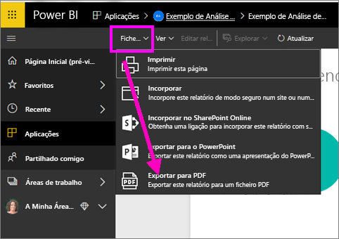
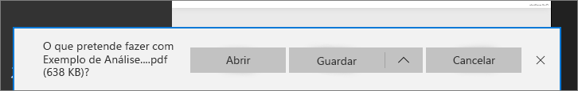

# Exportar relatórios do Power BI para PDF
Com o Power BI, pode publicar o seu relatório em formato PDF e criar facilmente um documento com base no seu relatório do Power BI. Quando **exportar para PDF**, cada página no relatório do Power BI irá tornar-se numa página individual do seu PDF.

## Como exportar o seu relatório do Power BI para PDF
No serviço Power BI, selecione um relatório para apresentá-lo na tela. Também pode selecionar um relatório a partir da secção Página inicial, da secção Aplicações ou de qualquer outra secção no painel de navegação esquerdo.

1. Selecione **Ficheiro** > **Exportar para PDF** na barra de menus.

    

    Será apresentado um pop-up onde poderá selecionar a opção **Vista atual** ou **Vista predefinida**.  A opção **Vista atual** exporta o relatório no estado atual, que inclui as alterações ativas que efetuou na segmentação de dados e nos valores de filtro.  A maioria dos utilizadores seleciona esta opção.  Em alternativa, ao selecionar a opção **Vista predefinida** exporta o relatório no estado original (conforme partilhado pelo autor) e não reflete as alterações que tiver efetuado ao estado original.
    
    Além disso, existe uma caixa de verificação para selecionar se quer exportar os separadores ocultos de um relatório.  Selecione esta caixa se quiser exportar apenas os separadores do relatório que estiverem visíveis no seu browser.  Se preferir obter todos os separadores ocultos como parte da exportação, pode manter a caixa desselecionada.  Se a caixa de verificação aparecer a cinzento, significa que não existem separadores ocultos no relatório.  Após efetuar as suas seleções, clique no botão Exportar para continuar.
    
    É apresentada uma barra de progresso no canto superior direito. A exportação poderá demorar alguns minutos e poderá continuar a trabalhar no Power BI enquanto o relatório estiver a ser exportado.

    

    Quando a exportação for concluída, a faixa de notificação será alterada para informar que o serviço Power BI concluiu o processo de exportação.

2. Quando isto acontecer, o seu ficheiro ficará disponível onde o browser mostra os ficheiros descarregados. Na imagem seguinte, é mostrado como faixa de transferência na parte inferior da janela do browser.

    

E é tudo. Pode transferir o ficheiro e abri-lo com qualquer visualizador de PDFs, como o que está disponível no Microsoft Edge.

## Limitações e considerações
Há algumas observações e limitações a ter em conta ao trabalhar com a funcionalidade **Exportar para PDF**.

* Os **visuais R** não são atualmente suportados. No PDF, estes elementos visuais irão estar em branco e será apresentada uma mensagem de erro.  

* Os **visuais personalizados** que tenham sido **certificados** são suportados. Para obter mais informações sobre visuais personalizados certificados, incluindo como certificar um visual personalizado, consulte [certificar um visual personalizado](../power-bi-custom-visuals-certified.md). Não são suportados elementos visuais personalizados que não tenham sido certificados. No PDF, estes serão apresentados com uma mensagem de erro.   

* Atualmente, não pode exportar relatórios com mais de 30 páginas.

* O processo de exportação do relatório para PDF pode demorar alguns minutos, pelo que pedimos que aguarde pacientemente. Os fatores que podem afetar o tempo necessário incluem a estrutura do relatório e a carga atual no serviço Power BI.

* Se o item de menu **Exportar para PDF** não estiver disponível no serviço Power BI, tal poderá dever-se ao facto de o seu administrador de inquilinos ter desativado a funcionalidade. Contacte o seu administrador de inquilinos para obter informações.

* As imagens de fundo serão recortadas com a área delimitadora do gráfico. Recomenda-se vivamente que remova as imagens de fundo antes de exportar para PDF.

* Os relatórios pertencentes a um utilizador fora do seu domínio de inquilino do Power BI (por exemplo, um relatório pertencente a alguém fora da sua organização e partilhado consigo) não podem ser publicados em PDF.

* Se partilhar um dashboard com alguém fora da sua organização (e, portanto, um utilizador que não esteja no seu inquilino do Power BI), esse utilizador já não poderá exportar os relatórios associados do dashboard partilhado para PDF. Por exemplo, se for aaron@contoso.com, pode partilhar com cassie@cohowinery.com. No entanto, cassie@cohowinery.com não poderá exportar os relatórios associados para PDF.

* Ao exportar para PDF com relatórios que contenham uma imagem de fundo, poderá ver uma imagem distorcida na exportação se estiver a utilizar as opções "Normal" ou "Ajustar" para o Fundo de Página.  Para obter os melhores resultados, recomenda-se que utilize a opção "Ajustar" para evitar problemas no documento exportado.

* O serviço Power BI utiliza a sua definição de idioma do Power BI como o idioma da exportação para PDF. Para ver ou definir a sua preferência de idioma, selecione o ícone de engrenagem > **Definições** > **Geral** > **Idioma**.

* Os filtros de URL não são atualmente respeitados quando seleciona “Valores Atuais” na exportação.

## Próximos passos
[Imprimir um relatório](end-user-print.md)
