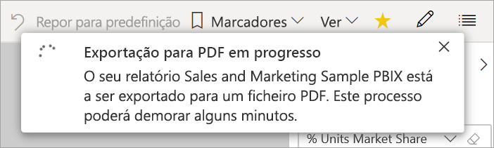

# Exportar relatórios do Power BI para PDF

[!INCLUDE [power-bi-service-new-look-include](../includes/power-bi-service-new-look-include.md)]

Com o Power BI, pode publicar o seu relatório para o formato PDF e criar facilmente um documento baseado no seu relatório do Power BI. Quando exporta para PDF, cada página do relatório do Power BI torna-se uma página individual no seu documento PDF.

## Exportar o seu relatório do Power BI para PDF
No serviço Power BI, selecione um relatório para apresentá-lo na tela. Também pode selecionar um relatório a partir do contentor **Página inicial**, do contentor **Aplicações** ou de qualquer outro contentor do painel de navegação.

1. Selecione **Exportar** > **PDF** na barra de menus.

    

    Será apresentado um pop-up onde terá a opção de selecionar **Valores atuais** ou **Valores predefinidos**. A opção **Valores atuais** exporta o relatório no estado atual, que inclui as alterações ativas que efetuou na segmentação de dados e nos valores de filtro. A maioria dos utilizadores seleciona esta opção. Em alternativa, selecionar **Valores predefinidos** exporta o relatório no respetivo estado original, tal como o *criador* o partilhou, e não reflete nenhuma alteração que tenha feito a esse estado original.
    
    Além disso, existe uma caixa de verificação para selecionar se quer exportar os separadores ocultos de um relatório. Selecione esta caixa de verificação se quiser exportar apenas os separadores do relatório que estiverem visíveis no seu browser. Se preferir incluir todos os separadores ocultos na sua exportação, pode deixar esta caixa de verificação desselecionada. Se a caixa de verificação aparecer a cinzento, significa que não existem separadores ocultos no relatório. Depois de fazer as suas seleções, selecione **Exportar** para continuar.
    
    É apresentada uma barra de progresso no canto superior direito. A exportação poderá demorar alguns minutos. Pode continuar a trabalhar no Power BI enquanto o relatório estiver a ser exportado.

    

    Quando o serviço Power BI conclui o processo de exportação, a faixa de notificação é alterada para o informar.

2. Quando isto acontecer, o seu ficheiro ficará disponível onde o browser mostra os ficheiros descarregados. Na imagem seguinte, é mostrado como faixa de transferência na parte inferior da janela do browser.

    

E é tudo. Pode transferir o ficheiro e abri-lo com qualquer visualizador de PDFs, como o que está disponível no Microsoft Edge.

## Limitações e considerações
Existem algumas considerações e limitações a ter em conta ao trabalhar com a funcionalidade **Exportar para PDF**.

* Os elementos visuais Python e R não são atualmente suportados. No PDF, estes elementos visuais estão em branco e apresentam uma mensagem de erro. 
* Os elementos visuais personalizados que tiverem sido certificados são suportados. Para obter mais informações sobre os elementos visuais personalizados certificados, incluindo como certificar um elemento visual, veja [Certificar um elemento visual personalizado](../developer/power-bi-custom-visuals-certified.md). Não são suportados elementos visuais personalizados que não tenham sido certificados. No PDF, são apresentados com uma mensagem de erro.
* O elemento visual ESRI não é suportado
* Os relatórios com mais de 30 páginas não podem ser exportados atualmente.
* O processo de exportar o relatório para PDF pode demorar alguns minutos a ser concluído, por isso pedimos que seja paciente. Os fatores que podem afetar o tempo necessário incluem a estrutura do relatório e a carga atual no serviço Power BI.
* Se o item de menu **Exportar para PDF** não estiver disponível no serviço Power BI, é provável que o seu administrador de inquilinos tenha desativado a funcionalidade. Contacte o seu administrador de inquilinos para obter informações.
* As imagens de fundo serão recortadas de acordo com a área delimitadora do gráfico. Recomendamos que remova as imagens de fundo antes de exportar para PDF.
* Os relatórios pertencentes a um utilizador fora do seu domínio de inquilino do Power BI (por exemplo, um relatório pertencente a alguém fora da sua organização e partilhado consigo) não podem ser publicados para PDF.
* Se partilhar um dashboard com alguém fora da sua organização (e, portanto, um utilizador que não está no seu inquilino do Power BI), esse utilizador não poderá exportar os relatórios associados do dashboard partilhado para PDF. Por exemplo, se for aaron@contoso.com, pode partilhar com cassie@cohowinery.com. No entanto, cassie@cohowinery.com não pode exportar os relatórios associados para PDF.
* Quando exportar para PDF relatórios que contêm uma imagem de fundo, poderá ver uma imagem distorcida na exportação, se utilizar as opções **Normal** ou **Preenchimento** para a definição **Fundo da Página**. Para obter os melhores resultados, utilize a opção **Ajustar** para evitar problemas com o documento exportado.
* O serviço Power BI utiliza a sua definição de idioma do Power BI como o idioma da exportação para PDF. Para ver ou definir a sua preferência de idioma, selecione o ícone de engrenagem  > **Definições** > **Geral** > **Idioma**.
* Os filtros de URL não são atualmente respeitados quando seleciona **Valores Atuais** na exportação.
* Os relatórios com tamanhos de página invulgares podem causar problemas em cenários de exportação. Para obter melhores resultados, pondere mudar o seu relatório para um tamanho de página padrão.
* Na exportação para PDF, os tipos de letra personalizados em temas que utilizem os mesmos serão substituídos por um tipo de letra predefinido.
* Embora procuremos proporcionar uma experiência consistente, não podemos garantir que o PDF exportado do serviço Power BI irá sempre corresponder ao PDF exportado de um ficheiro local do Power BI Desktop.

## Próximos passos
[Imprimir um relatório](end-user-print.md)
