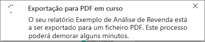

# Exportar relatórios do Power BI para PDF
Com o Power BI, pode publicar o seu relatório em formato PDF e criar facilmente um documento com base no seu relatório do Power BI. Quando **exportar para PDF**, cada página no relatório do Power BI irá tornar-se numa página individual do seu PDF.

## Como exportar o seu relatório do Power BI para PDF
No serviço Power BI, selecione um relatório para apresentá-lo na tela. Também pode selecionar um relatório a partir da secção Página inicial, da secção Aplicações ou de qualquer outra secção no painel de navegação esquerdo.

1. Selecione **Ficheiro** > **Exportar para PDF** na barra de menus.

    

    É apresentada uma barra de progresso no canto superior direito. A exportação poderá demorar alguns minutos e poderá continuar a trabalhar no Power BI enquanto o relatório estiver a ser exportado.

    

    Quando a exportação for concluída, a faixa de notificação será alterada para informar que o serviço Power BI concluiu o processo de exportação.

2. Quando isto acontecer, o seu ficheiro ficará disponível onde o browser mostra os ficheiros descarregados. Na imagem seguinte, é mostrado como faixa de transferência na parte inferior da janela do browser.

    

E é tudo. Pode transferir o ficheiro e abri-lo com qualquer visualizador de PDFs, como o que está disponível no Microsoft Edge.

## Limitações e observações
Há algumas observações e limitações a ter em conta ao trabalhar com a funcionalidade **Exportar para PDF**.

- A interatividade em sessão (como realçar, filtrar e desagregar, entre outros) ainda não é suportada ao exportar para PDF. O PDF exportado mostra os elementos visuais originais conforme estes foram guardados no relatório. Se tiver aplicado filtros e segmentações de dados e quiser mantê-los ao realizar a exportação, guarde o relatório antes de efetuar este processo.

* Os **visuais R** não são atualmente suportados. No PDF, estes elementos visuais irão estar em branco e será apresentada uma mensagem de erro.  

* Os **visuais personalizados** que tenham sido **certificados** são suportados. Para obter mais informações sobre visuais personalizados certificados, incluindo como certificar um visual personalizado, consulte [certificar um visual personalizado](../power-bi-custom-visuals-certified.md). Não são suportados elementos visuais personalizados que não tenham sido certificados. No PDF, estes serão apresentados com uma mensagem de erro.   

* Atualmente, não pode exportar relatórios com mais de 30 páginas.

* O processo de exportação do relatório para PDF pode demorar alguns minutos, pelo que pedimos que aguarde pacientemente. Os fatores que podem afetar o tempo necessário incluem a estrutura do relatório e a carga atual no serviço Power BI.

* Se o item de menu **Exportar para PDF** não estiver disponível no serviço Power BI, tal poderá dever-se ao facto de o seu administrador de inquilinos ter desativado a funcionalidade. Contacte o seu administrador de inquilinos para obter informações.

* As imagens de fundo serão recortadas com a área delimitadora do gráfico. Recomenda-se vivamente que remova as imagens de fundo antes de exportar para PDF.

* Os relatórios pertencentes a um utilizador fora do seu domínio de inquilino do Power BI (por exemplo, um relatório pertencente a alguém fora da sua organização e partilhado consigo) não podem ser publicados em PDF.

* Se partilhar um dashboard com alguém fora da sua organização (e, portanto, um utilizador que não esteja no seu inquilino do Power BI), esse utilizador já não poderá exportar os relatórios associados do dashboard partilhado para PDF. Por exemplo, se for aaron@contoso.com, poderá partilhar com cassie@cohowinery.com. No entanto, cassie@cohowinery.com não poderá exportar os relatórios associados para PDF.

* O serviço Power BI utiliza a sua definição de idioma do Power BI como o idioma da exportação para PDF. Para ver ou definir a sua preferência de idioma, selecione o ícone de engrenagem > **Definições** > **Geral** > **Idioma**.

## Próximos passos
[Imprimir um relatório](end-user-print.md)