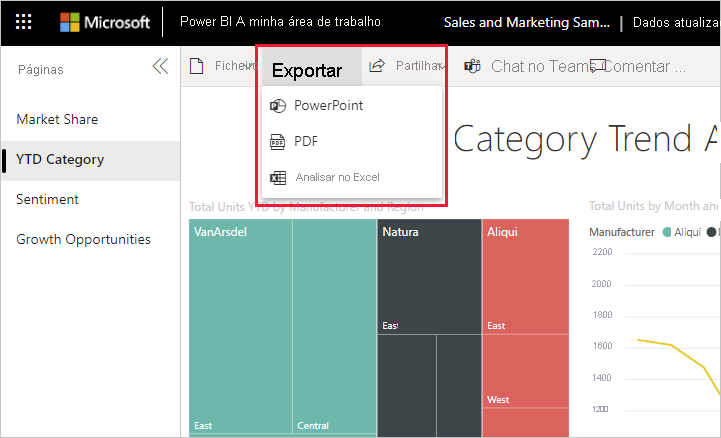

# Exportar relatórios para o PowerPoint

[!INCLUDE[consumer-appliesto-yynn](../includes/consumer-appliesto-yynn.md)]

Com o serviço Power BI (app.powerbi.com), pode publicar o seu relatório no Microsoft PowerPoint e criar facilmente um conjunto de diapositivos com base no seu relatório do Power BI. Quando exporta para o PowerPoint, acontece o seguinte:

* Cada página no relatório do Power BI torna-se um diapositivo no PowerPoint.
* Cada página no relatório do Power BI é exportada como uma só imagem de alta resolução no PowerPoint.
* Pode preservar as definições de filtragem e de segmentação de dados que adicionou ao relatório.
* É criada uma ligação no PowerPoint que direciona para o relatório do Power BI.

É rápido exportar o seu **relatório do Power BI** para o **PowerPoint**. Siga os passos descritos na secção seguinte.

Também pode copiar um elemento visual de cada vez a partir do serviço Power BI e colá-lo no PowerPoint (ou em qualquer outro programa que suporte a ação colar). Selecione o ícone **Copiar como imagem** para copiar o elemento visual para a sua área de transferência. Em seguida, abra o PowerPoint e cole o elemento visual. Para obter mais informações, veja [Copiar elementos visuais como imagens estáticas](../visuals/power-bi-visualization-copy-paste.md).

## Exportar o seu relatório do Power BI para o PowerPoint
No **serviço Power BI**, selecione um relatório para apresentá-lo na tela. Também pode selecionar um relatório a partir do contentor **Página inicial**, **Aplicações** ou de qualquer outro contentor do painel de navegação.

[!INCLUDE [power-bi-service-new-look-include](../includes/power-bi-service-new-look-include.md)]

Quando o relatório que pretende exportar para o PowerPoint for apresentado na tela, selecione **Ficheiro** > **Exportar para o PowerPoint** a partir da barra de menus.

Será apresentado um pop-up onde terá a opção de selecionar **Valores atuais** ou **Valores predefinidos**. A opção **Valores atuais** exporta o relatório no estado atual, que inclui as alterações ativas que efetuou na segmentação de dados e nos valores de filtro.  A maioria dos utilizadores seleciona esta opção. Se tiver utilizado a barra de deslocamento, o campo **Valores atuais** não incluirá o estado de deslocamento do elemento visual, exportará antes a parte superior dos dados. Em alternativa, selecionar a opção **Valores predefinidos** exporta o relatório no estado original (conforme partilhado pelo *designer*) e não reflete as alterações que tiver feito ao estado original.

 
Além disso, existe uma caixa de verificação para selecionar se quer exportar os separadores ocultos de um relatório. Selecione esta caixa de verificação se quiser exportar apenas os separadores do relatório que estiverem visíveis no seu browser. Se preferir incluir todos os separadores ocultos na exportação, mantenha esta caixa de verificação desselecionada. Se a caixa de verificação aparecer a cinzento, significa que não existem separadores ocultos no relatório. Um exemplo de separador oculto seria um separador de descrição. As [descrições personalizadas](../create-reports/desktop-tooltips.md) são criadas por *designers* de relatórios e não são apresentadas como separadores de relatório no serviço Power BI para *consumidores*. 

Depois de fazer as suas seleções, selecione **Exportar** para continuar. Verá uma faixa de notificação no canto superior direito da janela de browser do serviço Power BI a informar que o relatório está a ser exportado para o PowerPoint. 

A exportação poderá demorar alguns minutos. Os fatores que podem afetar o tempo necessário incluem a estrutura do relatório e a carga atual no serviço Power BI. Pode continuar a trabalhar no Power BI enquanto o relatório estiver a ser exportado.

Quando o serviço Power BI concluir o processo de exportação, a faixa de notificação será alterada para o informar. Quando isto acontecer, o seu ficheiro ficará disponível onde o browser mostra os ficheiros descarregados. Na imagem seguinte, é mostrado como faixa de transferência na parte inferior da janela do browser.

E é tudo. Pode transferir o ficheiro, abri-lo com o PowerPoint e, em seguida, modificar ou melhorá-lo tal como faria com qualquer outro conjunto de diapositivos do PowerPoint.

## Abrir o ficheiro PowerPoint
Quando abrir o ficheiro PowerPoint que o Power BI exportou, tem alguns elementos úteis à disposição. Veja a seguinte imagem e consulte os elementos numerados que descrevem algumas destas funcionalidades úteis. As páginas no PowerPoint são sempre criadas no tamanho padrão de 9:16, independentemente dos tamanhos ou dimensões de página originais no relatório do Power BI.

1. A primeira página do conjunto de diapositivos inclui o nome do seu relatório e uma ligação que lhe permite **Ver no Power BI** o relatório no qual o conjunto de diapositivos se baseia.
2. Também obterá algumas informações úteis sobre o relatório. **Última atualização dos dados** mostra a data e hora em que o relatório exportado se baseia. **Transferido às** mostra a data e hora em que o relatório do Power BI foi exportado para um ficheiro do PowerPoint. A hora de **Transferido a** está definida como o fuso horário do computador no momento da exportação.

3. Cada página do relatório é um diapositivo diferente, conforme apresentado no painel de navegação. 
4. O relatório publicado é composto no idioma das suas definições do Power BI ou da definição de região do seu browser. Para ver ou definir a sua preferência de idioma, selecione o ícone de engrenagem  > **Definições** > **Geral** > **Idioma**. Para obter informações sobre a região, veja [Idiomas e países/regiões com suporte no Power BI](../fundamentals/supported-languages-countries-regions.md).

Quando vê um diapositivo individual, verá que cada página do relatório é uma imagem independente. O deslocamento no PowerPoint não está disponível, dado que cada diapositivo é uma imagem estática.

A partir daí, pode fazer o que quiser com o conjunto do PowerPoint ou com as imagens de alta resolução.

## Considerações e resolução de problemas
Existem algumas considerações e limitações a ter em conta ao trabalhar com a funcionalidade **Exportar para o PowerPoint**.
 

* Se não vir a opção **Exportar**, certifique-se de que ativou "Novo aspeto" e de que está a ver um relatório (e não um dashboard).

    

* Os [filtros de URL](../collaborate-share/service-url-filters.md) não são atualmente respeitados quando escolhe **Valores Atuais** na exportação.

* Ao exportar para o PowerPoint, se o relatório utilizar um tipo de letra personalizado, esse tipo de letra será substituído por um tipo de letra predefinido.

* Os seguintes elementos visuais não são suportados e não serão exportados para o PowerPoint:
   - Não são suportados [elementos visuais personalizados que não tenham sido certificados](../developer/visuals/power-bi-custom-visuals-certified.md). 
   - O [elemento visual ArcGIS ESRI](../visuals/power-bi-visualizations-arcgis.md) não é suportado
   - Os elementos visuais R e Python não são suportados.
   - As imagens de fundo serão recortadas de acordo com a área delimitadora do gráfico. Recomendamos que remova as imagens de fundo antes de exportar para o PowerPoint.

* Alguns relatórios não podem ser exportados. Incluem-se:
    - Os relatórios pertencentes a um utilizador fora do domínio de inquilino do Power BI, por exemplo, um relatório pertencente a alguém fora da sua organização e partilhado consigo.
    - Se partilhar um dashboard com alguém fora da sua organização (e, portanto, um utilizador que não está no seu inquilino do Power BI), esse utilizador não poderá exportar os relatórios associados do dashboard partilhado para o PowerPoint. Por exemplo, se for aaron@contoso.com, pode partilhar com david@cohowinery.com. No entanto, david@cohowinery.com não poderá exportar os relatórios associados para o PowerPoint.
    - Relatórios com mais de 30 página. Apenas as primeiras 30 páginas serão exportadas.
    - Os relatórios que estão a ser exportados para versões mais antigas do PowerPoint.
    - Relatórios que demoram mais de uma hora a processar. 
    - Páginas de relatório que demoram mais de 6 minutos a carregar. 

* Se o item de menu **Exportar para PowerPoint** não estiver disponível no serviço Power BI, é provável que o seu administrador de inquilinos tenha desativado a funcionalidade. Contacte o seu administrador de inquilinos para obter informações.
* O serviço Power BI utiliza a sua definição de idioma do Power BI como o idioma da exportação do PowerPoint. Para ver ou definir a sua preferência de idioma, selecione o ícone de engrenagem  > **Definições** > **Geral** > **Idioma**.

## Próximos passos
[Copiar elementos visuais como imagens estáticas](../visuals/power-bi-visualization-copy-paste.md)    
[Imprimir um relatório](end-user-print.md)
