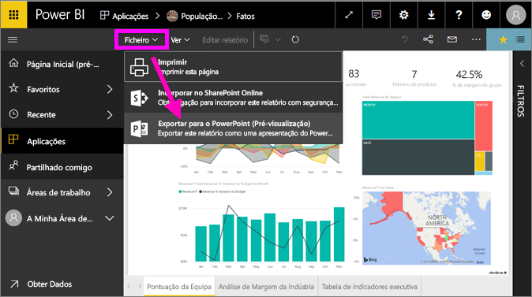

# Exportar relatórios do Power BI para o PowerPoint
Com o Power BI, pode publicar o seu relatório no **Microsoft PowerPoint** e criar facilmente um conjunto de diapositivos com base no seu relatório do Power BI. Quando **exportar para o PowerPoint**, acontece o seguinte:

* Cada página no relatório do Power BI torna-se um diapositivo no PowerPoint
* Cada página no relatório do Power BI é exportada como uma imagem de alta resolução única no PowerPoint <!-- * The filters and slicers settings that you added to the report are preserved. -->
* É criada uma ligação no PowerPoint que direciona para o relatório do Power BI 

É rápido exportar o seu **relatório do Power BI** para o **PowerPoint**. Basta seguir os passos enumerados na secção seguinte.

## Como exportar o seu relatório do Power BI para o PowerPoint
No serviço Power BI, selecione um relatório para apresentá-lo na tela. Também pode selecionar um relatório a partir da sua **Página Inicial**, **Aplicações** ou qualquer outra secção no painel de navegação esquerdo.

Quando o relatório que quer exportar para o PowerPoint for apresentado na tela, selecione **Ficheiro > Exportar para o PowerPoint** a partir da barra de menus no serviço Power BI.

Irá ver uma faixa de notificação no canto superior direito da janela de browser do serviço Power BI a informar que o relatório está a ser exportado para o PowerPoint. Poderão demorar alguns minutos e pode continuar a trabalhar no Power BI enquanto o relatório estiver a ser exportado.

Quando a exportação for concluída, a faixa de notificação será alterada para informar que o serviço Power BI concluiu o processo de exportação.

Quando isto acontecer, o seu ficheiro ficará disponível onde o browser mostra os ficheiros descarregados. Na imagem seguinte, é mostrado como faixa de transferência na parte inferior da janela do browser.

E é tudo. Pode transferir o ficheiro, abri-lo com o PowerPoint e, em seguida, modificá-lo ou melhorá-lo tal como faria com outro conjunto do PowerPoint.

## Consultar o ficheiro PowerPoint exportado
Quando abrir o ficheiro PowerPoint que o Power BI exportou, tem alguns elementos úteis à disposição. Veja a imagem seguinte e consulte os elementos numerados abaixo que descrevem algumas destas funcionalidades úteis.

1. A primeira página do conjunto de diapositivos inclui o nome do seu relatório e uma ligação que lhe permite **Ver no Power BI** o relatório no qual o conjunto de diapositivos se baseia.
2. Obtém também algumas informações úteis sobre o relatório, incluindo a *última atualização de dados* na qual o relatório exportado se baseia e a data e hora de *transferência*, que corresponde à data e hora em que o relatório do Power BI foi exportado para um ficheiro PowerPoint.
3. Cada página do relatório é um diapositivo diferente, conforme apresentado no painel de navegação à esquerda. 
4. O relatório publicado é composto no idioma das suas definições do Power BI ou da definição de região do seu browser. Para ver ou definir a sua preferência de idioma, selecione o ícone de engrenagem  **> Definições > Geral > Idioma**. Para obter informações sobre a região, veja [Idiomas e países/regiões com suporte no Power BI](../supported-languages-countries-regions.md).
5. A apresentação do PowerPoint inclui um diapositivo de capa com a hora exportada no fuso horário correto.

Quando aceder a um diapositivo individual, irá reparar que cada página do relatório é uma imagem diferente.

>[!NOTE]
> Ter um visual para cada página do relatório é um comportamento novo. O comportamento anterior, que fornecia uma imagem independente para cada visual, já não está implementado. 
 

O que fazer com o conjunto do PowerPoint a partir daí, ou com as imagens de alta resolução, é decisão sua!

## Limitações
Há algumas considerações e limitações a ter em conta ao trabalhar com a funcionalidade **Exportar para o PowerPoint**.

* A interatividade em sessão, como realçar e filtrar, desagregar, entre outros, ainda não é suportada ao exportar para o PowerPoint. O PowerPoint exportado mostra os visuais originais conforme estes foram guardados no relatório. Se tiver aplicado filtros e segmentações de dados e quiser isso preservado na exportação, guarde o relatório e, em seguida, faça a exportação.
* Os **visuais R** não são atualmente suportados. Estes visuais são exportados como imagem em branco para o PowerPoint com uma mensagem de erro a indicar que o visual não é suportado.
* Os **visuais personalizados** que tenham sido **certificados** são suportados. Para obter mais informações sobre visuais personalizados certificados, incluindo como certificar um visual personalizado, consulte [certificar um visual personalizado](../power-bi-custom-visuals-certified.md). Os visuais personalizados que não tenham sido certificados não são suportados, sendo exportados como imagem em branco para o PowerPoint com uma mensagem de erro a indicar que o visual não é suportado.
* Atualmente, não pode exportar relatórios com mais de 30 páginas.
* O processo de exportar o relatório para o PowerPoint pode demorar alguns minutos, pelo que pedimos que seja paciente. Os fatores que podem afetar o tempo necessário incluem a estrutura do relatório e a carga atual no serviço Power BI.
* Se o item de menu **Exportar para PowerPoint** não estiver disponível no serviço Power BI, tal poderá dever-se ao facto de o seu administrador de inquilinos ter desativado a funcionalidade. Contacte o seu administrador de inquilino para obter informações.
* As imagens de fundo serão recortadas com a área delimitadora do gráfico. Recomenda-se vivamente que remova as imagens de fundo antes de exportar para o PowerPoint.
* As páginas no PowerPoint são sempre criadas no tamanho padrão de 9:16, independentemente dos tamanhos ou dimensões de página originais no relatório do Power BI.
* Os relatórios pertencentes a um utilizador fora do seu domínio de inquilino do Power BI (por exemplo, um relatório pertencente a alguém fora da sua organização e partilhado consigo) não podem ser publicados no PowerPoint.
* Se partilhar um dashboard com alguém fora da sua organização (e, portanto, um utilizador que não esteja no seu inquilino do Power BI), esse utilizador já não poderá exportar os relatórios associados do dashboard partilhado para o PowerPoint. Por exemplo, se for aaron@contoso.com, pode partilhar com david@cohowinery.com. No entanto, david@cohowinery.com não pode exportar os relatórios associados para o PowerPoint.
* Como anteriormente mencionado, cada página do relatório é exportada como uma imagem única no ficheiro do PowerPoint.
* O serviço Power BI utiliza a sua definição de idioma do Power BI como o idioma da exportação do PowerPoint. Para ver ou definir a sua preferência de idioma, selecione o ícone de engrenagem  **> Definições > Geral > Idioma**.
* A hora em **Transferido às** no diapositivo da capa do ficheiro PowerPoint exportado está definida para o fuso horário do seu computador na altura da exportação.

## Próximos passos
[Imprimir um relatório](end-user-print.md)