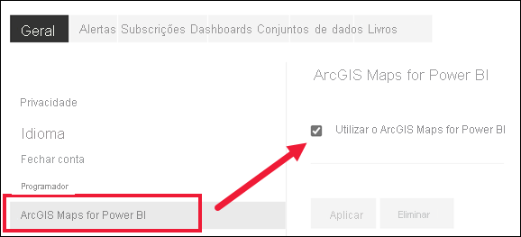

# Optar ativamente por participar na pré-visualização de funcionalidades do serviço Power BI

[!INCLUDE[consumer-appliesto-yynn](../includes/consumer-appliesto-yynn.md)]

## O que são *funcionalidades de pré-visualização*?
À medida que melhoramos o serviço Power BI, vamos lançar algumas novas funcionalidades como *funcionalidades de pré-visualização*. As funcionalidades de pré-visualização podem ser ativadas e desativadas, dando-lhe a oportunidade de experimentá-las.

Algumas funcionalidades de pré-visualização podem ser ativadas e desativadas do dashboard, do separador Home Page ou do próprio relatório do Power BI. Estão também disponíveis outras funcionalidade de pré-visualização no menu *Definições*. Este artigo mostra como aceder às funcionalidades de pré-visualização através do menu Definições.

## Encontre pré-visualizações e ative-as (ou desative-as)
1. Abra o menu de Definições ao selecionar o ícone de engrenagem no canto superior direito do ecrã do Power BI e selecione **Definições**.
   
   .
2. Selecione o separador **Geral**. Se existirem pré-visualizações, verá a opção **Funcionalidades de pré-visualização** ou verá uma funcionalidade de pré-visualização listada no lado esquerdo.  Neste exemplo, existe uma pré-visualização listada para o ArcGIS Maps. 
   
   
3. Selecione o botão de opção **Ativar** ou marque a caixa de verificação para testar a nova experiência. Em seguida, selecione **Aplicar**.
4. Para desativar as funcionalidades de pré-visualização, siga os passos 1 a 3 acima e, no passo 3, selecione **Desativar** ou remova a marca de verificação e selecione **Aplicar**.

Tem perguntas ou comentários? [Visite o fórum da comunidade do Power BI](https://community.powerbi.com/t5/Navigation-Preview-Forum/bd-p/NavigationPreview).

