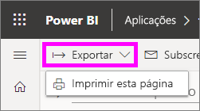
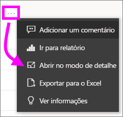
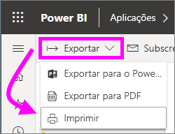

# Imprimir a partir do serviço Power BI

[!INCLUDE [power-bi-service-new-look-include](../includes/power-bi-service-new-look-include.md)]

Imprima um dashboard completo, um mosaico do dashboard, uma página de relatório ou um elemento visual de um relatório a partir do serviço Power BI. Os relatórios só podem ser impressos uma página de cada vez. Não pode imprimir todo o relatório de uma só vez.

   > [!NOTE]
   > A caixa de diálogo de impressão que é apresentada depende do browser que está a utilizar.
   > 
## Imprimir um dashboard
1. Abra o dashboard que quer imprimir.
2. No canto superior esquerdo, selecione Exportar e **Imprimir esta página**.
   
    
3. A janela Imprimir do browser abre. Escolha as definições e o destino de impressão, e selecione **Imprimir**.
   

   
    

## Imprimir um mosaico do dashboard
1. Abra o dashboard no [modo de ecrã inteiro](end-user-focus.md) ao selecionar o ícone de ecrã inteiro  na barra de menus superior.
3. [Abra o mosaico no Modo de detalhe](end-user-focus.md) ao pairar o rato para apresentar **Mais opções** (...) e ao selecionar **Abrir no modo de detalhe** ou o ícone de detalhe .
   
    
4. Paire o rato sobre o mosaico para revelar o menu de Opções.
   
    
4. Selecione o ícone de impressão .     
   

## Imprimir uma página de relatório
Os relatórios podem ser impressos uma página de cada vez.

1. Abra o relatório e selecione **Exportar** > **Imprimir** para imprimir a página de relatório atual.
   
    
3. A janela Imprimir do browser abre.
   

## Imprimir um elemento visual de relatório
1. [Abra o elemento visual no Modo de detalhe](end-user-focus.md) ao pairar o rato sobre o mosaico e selecionar o ícone de Detalhe  no canto superior direito.

2. No canto superior esquerdo, selecione **Exportar** > **Imprimir** para imprimir o elemento visual.

    

## Considerações e resolução de problemas

* P: Não consigo imprimir todas as páginas do relatório de uma só vez.    
* R: Está correto. As páginas do relatório só podem ser impressas uma página de cada vez.
* P: Não consigo imprimir em PDF.    
* R: Esta opção só é apresentada se já tiver configurado o controlador de PDF no seu browser.    
* P: O que vejo quando seleciono **Imprimir** não corresponde ao que estão a mostrar aqui.    
* R: Os ecrãs de impressão variam consoante o browser e a versão do software.
* P: A minha impressão não é dimensionada corretamente.  O meu dashboard não cabe na página. Outras perguntas sobre dimensionamento e orientação.    
* R: Não podemos garantir que a cópia impressa será exatamente igual ao que é apresentado no serviço Power BI. Aspetos como o dimensionamento, as margens, os detalhes visuais, a orientação e o tamanho não são controlados pelo Power BI. Para obter ajuda com problemas como este, consulte a documentação relativa ao seu browser específico.      

## Próximos passos
[Partilhar dashboards e relatórios com colegas e outras pessoas](../service-share-dashboards.md)

Mais perguntas? [Pergunte à Comunidade do Power BI](http://community.powerbi.com/)

