# Imprimir a partir do serviço Power BI

[!INCLUDE[consumer-appliesto-yynn](../includes/consumer-appliesto-yynn.md)]
## O que pode ser impresso
[!INCLUDE [power-bi-service-new-look-include](../includes/power-bi-service-new-look-include.md)]

Imprima um dashboard completo, um mosaico do dashboard, uma página de relatório ou um elemento visual de um relatório a partir do serviço Power BI. Se o seu relatório tiver mais do que uma página, terá de imprimir cada página em separado. 

## Considerações sobre impressão

A maioria dos dashboards e relatórios do Power BI são criados por *designers* de relatórios para serem utilizados online e terem um aspeto fantástico quando são apresentados em vários dispositivos. Quando imprime um relatório, a forma como esse conteúdo é apresentado no papel é controlado pelo seu browser. 

Pode utilizar definições do browser para ajustar a impressão, mas, mesmo assim, poderá não conseguir obter o resultado pretendido. Considere [exportar para PDF](end-user-pdf.md) primeiro e, depois, imprimir o PDF. 

## Ajustar as definições de impressão do browser
Quando imprime a partir do Power BI, o seu browser abre a janela Imprimir. Cada browser tem uma janela Imprimir diferente. Contudo, verá que todas têm opções semelhantes que poderá utilizar para controlar o aspeto da sua impressão. 

Seguem-se algumas dicas rápidas que pode utilizar para formatar a sua impressão.

   > 
1. Se a largura do seu dashboard, relatório ou elemento visual for superior à altura do mesmo, considere utilizar o esquema **Horizontal**. 

   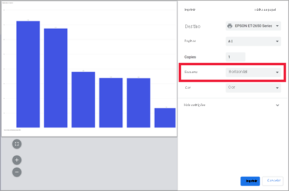

2. Para incluir mais elementos numa página impressa, ajuste aspetos como as margens e a escala. 

    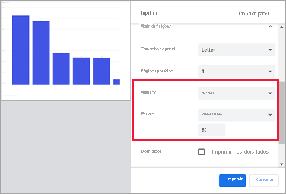

Teste as definições do seu browser até obter o aspeto pretendido. Alguns browsers têm inclusivamente opções para imprimir gráficos de fundo. 

## Imprimir um dashboard
1. Abra o dashboard que quer imprimir.
2. No canto superior esquerdo, selecione **Ficheiro** e escolha **Imprimir esta página**.
   
    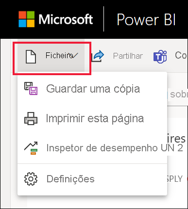

3. A janela Imprimir do browser abre. Escolha as definições. Por exemplo, se a largura do seu dashboard for superior à altura do mesmo, é recomendado alterar o esquema para **Horizontal**. Selecione **Imprimir**.
   
    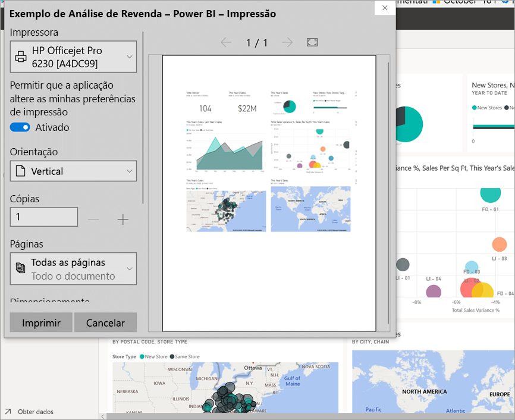

## Imprimir um mosaico do dashboard
1. Abra o dashboard no [modo de ecrã inteiro](end-user-focus.md) ao selecionar o ícone de ecrã inteiro  na barra de menus superior.

3. [Abra o mosaico no Modo de detalhe](end-user-focus.md) ao pairar o rato para apresentar **Mais opções** (...) e ao selecionar **Abrir no modo de detalhe** ou o ícone de detalhe .
   
    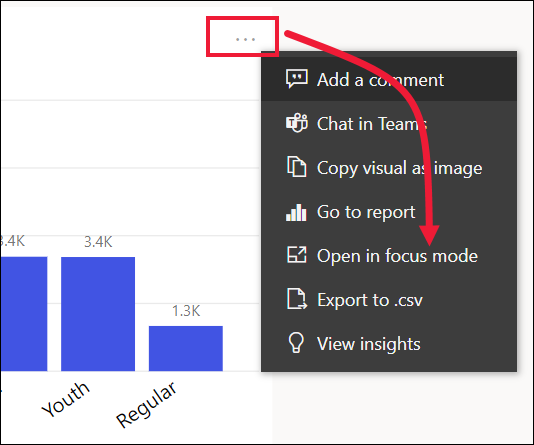

4. Paire o rato sobre o mosaico para revelar o menu de Opções.
   
    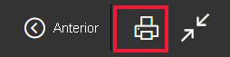

    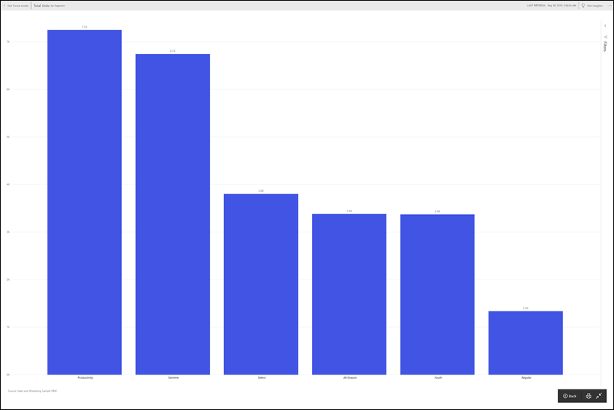

4. Selecione o ícone Imprimir .     

5. A janela Imprimir do browser abre. Escolha as definições. Por exemplo, se o seu mosaico não couber na página, é recomendado alterar a escala para 75%. Selecione **Imprimir**.

    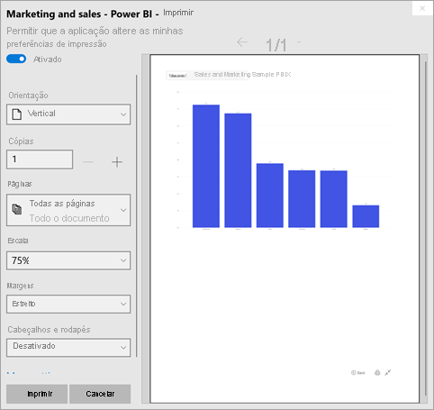 

> [!TIP]
> Se tiver seguido todos estes passos e o seu mosaico ainda não estiver a ser apresentado da maneira pretendida, experimente fazer o seguinte.
> 1. Abra a janela Imprimir e faça as alterações às definições de impressão que acha que vão proporcionar a melhor impressão. Por exemplo, altere o esquema, as margens e a escala. 
> 2. Contudo, em vez de imprimir, selecione **Cancelar**. 
> 3. Siga novamente os passos 1 a 5. O seu mosaico ajustar-se-á às novas definições da janela Imprimir e estará pronto para impressão.

## Imprimir uma página de relatório
Os relatórios podem ser impressos uma página de cada vez.

1. Abra o relatório e selecione **Ficheiro** > **Imprimir esta página** para imprimir a página atual do relatório.
   
    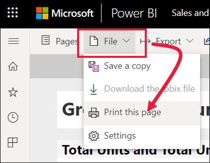
2. A janela Imprimir do browser abre.

3. Siga os passos de impressão acima a partir de **Imprimir um dashboard**.
   

## Imprimir um elemento visual de relatório
1. [Abra o elemento visual no Modo de detalhe](end-user-focus.md) ao pairar o rato sobre o mosaico e selecionar o ícone de Detalhe  no canto superior direito.

    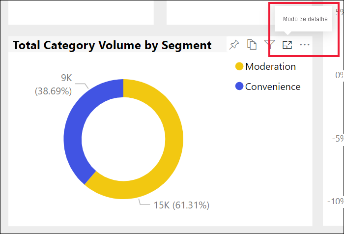

2. No canto superior esquerdo, selecione **Ficheiro** > **Imprimir esta página** para imprimir o elemento visual.

    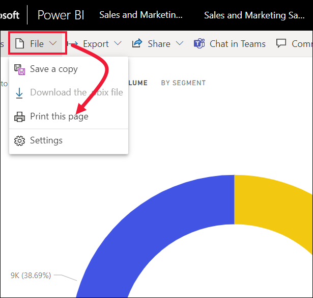

3. Siga os passos de impressão acima a partir de **Imprimir um dashboard**.

## Considerações e resolução de problemas

* P: Não consigo imprimir todas as páginas do relatório de uma só vez.    
* R: Está correto. As páginas do relatório só podem ser impressas uma página de cada vez.
* P: Não consigo imprimir em PDF.    
* R: Esta opção só é apresentada se já tiver configurado o controlador de PDF no seu browser.    
* P: O que vejo quando seleciono **Imprimir** não corresponde ao que estão a mostrar aqui.    
* R: Os ecrãs de impressão variam consoante o browser e a versão do software.
* P: A minha impressão não é dimensionada corretamente.  O meu dashboard não cabe na página. Outras perguntas sobre dimensionamento e orientação.    
* R: Não podemos garantir que a cópia impressa será exatamente igual ao que é apresentado no serviço Power BI. Aspetos como o dimensionamento, as margens, os detalhes visuais, a orientação e o tamanho não são controlados pelo Power BI. Experimente ajustar as definições de impressão do seu browser. Algumas das definições acima sugeridas incluem a orientação da página (vertical ou horizontal), o tamanho das margens e a escala. Se isto não ajudar, veja a documentação relativa ao seu browser específico.      
* P: Quando estou a imprimir no modo de ecrã inteiro, não vejo a opção de impressão quando pairo sobre o elemento visual.   
* R: Regresse ao dashboard ou relatório na vista predefinida e reabra o elemento visual no modo de detalhe e, em seguida, no modo de ecrã inteiro. 

## Passos seguintes
[Partilhar dashboards e relatórios com colegas e outras pessoas](../collaborate-share/service-share-dashboards.md)

Mais perguntas? [Pergunte à Comunidade do Power BI](https://community.powerbi.com/)
