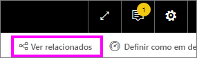
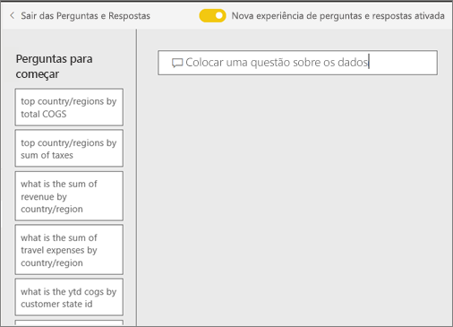

# Perguntas e Respostas para **consumidores** do Power BI
## O que são as Perguntas e Respostas?
Às vezes, a maneira mais rápida de obter uma resposta dos seus dados é fazer uma pergunta em linguagem natural. Por exemplo, "qual foi o total de vendas no ano passado".

Utilize as Perguntas e Respostas para explorar os seus dados com recursos intuitivos em linguagem natural e receba as respostas na forma de quadros e gráficos. As Perguntas e Respostas são diferentes de um motor de busca -- as Perguntas e Respostas fornecem apenas resultados relativos aos dados no Power BI.

As **Perguntas e Respostas do Power BI** estão disponíveis mediante uma licença Pro ou Premium.  As [Perguntas e Respostas nas aplicações para dispositivos móveis do Power B](mobile/mobile-apps-ios-qna.md) e as [Perguntas e Respostas com o Power BI Embedded](../developer/qanda.md) são abordadas em artigos separados. Neste momento, as **Perguntas e Respostas do Power BI** apresentam apenas as respostas às consultas de linguagem natural realizadas em inglês, embora exista uma pré-visualização em espanhol que pode ser ativada pelo administrador do Power BI.

A pergunta é apenas o início.  Divirta-se viajando pelos seus dados, refinando ou ampliando a sua pergunta, revelando informações novas e fiáveis, concentrando-se em detalhes e diminuindo o zoom para uma visão mais ampla. Vai ficar encantado com as informações obtidas e as descobertas.

A experiência é verdadeiramente interativa... e rápida! Com tecnologia de armazenamento dentro da memória, a resposta é praticamente instantânea.

## Onde posso utilizar as Perguntas e Respostas?
Poderá encontrar as Perguntas e Respostas nos dashboards no serviço Power BI e na parte inferior do dashboard no Power BI para dispositivos móveis. A menos que o designer lhe tenha dado permissões de edição, poderá utilizar as Perguntas e Respostas para explorar dados, mas não conseguirá guardar quaisquer visualizações criadas com as Perguntas e Respostas.

## Utilizar as Perguntas e Respostas num dashboard no serviço Power BI
No serviço Power BI (app.powerbi.com), um dashboard contém mosaicos afixados a partir de um ou mais conjuntos de dados e, por isso, pode fazer perguntas sobre quaisquer dados contidos em qualquer um desses conjuntos de dados. Para ver os relatórios e os conjuntos de dados que foram utilizados na criação do dashboard, selecione **Ver relacionados** na barra de menus.

## Como posso começar?
Em primeiro lugar, familiarize-se com os conteúdos. Observe os elementos visuais no dashboard e no relatório. Obtenha uma ideia do tipo e do intervalo de dados que tem disponíveis. 

Por exemplo:

* Se os valores e as etiquetas do eixo dos elementos visuais incluírem “vendas”, “conta”, “mês” e “oportunidades”, poderá fazer perguntas como: "Que *conta* tem a *oportunidade* mais alta" ou "mostrar *vendas* por mês como um gráfico de barras."

* Se tiver dados de desempenho do site no Google Analytics, pode perguntar às Perguntas e Respostas sobre o tempo gasto numa página Web, o número de visitas à página exclusiva e taxas de envolvimento do utilizador. Ou, se estiver a consultar dados demográficos, pode fazer perguntas sobre a idade e a renda doméstica por local.

Assim que estiver familiarizado com os dados, regresse ao dashboard e coloque o cursor na caixa de perguntas. Esta ação irá abrir o ecrã Perguntas e Respostas.

 

Mesmo antes de começar a escrever, as Perguntas e Respostas apresentam um ecrã novo com sugestões para o ajudar a formular a sua pergunta. Verá as expressões e as perguntas que contêm os nomes das tabelas nos conjuntos de dados subjacentes e poderá até ver as perguntas *em destaque** criadas pelo próprio proprietário do conjunto de dados.

Pode selecionar qualquer uma destas para as adicionar à caixa de perguntas e, em seguida, reformulá-las para conseguir encontrar uma resposta específica. 

Outra forma de as Perguntas e Respostas o ajudarem a fazer perguntas baseia-se em mensagens, preenchimento automático e ajudas visuais. 

 

### Que visualização o P e R utiliza?
O P e R escolhe a melhor visualização com base nos dados que são apresentados. Às vezes, os dados nos conjuntos de dados subjacentes são definidos como um determinado tipo ou categoria, o que ajuda o P e R a saber como apresentá-los. Por exemplo, se os dados são definidos como um tipo de data, é mais provável que sejam apresentados como um gráfico de linhas. Os dados que são categorizados como uma cidade são mais prováveis de serem apresentados como um mapa.

Nas Perguntas e Respostas também pode especificar qual o elemento visual que quer utilizar ao adicioná-lo à sua pergunta. Mas tenha em mente que nem sempre será possível apresentar os dados no tipo de elemento visual que pediu. As Perguntas e Respostas irão apresentar uma lista dos tipos de elementos visuais viáveis.

## Considerações e resolução de problemas
**Pergunta**: Não vejo as Perguntas e Respostas neste dashboard.    
**Resposta 1**: Se não vir uma caixa de perguntas, verifique primeiro as suas definições. Para fazê-lo, selecione o ícone de engrenagem no canto superior direito da barra de ferramentas do Power BI.   

Em seguida, selecione **Definições** > **Dashboards**. Certifique-se de que existe uma marca de verificação junto a **Mostrar a caixa de pesquisa Perguntas e Respostas neste dashboard**.    
  

**Resposta 2**: Por vezes, o *designer* do dashboard ou o seu administrador podem desativar as Perguntas e Respostas. Contacte os mesmos para saber se é possível voltar a ativá-las.   

**Pergunta**: Não estou a obter os resultados que pretendo ver ao escrever uma pergunta.    
**Resposta**: Fale com o *designer* do dashboard. Existem várias formas de o designer conseguir melhorar os resultados das Perguntas e Respostas. Por exemplo, o designer pode mudar o nome das colunas no conjunto de dados de maneira a utilizar termos que sejam fáceis de compreender (`CustomerFirstName` em vez de `CustFN`). Uma vez que o designer conhece extensivamente o conjunto de dados, o próprio também poderá elaborar perguntas úteis e adicioná-las à tela das Perguntas e Respostas.

## Próximos passos
[Sugestões de Perguntas e Respostas para os consumidores do Power BI](end-user-q-and-a.md)
