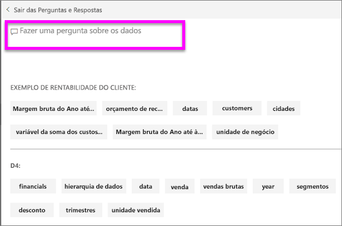
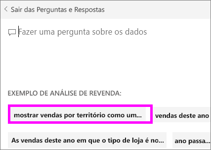

# Perguntas e Respostas para **consumidores** do Power BI
## O que são as Perguntas e Respostas?
Às vezes, a maneira mais rápida de obter uma resposta dos seus dados é fazer uma pergunta em linguagem natural. Por exemplo, "qual foi o total de vendas no ano passado".  
Utilize as Perguntas e Respostas para explorar os seus dados com recursos intuitivos em linguagem natural e receba as respostas na forma de quadros e gráficos. As Perguntas e Respostas são diferentes de um motor de busca -- as Perguntas e Respostas fornecem apenas resultados relativos aos dados no Power BI.

As **Perguntas e Respostas do Power BI** só suportam responder a consultas de linguagem natural feitas em inglês. Existe uma pré-visualização disponível para espanhol que pode ser ativada pelo seu administrador do Power BI.

As **Perguntas e Respostas do Power BI** estão disponíveis mediante uma licença Pro ou Premium. 
>

A pergunta é apenas o início.  Divirta-se viajando pelos seus dados, refinando ou ampliando a sua pergunta, revelando informações novas e fiáveis, concentrando-se em detalhes e diminuindo o zoom para uma visão mais ampla. Vai ficar encantado com as informações obtidas e as descobertas.

A experiência é verdadeiramente interativa... e rápida! Com tecnologia de armazenamento dentro da memória, a resposta é praticamente instantânea.

## Onde posso utilizar as Perguntas e Respostas?
Poderá encontrar as Perguntas e Respostas em dashboards no serviço Power BI, na parte inferior dos dashboards no Power BI Mobile e acima da visualização no Power BI Embedded. A menos que o designer lhe tenha dado permissões de edição, poderá utilizar as Perguntas e Respostas para explorar dados, mas não conseguirá guardar quaisquer visualizações criadas com as Perguntas e Respostas.

## Como é que o P e R sabe como responder às perguntas?
As Perguntas e Respostas procuram respostas em todos os conjuntos de dados associados ao dashboard. Se um conjunto de dados tiver um mosaico no dashboard, as Perguntas e Respostas vão procurar respostas nesse conjunto de dados. 

## Como posso começar?
Em primeiro lugar, familiarize-se com os conteúdos. Observe as visualizações no dashboard e no relatório. Obtenha uma ideia do tipo e do intervalo de dados que tem disponíveis. Em seguida, regresse ao dashboard e coloque o cursor na caixa de perguntas. Esta ação irá abrir o ecrã Perguntas e Respostas.

 

* Se os valores e as etiquetas do eixo das visualizações incluírem "vendas", "conta", "mês" e "oportunidades", pode fazer perguntas como: "Que *conta* tem a *oportunidade* mais alta" ou "mostrar *vendas* por mês como um gráfico de barras."

* Se tiver dados de desempenho do site no Google Analytics, pode perguntar às Perguntas e Respostas sobre o tempo gasto numa página Web, o número de visitas à página exclusiva e taxas de envolvimento do utilizador. Ou, se estiver a consultar dados demográficos, pode fazer perguntas sobre a idade e a renda doméstica por local.

Na parte inferior do ecrã, verá outros itens úteis. Para cada conjunto de dados, as Perguntas e Respostas mostram-lhe palavras-chave e, por vezes, até algumas perguntas sugeridas ou de exemplo. Selecione qualquer uma destas opções para as adicionar à caixa de perguntas. 

Outra forma de as Perguntas e Respostas o ajudarem a fazer perguntas baseia-se em mensagens, preenchimento automático e ajudas visuais. 

 

### Que visualização o P e R utiliza?
O P e R escolhe a melhor visualização com base nos dados que são apresentados. Às vezes, os dados nos conjuntos de dados subjacentes são definidos como um determinado tipo ou categoria, o que ajuda o P e R a saber como apresentá-los. Por exemplo, se os dados são definidos como um tipo de data, é mais provável que sejam apresentados como um gráfico de linhas. Os dados que são categorizados como uma cidade são mais prováveis de serem apresentados como um mapa.

Também pode informar ao P e R a visualização que será utilizada ao adicioná-la à sua pergunta. Mas tenha em mente que não será sempre possível apresentar os dados no tipo de visualização que pediu. As Perguntas e Respostas vão apresentar-lhe uma lista dos tipos de visualizações viáveis.

## Considerações e resolução de problemas
**Pergunta**: Não vejo as Perguntas e Respostas neste dashboard.    
**Resposta 1**: Se não vir uma caixa de perguntas, verifique primeiro as suas definições. Para fazê-lo, selecione o ícone de engrenagem no canto superior direito da barra de ferramentas do Power BI.   

Em seguida, selecione **Definições** > **Dashboards**. Certifique-se de que existe uma marca de verificação junto a **Mostrar a caixa de pesquisa Perguntas e Respostas neste dashboard**.
  

**Resposta 2**: Por vezes, o *designer* do dashboard ou o seu administrador podem desativar as Perguntas e Respostas. Contacte os mesmos para saber se é possível voltar a ativá-las.   

**Pergunta**: Não estou a obter os resultados que pretendo ver ao escrever uma pergunta.    
**Resposta**: Fale com o *designer* do dashboard. Existem várias formas de o designer conseguir melhorar os resultados das Perguntas e Respostas. Por exemplo, o designer pode mudar o nome das colunas no conjunto de dados de maneira a utilizar termos que sejam fáceis de compreender (`CustomerFirstName` em vez de `CustFN`). Uma vez que o designer conhece extensivamente o conjunto de dados, o próprio também poderá elaborar perguntas úteis e adicioná-las à tela das Perguntas e Respostas.

## Próximos passos

