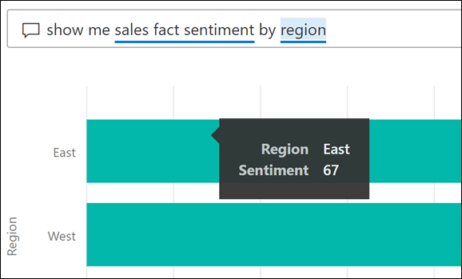

# Perguntas e Respostas para utilizadores empresariais do Power BI

[!INCLUDE[consumer-appliesto-yyny](../includes/consumer-appliesto-yyny.md)]

[!INCLUDE [power-bi-service-new-look-include](../includes/power-bi-service-new-look-include.md)]

## O que são as Perguntas e Respostas?
Às vezes, a maneira mais rápida de obter uma resposta dos seus dados é fazer uma pergunta em linguagem natural. Por exemplo, "qual foi o total de vendas no ano passado".

Utilize as Perguntas e Respostas para explorar os seus dados com recursos intuitivos em linguagem natural e receba as respostas na forma de quadros e gráficos. As Perguntas e Respostas são diferentes de um motor de busca -- as Perguntas e Respostas fornecem apenas resultados relativos aos dados no Power BI.

## Que visualização o P e R utiliza?
O P e R escolhe a melhor visualização com base nos dados que são apresentados. Por vezes, os dados no conjunto de dados subjacente são definidos como um determinado tipo ou categoria, o que ajuda as Perguntas e Respostas a saber como apresentá-los. Por exemplo, se os dados são definidos como um tipo de data, é mais provável que sejam apresentados como um gráfico de linhas. Os dados que são categorizados como uma cidade são mais prováveis de serem apresentados como um mapa.

Nas Perguntas e Respostas também pode especificar qual o elemento visual que quer utilizar ao adicioná-lo à sua pergunta. Mas tenha em mente que nem sempre será possível apresentar os dados no tipo de elemento visual que pediu. As Perguntas e Respostas irão apresentar uma lista dos tipos de elementos visuais viáveis.

## Onde posso utilizar as Perguntas e Respostas?
Poderá encontrar as Perguntas e Respostas nos dashboards no serviço Power BI e na parte inferior do dashboard no Power BI para dispositivos móveis. A menos que o designer lhe tenha dado permissões de edição, poderá utilizar as Perguntas e Respostas para explorar dados, mas não conseguirá guardar quaisquer visualizações criadas com as Perguntas e Respostas.

Encontrará também Perguntas e Respostas sobre relatórios, se o *designer* de relatórios tiver adicionado um [elemento visual de Perguntas e Respostas](../visuals/power-bi-visualization-q-and-a.md).   

## Perguntas e Respostas em dashboards

As **Perguntas e Respostas do Power BI** estão disponíveis mediante uma licença Pro ou Premium.  As [Perguntas e Respostas nas aplicações para dispositivos móveis do Power B](mobile/mobile-apps-ios-qna.md) e as [Perguntas e Respostas com o Power BI Embedded](../developer/embedded/qanda.md) são abordadas em artigos separados. Neste momento, as **Perguntas e Respostas do Power BI** apresentam apenas as respostas às consultas de linguagem natural realizadas em inglês, embora exista uma pré-visualização em espanhol que pode ser ativada pelo administrador do Power BI.

A pergunta é apenas o início.  Divirta-se viajando pelos seus dados, refinando ou ampliando a sua pergunta, revelando informações novas e fiáveis, concentrando-se em detalhes e diminuindo o zoom para uma visão mais ampla. Vai ficar encantado com as informações obtidas e as descobertas.

A experiência é verdadeiramente interativa... e rápida! Com tecnologia de armazenamento dentro da memória, a resposta é praticamente instantânea.

## Utilizar as Perguntas e Respostas num dashboard no serviço Power BI
No serviço Power BI (app.powerbi.com), um dashboard contém mosaicos afixados a partir de um ou mais conjuntos de dados e, por isso, pode fazer perguntas sobre quaisquer dados contidos em qualquer um desses conjuntos de dados. Para ver os relatórios e os conjuntos de dados que foram utilizados na criação do dashboard, selecione **Ver conteúdos relacionados** no menu pendente **Mais ações**.

## Como posso começar?
Em primeiro lugar, familiarize-se com os conteúdos. Observe os elementos visuais no dashboard e no relatório. Obtenha uma ideia do tipo e do intervalo de dados que tem disponíveis. 

Por exemplo:

* Se os valores e as etiquetas do eixo dos elementos visuais incluírem “vendas”, “conta”, “mês” e “oportunidades”, poderá fazer perguntas como: "Que *conta* tem a *oportunidade* mais alta" ou "mostrar *vendas* por mês como um gráfico de barras."

* Se tiver dados de desempenho do site no Google Analytics, pode perguntar às Perguntas e Respostas sobre o tempo gasto numa página Web, o número de visitas à página exclusiva e taxas de envolvimento do utilizador. Ou, se estiver a consultar dados demográficos, poderá fazer perguntas sobre a faixa etária e o rendimento familiar por localização.

Assim que estiver familiarizado com os dados, regresse ao dashboard e coloque o cursor na caixa de perguntas. Esta ação irá abrir o ecrã Perguntas e Respostas.

 

Mesmo antes de começar a escrever, as Perguntas e Respostas apresentam um ecrã novo com sugestões para o ajudar a formular a sua pergunta. Verá as expressões e as perguntas que contêm os nomes das tabelas nos conjuntos de dados subjacentes e poderá até ver as perguntas *em destaque* criadas pelo próprio proprietário do conjunto de dados.

Pode selecionar qualquer uma destas para as adicionar à caixa de perguntas e, em seguida, reformulá-las para conseguir encontrar uma resposta específica. 

 

Para o ajudar a fazer perguntas, o Power BI tem outras funcionalidades, tais como os avisos, o preenchimento automático e as ajudas visuais. O Power BI ajuda-o com as Perguntas e Respostas nos dashboards e com o elemento visual das Perguntas e Respostas. Vamos abordar estas funcionalidades em maior detalhe abaixo, na secção [Criar um elemento visual das Perguntas e Respostas ao introduzir uma consulta em linguagem natural](#create-a-visual-using-your-own-qa-question)

## O elemento visual das Perguntas e Respostas em relatórios do Power BI

O elemento visual das Perguntas e Respostas permite colocar perguntas em linguagem natural e obter respostas sob a forma de um elemento visual. O comportamento do elemento visual das Perguntas e Respostas é idêntico ao de qualquer outro elemento visual num relatório, na medida em que pode ter filtragem cruzada/destaque cruzado e também suporta marcadores e comentários. 

Pode identificar um elemento visual das Perguntas e Respostas pela sua caixa de perguntas na parte superior. É aqui que vai inserir ou introduzir perguntas em linguagem natural. O elemento visual das Perguntas e Respostas pode ser utilizado repetidamente para colocar perguntas sobre os seus dados. Quando sai do relatório, o elemento visual das Perguntas e Respostas é reposto para a predefinição. 

## Utilizar as Perguntas e Respostas 
Para utilizar as Perguntas e Respostas num dashboard ou utilizar o elemento visual das Perguntas e Respostas num relatório, selecione uma das perguntas sugeridas ou escreva a sua própria pergunta em linguagem natural. 

### Criar um elemento visual com uma pergunta sugerida

Aqui, selecionámos os **principais estados geográficos por unidades totais**. O Power BI faz o seu melhor para selecionar o tipo de elemento visual a utilizar. Neste caso, é um mapa básico.

No entanto, pode indicar ao Power BI qual o tipo de elemento visual a utilizar ao adicioná-lo à sua consulta em linguagem natural. Tenha em conta que nem todos os tipos de elementos visuais funcionarão ou farão sentido com os seus dados. Por exemplo, estes dados não produziriam um gráfico de dispersão coerente. Mas funciona como um mapa de manchas.

Se não souber que tipo de perguntas colocar ou qual a terminologia a utilizar, expanda **Mostrar todas as sugestões** ou procure outros elementos visuais no relatório. Assim, ficará familiarizado com os termos e conteúdos do conjunto de dados.

### Criar um elemento visual com a sua própria pergunta das Perguntas e Respostas

1. Escreva a sua pergunta no campo Perguntas e Respostas em linguagem natural. À medida que escreve a sua pergunta, o Power BI ajuda-o no preenchimento automático, ajudas visuais e feedback.

    **Preenchimento Automático** – ao escrever a sua pergunta, a funcionalidade Perguntas e Respostas do Power BI apresenta sugestões relevantes e contextuais para o ajudar a ser produtivo rapidamente com uma linguagem natural. Ao escrever, obtém feedback e resultados imediatos. A experiência é semelhante a escrever num motor de busca.

    Neste exemplo, a sugestão que pretendemos é a última. 

    

    **Sublinhados contínuos e pontilhados** – a funcionalidade Perguntas e Respostas do Power BI apresenta as palavras com sublinhados para ajudar a ver que palavras o Power BI reconheceu ou não reconheceu. 

    Um sublinhado azul sólido indica que o Power BI reconheceu a palavra. O exemplo abaixo mostra que as Perguntas e Respostas reconheceram os termos **sentimento de factos de vendas** e **região**.

    

    Um sublinhado duplo a vermelho indica uma palavra que o Power BI não reconhece. Um exemplo poderá ser utilizar a palavra "geography" (geografia), embora a mesma não exista nos dados. A palavra existe no dicionário, mas a funcionalidade Perguntas e Respostas marca este termo com um sublinhado a vermelho. A funcionalidade Perguntas e Respostas do Power BI não consegue criar uma visualização e sugere que pergunte ao designer do relatório para adicionar o termo.  

    

    Se o Power BI não tiver certeza quanto a uma palavra, verá um sublinhado pontilhado. Selecione a palavra para ver uma lista de sugestões. Um exemplo poderá ser a palavra "Location" (Localização). Vários campos podem conter a palavra “Localização”, pelo que o sistema pede que escolha o campo desejado.  

    

    
    
    A funcionalidade Perguntas e Respostas do Power BI reconhece palavras que significam a mesma coisa, graças à integração com o Bing e o Office. A funcionalidade Perguntas e Respostas sublinha a palavra, para que saiba que não é uma correspondência direta

    

    **Sugestões** – à medida que escreve a pergunta, o Power BI informa-o se não entender a mesma e tenta ajudar. No exemplo a seguir, o Power BI sugere dois campos diferentes que ele reconhece para “VanArsdel”. 

    

    Depois de selecionar a correção do Power BI, observe que todas as palavras são reconhecidas e sublinhadas a azul. Os resultados são apresentados como um gráfico de linhas. 

    

    Porém, pode alterar o gráfico de linhas para outro tipo de elemento visual.  

    

## Considerações e resolução de problemas

**Pergunta**: não vejo as Perguntas e Respostas neste dashboard.    
**Resposta 1**: se não vir uma caixa de perguntas, verifique primeiro as suas definições. Para o fazer, selecione o ícone de engrenagem no canto superior direito da barra de ferramentas do Power BI ou no menu pendente **Mais opções (...).   

Em seguida, selecione **Definições** > **Dashboards**. Certifique-se de que existe uma marca de verificação junto a **Mostrar a caixa de pesquisa Perguntas e Respostas neste dashboard**.    
  

**Resposta 2**: Por vezes, não terá acesso às definições. Se o proprietário do dashboard ou o administrador tiver desativado a funcionalidade Perguntas e Respostas, pergunte-lhe se é possível ativá-la novamente. Para pesquisar o proprietário, selecione o nome do dashboard na barra de menus superior.

    

**Pergunta**: não estou a obter os resultados que pretendo ver ao escrever uma pergunta.    
**Resposta**: Selecione a opção para entrar em contacto com o proprietário do relatório ou do dashboard. Pode fazê-lo diretamente na página das Perguntas e Respostas do dashboard ou no elemento visual de Perguntas e Respostas. Em alternativa, pode procurar o proprietário no cabeçalho do Power BI.  Existem várias formas de o proprietário conseguir melhorar os resultados das Perguntas e Respostas. Por exemplo, o proprietário pode mudar o nome das colunas no conjunto de dados de maneira a utilizar termos que sejam fáceis de compreender (`CustomerFirstName` em vez de `CustFN`). Uma vez que o proprietário conhece muito bem o conjunto de dados, o próprio também poderá elaborar perguntas úteis e adicioná-las às perguntas sugeridas das Perguntas e Respostas.

## Privacidade

A Microsoft pode utilizar as suas perguntas para melhorar o Power BI. Veja a [Declaração de Privacidade da Microsoft](https://go.microsoft.com/fwlink/?LinkId=521839) para obter mais informações.

## Passos seguintes
Para saber como um elemento visual das Perguntas e Respostas é criado e gerido por um *designer* de relatórios, veja [Tipo de elemento visual das Perguntas e Respostas](../visuals/power-bi-visualization-q-and-a.md).
