<!-- once the sample aps are live, change this so consumers can follow along -->
# Guia de Início Rápido: saiba mais sobre as funcionalidades do Power BI para ***consumidores***
Neste guia de início rápido, ficará a saber como interagir com o Power BI para obter informações empresariais baseadas em dados. Este artigo não pretende ser uma descrição detalhada, mas uma apresentação rápida de muitas das ações disponíveis para os **consumidores** do Power BI.

Se não estiver inscrito no Power BI, [inscreva-se para uma avaliação gratuita](https://app.powerbi.com/signupredirect?pbi_source=web) antes de começar.

## Pré-requisitos
- Serviço Power BI (app.powerbi.com) <!-- app from AppSource -->

## Vista de leitura
A Vista de leitura está disponível no serviço Power BI para *consumidores* de relatórios. Quando um colega partilha um relatório consigo, a Vista de leitura é a forma que utiliza para explorar e interagir com o relatório. 

O outro modo de relatório do Power BI é a [Vista de edição](../service-interact-with-a-report-in-editing-view.md), disponível para *estruturadores* de relatórios.  

A Vista de leitura é uma forma prática e segura de explorar os seus dashboards e relatórios. Enquanto segmenta e decompõe os dashboards e os relatórios partilhados consigo, os conjuntos de dados subjacentes permanecem intactos e inalterados. 

Na Vista de leitura, pode efetuar ações como realçar e filtrar de forma cruzada os elementos visuais de uma página.  Basta realçar ou selecionar um valor num elemento visual para ver instantaneamente o impacto nos outros elementos visuais. Use o painel Filtrar para adicionar e modificar filtros numa página de relatório e alterar a maneira como os valores são classificados numa visualização. Estas são apenas algumas das funcionalidades para *consumidores* no Power BI.  Continue a ler para saber mais.

 
### Visualizar uma aplicação
No Power BI, as *aplicações* juntam dashboards e relatórios relacionados num único lugar.

1. Selecione **Aplicações**  > **Obter aplicações**. 
   
     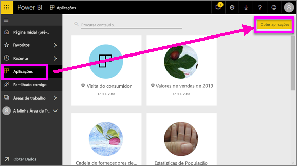
2. No AppSource, em **A minha organização**, procure para filtrar os resultados e encontrar a aplicação que procura.
   
     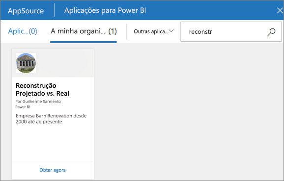
3. Selecione **Obter agora** para adicionar a aplicação ao seu Contentor de aplicações. 

### Visualizar um dashboard
Esta aplicação é aberta num dashboard. Um ***dashboard*** do Power BI é uma única página, frequentemente denominada tela, que utiliza visualizações para contar uma história. Como está limitada a uma página, um dashboard bem concebido contém apenas os elementos mais importantes da história.

As visualizações que vê no dashboard são denominadas *mosaicos* e são *afixadas* ao dashboard a partir de relatórios.

### Subscrever um dashboard (ou um relatório)
Não é necessário abrir o Power BI para monitorizar um dashboard.  Em alternativa, pode efetuar uma subscrição para que o Power BI lhe envie um instantâneo desse dashboard por e-mail, de acordo com um agendamento que definir. 

.

1. Na barra de menus superior, selecione **Subscrever** ou selecione o ícone de envelope .
   
   

3. Utilize o controlo de deslize amarelo para ativar e desativar a subscrição.  Em opção, preencha os detalhes da mensagem de e-mail. 

    Nas capturas de ecrã abaixo, repare que, na realidade, está a subscrever uma *página* de relatórios ao subscrever um relatório.  Para subscrever mais do que uma página num relatório, selecione **Adicionar outra subscrição** e selecione uma página diferente. 
      
   
   
    Atualizar a página de relatório não atualiza o conjunto de dados. Apenas o proprietário do conjunto de dados pode atualizar manualmente um conjunto de dados. Para procurar um nome do(s) conjunto(s) de dados subjacentes, selecione **Ver relacionado** na barra de menu superior.

### Ver conteúdos relacionados
O painel **Conteúdo relacionado** mostra-lhe como os conteúdos de serviço do Power BI (dashboards, relatórios e conjuntos de dados) estão interligados. Além de o painel apresentar os conteúdos relacionados, também lhe permite efetuar ações sobre os conteúdos e navegar facilmente pelos conteúdos relacionados.

Num dashboard ou relatório, selecione **Ver relacionados** na barra de menus superior.

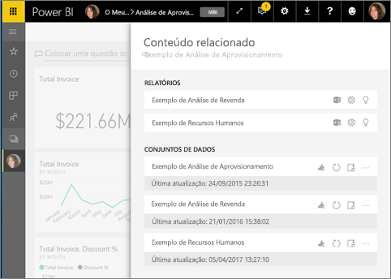

### Utilizar as Perguntas e Respostas para fazer perguntas com linguagem natural
Às vezes, a maneira mais rápida de obter uma resposta dos seus dados é fazer uma pergunta em linguagem natural. A caixa de perguntas das Perguntas e Respostas encontra-se na parte superior do dashboard. Por exemplo, "mostrar-me a contagem de grandes oportunidades por fase de vendas como um funil". 

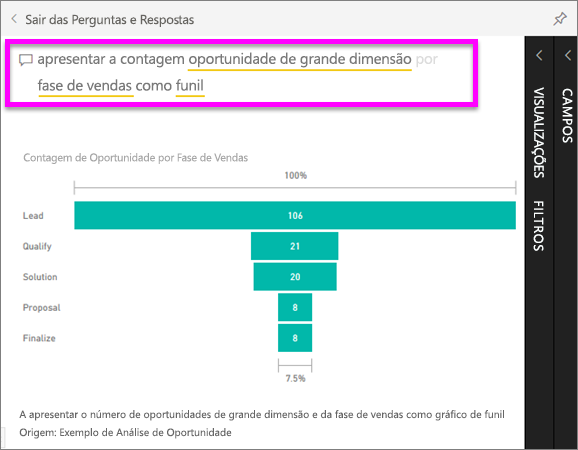

### Adicionar um dashboard como favorito
Ao marcar conteúdos como *favoritos*, poderá aceder aos mesmos na barra de navegação esquerda. A barra de navegação esquerda é apresentada em praticamente qualquer área do Power BI. Normalmente, os favoritos são os dashboards, as páginas de relatórios e as aplicações a que acede com mais frequência.

1. Saia das Perguntas e Respostas para regressar a um dashboard.    
2. No canto superior direito do serviço Power BI, selecione **Favorito** ou o .
   
   

### Abrir e ver um relatório e páginas de relatórios
Um relatório é uma ou mais páginas de elementos visuais. Os relatórios são criados pelos *estruturadores de relatórios* do Power BI e [partilhados com os *consumidores* diretamente](end-user-shared-with-me.md) ou como parte de uma [aplicação](end-user-apps.md). 

Os relatórios podem ser abertos a partir de um dashboard. A maioria dos mosaicos do dashboard são *afixados* dos relatórios. Selecionar um mosaico abre o relatório que foi utilizado para criar o mosaico. 

1. A partir de um dashboard, selecione um mosaico. Neste exemplo, selecionámos o mosaico de gráfico de colunas "Revenue" (Receita).

    

2.  O relatório associado é aberto. Repare que estamos na página "Revenue overview" (Visão geral da receita). Esta é a página do relatório que contém o gráfico de colunas que selecionámos a partir do dashboard.

    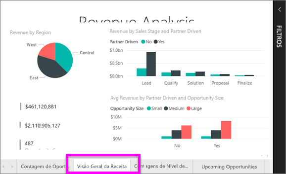

### Ajustar as dimensões de apresentação
Os relatórios são visualizados em vários dispositivos diferentes, com diversos tamanhos de ecrã e proporções.  A composição padrão pode não ser o que deseja ver no dispositivo.  

1. Para ajustar, na barra de menus superior, selecione **Ver**.

    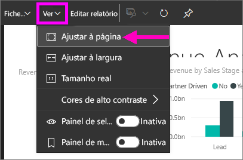

2.  Selecione uma das opções de visualização. Neste exemplo, selecionámos **Ajustar à página**.

    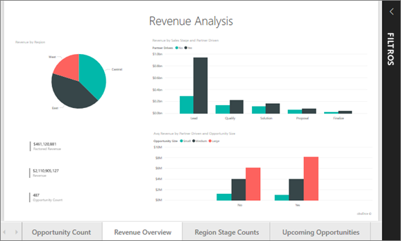    

### Utilizar o painel Filtros do relatório
Se o autor do relatório adicionar filtros a uma página num relatório, pode interagir com os mesmos e guardar as alterações com o relatório.

1. Selecione o ícone **Filtros** no canto superior direito.
   
   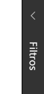  

2. Selecione um elemento visual para torná-lo ativo. Verá todos os filtros que foram aplicados a esse elemento visual (filtros de nível Visual), em toda a página de relatório (filtros de nível de Página) e em todo o relatório (filtros de nível de Relatório).
   
   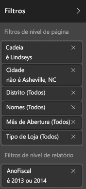

3. Passe o rato sobre um filtro e expanda-o, selecionando a seta para baixo.
   
   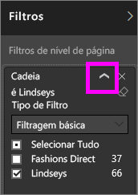

4. Altere os filtros e veja como os elementos visuais são afetados.  
   
     
     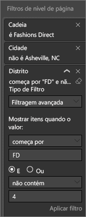

### Ver como todos os elementos visuais numa página estão interligados
Realce e filtre de forma cruzada as visualizações relacionadas numa página. As visualizações numa página de relatório único são "conectadas" umas às outras.  Isto significa que, se selecionar um ou mais valores numa visualização, outras visualizações que utilizem o mesmo valor serão alteradas com base na sua seleção.

> 
### Apresentar detalhes numa visualização
Passe o rato sobre os elementos visuais para ver os detalhes

### Ordenar uma visualização
Os elementos visuais numa página de relatório podem ser ordenados e guardados com as alterações aplicadas. 

1. Coloque o cursor sobre um elemento visual para o tornar ativo.    
2. Selecione as reticências (...) para abrir as opções de ordenação.

     

###  Abrir o painel **Seleção**
Navegue facilmente entre as visualizações na página do relatório. 

1. Selecione **Ver > painel Seleção** para abrir o painel Seleção. Ative o **painel Seleção**.

    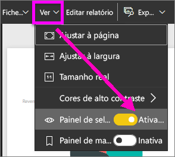

2. O painel Seleção é aberto na tela do relatório. Selecione um elemento visual na lista para o tornar ativo.

    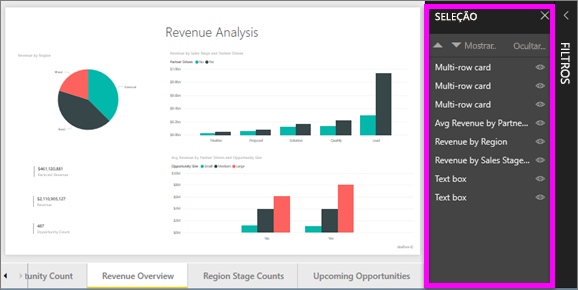

### Ampliar elementos visuais individuais
Passe o rato sobre um elemento visual e selecione o ícone **Modo de detalhe** . Quando vir uma visualização no Modo de detalhe, esta é expandida para preencher toda a tela do relatório, conforme mostrado abaixo.

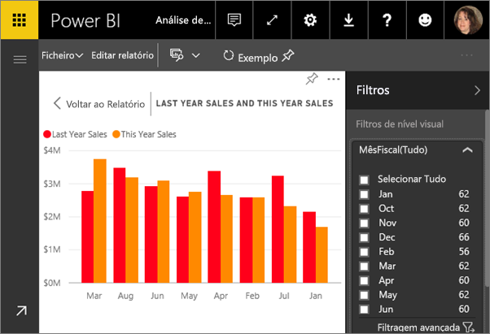

Para apresentar essa mesma visualização sem a distração de barras de menus, do painel de filtro e de outro cromado, selecione o ícone **Ecrã Inteiro** na barra de menus superior .

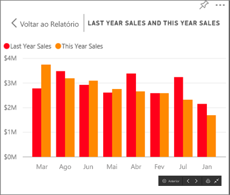

### Mostrar os dados utilizados para criar uma visualização
Uma visualização do Power BI é construída com dados dos conjuntos de dados subjacentes. Se estiver interessado em conhecer os bastidores, o Power BI permite-lhe *apresentar* os dados que estão a ser utilizados para criar o elemento visual. Quando seleciona **Mostrar Dados**, o Power BI apresenta os dados por baixo da visualização (ou junto da mesma).

1. No serviço Power BI, abra um relatório e selecione um elemento visual.  
2. Para apresentar os dados subjacentes ao elemento visual, selecione as reticências (...) e selecione **Mostrar dados**.
   
   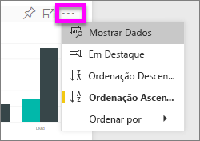

Esta foi uma rápida descrição geral de apenas algumas das ações que os **consumidores** podem efetuar com o serviço Power BI.  

## Limpar recursos
- Se estiver ligado a uma aplicação, na barra de navegação esquerda, selecione **Aplicações** para abrir a Lista de conteúdos da aplicação. Coloque o cursor sobre a aplicação para eliminar e selecione o ícone de caixote do lixo.

- Se tiver importado ou estiver ligado a um relatório de exemplo do Power BI, na barra de navegação esquerda, abra **A minha área de trabalho**. Ao utilizar os separadores na parte superior, localize o dashboard, o relatório e o conjunto de dados, e selecione o ícone de caixote do lixo para cada um.

## Próximos passos

