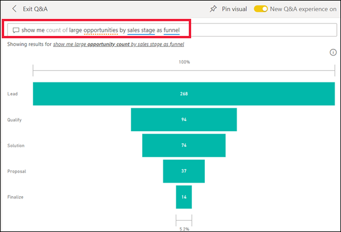
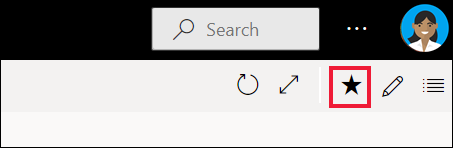
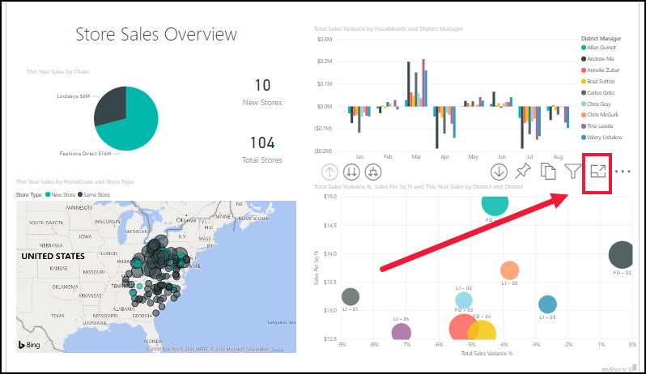
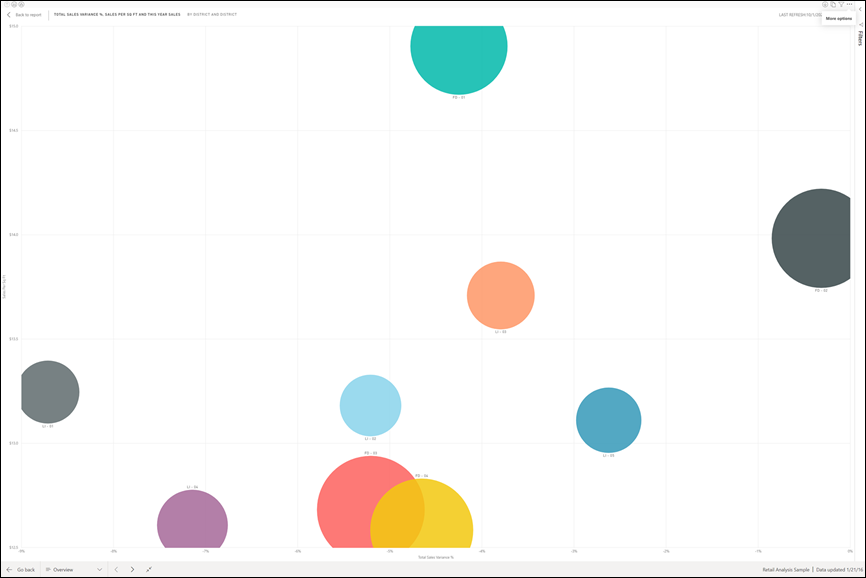

# Guia de Início Rápido: saiba mais sobre as funcionalidades do Power BI para *utilizadores empresariais*

[!INCLUDE[consumer-appliesto-ynny](../includes/consumer-appliesto-ynny.md)]

Neste guia de início rápido, ficará a saber como interagir com o Power BI para obter informações empresariais baseadas em dados. Este artigo não pretende ser uma descrição detalhada, mas uma apresentação rápida de muitas das ações disponíveis para os **utilizadores empresariais** do Power BI.

Se não estiver inscrito no Power BI, [inscreva-se para uma avaliação gratuita](https://app.powerbi.com/signupredirect?pbi_source=web) antes de começar.

## O que é Power BI? 
O Power BI é uma coleção de serviços de software, aplicações e conectores que funcionam em conjunto para transformar as origens de dados não relacionadas em informações coerentes, visualmente envolventes e interativas. Quer os seus dados sejam uma folha de cálculo do Excel simples ou uma coleção de dados de diferentes origens de dados, o Power BI permite-lhe ligar facilmente às origens de dados, visualizar (ou detetar) o que é importante e partilhá-lo com o número de pessoas que quiser. 

Abra o serviço Power BI num browser ou num dispositivo móvel. Você e os seus colegas trabalham a partir das mesmas aplicações, dashboards e relatórios fidedignos, os quais são atualizados automaticamente para que esteja sempre a trabalhar com os conteúdos mais recentes.   

## Vista de leitura
Existem dois modos de interagir com os relatórios no serviço Power BI: Vista de leitura e Vista de edição.  Se for um *utilizador empresarial*, será mais provável que utilize a Vista de leitura para consumir os relatórios criados por outros utilizadores. A Vista de edição é utilizada por *designers* de relatórios, que criam os relatórios e os partilham consigo. A Vista de leitura é a forma de explorar e interagir com os relatórios criados por colegas. 

Mesmo na Vista de leitura, o conteúdo não é estático. Pode aprofundar, procurar tendências, informações e outros dados de business intelligence. Divida e segmente os conteúdos e faça-lhes perguntas com as suas próprias palavras. Em alternativa, descontraia e deixe que os seus dados descubram informações interessantes por si ao receber alertas quando ocorrerem alterações aos dados e relatórios por e-mail com base na agenda que definir. Todos os seus dados em qualquer altura, na cloud ou no local, a partir de qualquer dispositivo. 

Continue a ler para saber mais.

## Conteúdos do Power BI
Quando utilizamos o termo "conteúdo" em Power BI, estamos a referir-nos aos relatórios, dashboards e aplicações. Estes são os elementos base que irá utilizar para explorar os seus dados e para tomar decisões empresariais. 

> [!NOTE]
> Os dashboards, os relatórios e as aplicações também podem ser vistos e partilhados em dispositivos móveis.

###  Aplicações

Uma *aplicação* é um tipo de conteúdo do Power BI que combina dashboards e relatórios relacionados num único local. Uma aplicação pode ter um ou mais dashboards ou relatórios em conjunto. As aplicações são criadas por *designers* do Power BI que distribuem e partilham as aplicações com os *utilizadores empresariais*. 

Pode ver as aplicações ao selecionar **Aplicações** no painel de navegação e, em seguida, escolher a aplicação que quer abrir.

Para saber mais sobre a visualização de aplicações, veja [Aplicações do Power BI](end-user-apps.md)

### Relatórios

Um relatório do Power BI é uma vista de múltiplas perspetivas sobre um conjunto de dados, com elementos visuais que representam diferentes achados e informações desse conjunto de dados. Um relatório pode ter um único elemento visual ou páginas cheias de elementos visuais. Os relatórios são criados pelos *designers* do Power BI, que distribuem e partilham esses relatórios com os *utilizadores empresariais*.

Para saber como ver relatórios, veja [Relatórios do Power BI](end-user-reports.md)

### Dashboards

Um dashboard do Power BI é uma única página, frequentemente denominada tela, que utiliza visualizações para contar uma história. Como está limitada a uma página, um dashboard bem concebido contém apenas os elementos mais importantes da história.

As visualizações que vê no dashboard são denominadas mosaicos e são afixadas ao dashboard por *designers* de relatórios. Na maioria dos casos, ao selecionar um mosaico, é direcionado para a página de relatório onde foi criada a visualização. 

Para saber como ver os dashboards, veja [Dashboards do Power BI](end-user-dashboards.md)
 
## Interagir no serviço Power BI

### Colaborar com colegas
Ignore o e-mail. Adicione um comentário pessoal ou inicie uma conversa com colegas sobre um dashboard, diretamente a partir do mesmo. A funcionalidade de comentário é apenas uma das formas a partir das quais o utilizador pode colaborar com as outras pessoas. 

Saiba mais sobre [comentários](end-user-comment.md)

### Descontraia e deixe que o Power BI trabalhe por si
O serviço Power BI trabalha por si de duas formas: com subscrições e alertas. 

#### Subscrever um dashboard (ou um relatório)
Não é necessário abrir o Power BI para monitorizar um dashboard.  Em alternativa, pode efetuar uma subscrição para que o Power BI lhe envie um instantâneo desse dashboard por e-mail, de acordo com um agendamento que definir. 

 Saiba mais sobre as [subscrições do Power BI](end-user-subscribe.md)

#### Obter alertas quando os dados atingirem um limiar
Os seus dados são dinâmicos e os seus elementos visuais são automaticamente atualizados de forma a refletir as alterações dos mesmos. Se quiser receber uma notificação quando os dados mudarem de forma a estarem acima ou abaixo de um limite definido por si, utilize os alertas de dados. Os alertas funcionam nos medidores, KPIs e cartões.    

O Power BI envia-lhe um e-mail quando o valor aumenta ou diminui para além do limite que definiu.  

Saiba mais sobre os [alertas do Power BI](end-user-alerts.md)

### Utilizar as Perguntas e Respostas para fazer perguntas com linguagem natural
Às vezes, a maneira mais rápida de obter uma resposta dos seus dados é fazer uma pergunta em linguagem natural. A caixa de perguntas das Perguntas e Respostas encontra-se na parte superior do dashboard. Por exemplo, "mostrar-me a contagem de grandes oportunidades por fase de vendas como um funil". 

Saiba mais sobre as [Perguntas e Respostas do Power BI](end-user-q-and-a.md)

### Apresentar detalhes numa visualização
Os elementos visuais são compostos por pontos de dados e, ao pairar o cursor sobre um ponto de dados, pode ver os detalhes.

### Adicionar um dashboard como favorito
Ao marcar conteúdos como *favorito*, poderá aceder aos mesmos a partir da [Home Page](end-user-home.md) e do painel de navegação. O painel de navegação é visível em praticamente todas as áreas do serviço Power BI. Normalmente, os favoritos são os dashboards, as páginas de relatórios e as aplicações a que acede com mais frequência.

Para guardar conteúdos como favorito, no canto superior direito do serviço Power BI, selecione o ícone de estrela. 
   

Para ver os favoritos, selecione **Favoritos** no painel de navegação.

Observe as outras ações disponíveis na barra de menus.  Não abordamos todas estas opções neste artigo, mas fizemo-lo noutros artigos.  Obtenha mais informações ao utilizar o índice do Power BI ou o campo **Procurar**. 

Saiba mais sobre os [favoritos e os destaques](end-user-favorite.md)

### Ajustar as dimensões de apresentação
Os relatórios são visualizados em vários dispositivos diferentes, com diversos tamanhos de ecrã e proporções.  A composição padrão pode não ser o que deseja ver no dispositivo.  

Para ajustar, na barra de menus no canto superior direito, selecione o ícone **Vista** e selecione uma das opções de apresentação. 

### Ver como todos os elementos visuais numa página estão interligados
Realce e filtre de forma cruzada as visualizações relacionadas numa página de relatório. As visualizações numa página de relatório único são "conectadas" umas às outras.  Isto significa que, se selecionar um ou mais valores numa visualização, outras visualizações que utilizem o mesmo valor serão alteradas com base na sua seleção.

> 

Saiba mais sobre as [interações visuais](end-user-interactions.md)

<!-- ###  Open the **Selection** pane
Easily navigate between the visualizations on the report page. 

1. Select **View > Selection pane** to open the Selection pane. Toggle **Selection pane** to On.

    

2. The Selection pane opens on your report canvas. Select a visual from the list to make it active.

     -->

### Ampliar elementos visuais individuais
Paire o rato sobre um elemento visual e selecione o ícone **Modo de detalhe**. Quando vir uma visualização no Modo de detalhe, esta é expandida para preencher toda a tela do relatório, conforme mostrado abaixo.

Para apresentar essa mesma visualização sem a distração das barras de menus, do painel de filtro e de outro cromado, selecione **Ecrã inteiro** no menu pendente Vista.   

Saiba mais sobre o [modo de detalhe e o modo de ecrã inteiro](end-user-focus.md)

### Ordenar uma visualização
Os elementos visuais numa página de relatório podem ser ordenados e guardados com as alterações aplicadas. 

Paire o cursor sobre um elemento visual para o tornar ativo e selecione **Mais opções** (...) para abrir as opções de ordenação.

 

Saiba mais sobre a [ordenação dos elementos visuais](end-user-search-sort.md)

### Mostrar os dados utilizados para criar uma visualização
Uma visualização do Power BI é construída com dados dos conjuntos de dados subjacentes. Se estiver interessado em conhecer os bastidores, o Power BI permite-lhe *apresentar* os dados que estão a ser utilizados para criar o elemento visual. Ao selecionar **Mostrar como uma tabela**, o Power BI apresenta os dados por baixo (ou junto) da visualização.

Com um elemento visual ativo, selecione **Mais opções** (...) e escolha **Mostrar como tabela**.
   
   

### Export data to Excel (Exportar dados para o Excel)
Além de mostrar os dados que são utilizados para criar um elemento visual, também pode exportar e vê-los no Microsoft Excel. Ao exportar para o Excel, está a criar um documento separado, uma folha de cálculo que não faz parte do Power BI. As alterações feitas no documento Excel não afetarão os dados no Power BI. Seja para analisar mais detalhadamente os dados, para utilizar os dados noutra aplicação ou para qualquer outro fim, o Power BI dá-lhe essa flexibilidade.

<!-- Exporting isn't limited to individual visuals; you can export entire reports to PowerPoint or PDF to share with your colleagues.

 -->

Esta foi uma rápida descrição geral de apenas algumas das ações que podem ser levadas a cabo pelos *utilizadores empresariais* com o serviço Power BI.  

## Limpar recursos
- Se estiver ligado a uma aplicação, no painel de navegação, selecione **Aplicações** para abrir a Lista de conteúdos da aplicação. Coloque o cursor sobre a aplicação para eliminar e selecione o ícone de caixote do lixo.

- Se tiver importado ou estiver ligado a um relatório de exemplo do Power BI, no painel de navegação, abra **A minha área de trabalho**. Ao utilizar os separadores na parte superior, localize o dashboard, o relatório e o conjunto de dados, e selecione o ícone de caixote do lixo para cada um.

## Próximos passos
[Power BI para utilizadores empresariais](end-user-consumer.md)

