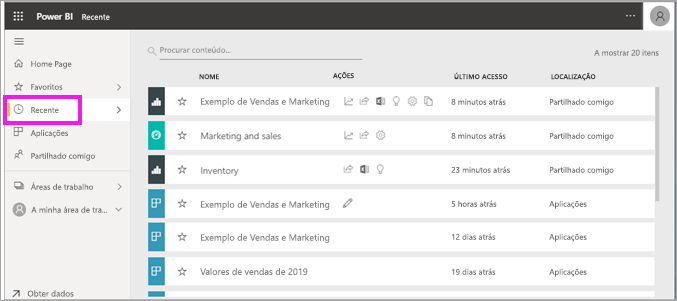
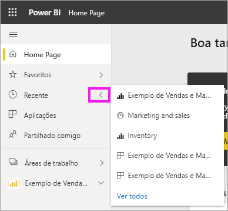
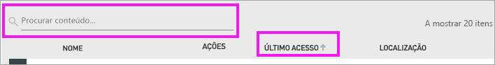

# Conteúdos **recentes** no serviço Power BI
Os conteúdos recentes são os últimos itens (até 20 itens) aos quais acedeu no serviço Power BI.  Incluem: dashboards, relatórios, aplicações e livros.

Veja a Amanda a demonstrar como o serviço Power BI preenche as listas de conteúdo **recente**. Em seguida, siga as instruções passo a passo abaixo do vídeo para experimentar.

<iframe width="560" height="315" src="https://www.youtube.com/embed/G26dr2PsEpk" frameborder="0" allowfullscreen></iframe>

> [!NOTE]
> Este vídeo utiliza uma versão mais antiga do serviço Power BI.

## Apresentar conteúdo recente
Para ver os cinco itens acedidos mais recentemente, no painel de navegação, selecione a seta à direita de **Recente**.  Aqui, pode selecionar o conteúdo recente para abri-lo. Apenas são listados os cinco itens mais recentes.

Se tiver mais de cinco itens acedidos recentemente, selecione **Ver todos** para abrir o ecrã Recente. Também pode selecionar **Recente** ou o  no painel de navegação.

## Ações disponíveis na lista de conteúdo **Recente**
As ações disponíveis dependem das definições atribuídas pelo *designer* do conteúdo. Algumas das opções podem incluir:
* Selecionar o ícone de estrela para [adicionar um dashboard, relatório ou aplicação aos favoritos](end-user-favorite.md) .
* Alguns dashboards e relatórios podem ser partilhados novamente  .
* [Abrir o relatório no Excel](end-user-export.md)  
* [Ver as informações](end-user-insights.md) que o Power BI encontra nos dados .
* Além disso, se as listas ficarem longas, [utilize o campo de pesquisa e a ordenação para localizar o que precisa](end-user-search-sort.md). Para saber se uma coluna pode ser ordenada, paire o cursor para ver se é apresentada uma seta. Neste exemplo, pairar o cursor sobre **Último acesso** mostra uma seta: os seus conteúdos recentes podem ser ordenados por data de acesso. 

    

## Próximos passos
[Aplicações do serviço Power BI](end-user-apps.md)

Mais perguntas? [Pergunte à Comunidade do Power BI](http://community.powerbi.com/)

