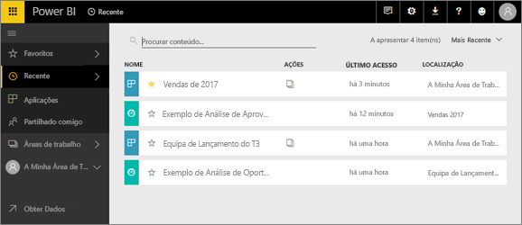
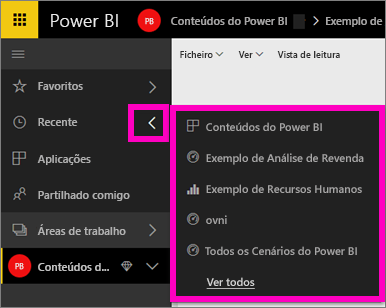
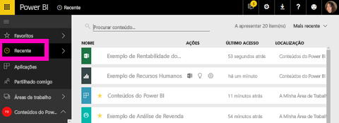

# Conteúdo **recente** no serviço Power BI
Conteúdo recente são os últimos itens (até 20 itens) aos quais acedeu no serviço Power BI.  Estes incluem: dashboards, relatórios, aplicações e livros em todas as áreas de trabalho.

Veja a Amanda a demonstrar como o serviço Power BI preenche as listas de conteúdo **recente**. Em seguida, siga as instruções passo a passo abaixo do vídeo para experimentar.

<iframe width="560" height="315" src="https://www.youtube.com/embed/G26dr2PsEpk" frameborder="0" allowfullscreen></iframe>

## Apresentar conteúdo recente
Para ver os cinco itens acedidos mais recentemente, no painel de navegação esquerdo, selecione a seta à direita de **Recente**.  Aqui, pode selecionar o conteúdo recente para abri-lo. Apenas são listados os cinco itens mais recentes.

Se tiver mais de cinco itens acedidos recentemente, selecione **Ver todos** para abrir o ecrã Recente (ver abaixo). Também pode selecionar **Recente** ou o  no painel de navegação esquerdo.

Aqui, pode interagir com o conteúdo como faria nos separadores [**Dashboards**](end-user-dashboards.md), [**Relatórios**](end-user-reports.md) e **Livros** individuais no ecrã aplicações <!--[**Apps**](end-user-apps.md)-->.

## Próximos passos
<!--[Power BI service Apps](end-user-apps.md)-->

Mais perguntas? [Pergunte à Comunidade do Power BI](http://community.powerbi.com/)

