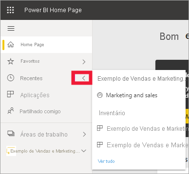
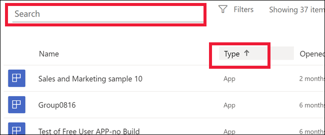

# Conteúdos **recentes** no serviço Power BI

[!INCLUDE[consumer-appliesto-yyny](../includes/consumer-appliesto-yyny.md)]

Os conteúdos **recentes** incluem os últimos itens aos quais acedeu no serviço Power BI. Estes conteúdos podem ser dashboards, relatórios, aplicações e livros. Ao selecionar **Recente** na barra de navegação, o Power BI apresentará os conteúdos por ordem cronológica descendente.  Para alterar a sequência de ordenação, selecione um título e escolha Ascendente ou Descendente.

Repare que dois itens são [favoritos](end-user-favorite.md) e apresentam um ícone de estrela. Um item, o Exemplo de Rentabilidade do Cliente, está armazenado na [Capacidade Premium](end-user-license.md).

## Ver os cinco itens mais recentes

Para apresentar apenas os cinco itens acedidos mais recentemente, selecione a seta à direita de **Recente** no painel de navegação.  Selecione o conteúdo para abri-lo. 

## Ver todos os conteúdos recentes

Se tiver mais de cinco itens acedidos recentemente, selecione **Ver todos** para abrir o ecrã **Recente**. Como fizemos no início deste artigo, pode ignorar a lista de opções e abrir o ecrã **Recente** ao selecionar a palavra **Recente** ou o ícone  no painel de navegação.

## Procurar e ordenar a lista de conteúdos recentes

Se as listas ficarem longas, [utilize o campo de pesquisa e a ordenação para localizar o que precisa](end-user-search-sort.md). Para saber se uma coluna pode ser ordenada, paire o cursor para ver se é apresentada uma seta. Neste exemplo, ao pairar o rato sobre **Tipo**, é apresentada uma seta. A partir da mesma, os conteúdos recentes podem ser ordenados alfabeticamente por tipo de conteúdo. 

Veja a Amanda a demonstrar como o serviço Power BI preenche as listas de conteúdo **recente**. Em seguida, siga as instruções passo a passo abaixo do vídeo para experimentar.

<iframe width="560" height="315" src="https://www.youtube.com/embed/G26dr2PsEpk" frameborder="0" allowfullscreen></iframe>

> [!NOTE]
> Este vídeo utiliza uma versão mais antiga do serviço Power BI.

<!--
## Actions available from the **Recent** content list
The actions available to you will depend on the settings assigned by the content *designer*. Some of your options may include:
* Select the star icon to [favorite a dashboard, report, or app](end-user-favorite.md) .
* Some dashboards and reports can be re-shared  .
* [Open the report in Excel](end-user-export.md)  
* [View insights](end-user-insights.md) that Power BI finds in the data . -->

## Passos seguintes
[Aplicações do serviço Power BI](end-user-apps.md)

Mais perguntas? [Pergunte à Comunidade do Power BI](https://community.powerbi.com/)

