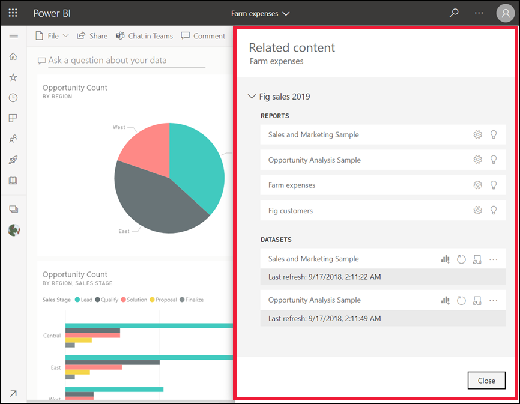
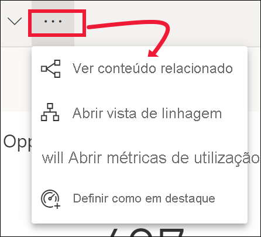

# Ver conteúdos relacionados no serviço Power BI

[!INCLUDE[consumer-appliesto-yyny](../includes/consumer-appliesto-yyny.md)]

[!INCLUDE [power-bi-service-new-look-include](../includes/power-bi-service-new-look-include.md)]

O painel **Conteúdo relacionado** mostra-lhe como os conteúdos de serviço do Power BI (dashboards, relatórios e conjuntos de dados) estão interligados. O painel **Conteúdos relacionados** também é uma plataforma de lançamento para ações. Aqui, pode efetuar tarefas como abrir um dashboard, abrir um relatório, gerar informações, analisar os dados no Excel e muito mais.  

No serviço Power BI, os relatórios são criados com base em conjuntos de dados, os elementos visuais dos relatórios são afixados aos dashboards e os elementos visuais dos dashboards são ligados aos relatórios. Mas como se pode saber que dashboards alojam visuais do seu relatório de Marketing? E como se localizam esses dashboards? O seu dashboard de Aquisição utiliza visuais de mais de um conjunto de dados? Se for esse o caso, que nome têm e como se podem abrir e editar? O seu conjunto de dados de RH está a ser utilizado em relatórios ou dashboards? Ou pode ser movido sem causar ligações quebradas? O painel **Conteúdo relacionado** pode responder a estas e outras perguntas.  Além de o painel apresentar os conteúdos relacionados, também lhe permite realizar ações sobre os conteúdos e navegar facilmente pelos conteúdos relacionados.

> [!NOTE]
> A funcionalidade de conteúdos relacionados não funciona em transmissão de conjuntos de dados.
> 
> 

## Ver conteúdos relacionados de um dashboard ou relatório
Veja o Will a visualizar conteúdos relacionados de um dashboard. Em seguida, siga as instruções passo a passo abaixo do vídeo para experimentar com o exemplo Análise de Aprovisionamento.

> [!NOTE]
> Este vídeo é baseado numa versão anterior do serviço Power BI. 

<iframe width="560" height="315" src="https://www.youtube.com/embed/B2vd4MQrz4M#t=3m05s" frameborder="0" allowfullscreen></iframe>

Com um dashboard ou relatório aberto, selecione **Mais opções** (...) na barra de menus e selecione **Ver conteúdos relacionados** na lista pendente.

É aberto o painel **Conteúdo relacionado**. Para um dashboard, mostra todos os relatórios que têm visualizações afixadas ao dashboard e os respetivos conjuntos de dados. Para este dashboard, há visualizações afixadas de apenas um relatório e esse relatório é baseado em apenas um conjunto de dados. Se observar a imagem no início deste artigo, verá conteúdos relacionados para um dashboard que tem visualizações afixadas a partir de quatro relatórios e de dois conjuntos de dados.

A partir daqui, pode realizar ações diretamente nos conteúdos relacionados, dependendo das permissões.  Por exemplo, selecione um nome de relatório ou dashboard para abri-lo.  Num relatório listado, selecione um ícone para abrir e editar as definições do relatório, [obter informações](end-user-insights.md) e muito mais. Num conjunto de dados, pode ver a data e hora da última atualização, [analisar no Excel](../collaborate-share/service-analyze-in-excel.md), [obter informações](end-user-insights.md), atualizar e muito mais.  

<!-- ## See related content for a dataset
You'll need at least *view* permissions to a dataset to open the **Related content** pane. In this example, we're using the [Procurement Analysis sample](../create-reports/sample-procurement.md).

From the nav pane, locate the **Workspaces** heading and select a workspace from the list. If you have content in a workspace, it will display in the canvas to the right. 

In a workspace, select the **Datasets** tab and locate the **See related** icon .

Select the icon to open the **Related content** pane.

From here, you can take direct action on the related content. For example, select a dashboard or report name to open it.  For any dashboard in the list, select an icon to [share the dashboard with others](../collaborate-share/service-share-dashboards.md) or to open the **Settings** window for the dashboard. For a report, select an icon to [analyze in Excel](../collaborate-share/service-analyze-in-excel.md), [rename](../create-reports/service-rename.md), or [get insights](end-user-insights.md).  -->

## Limitações e resolução de problemas
* Se não vir “Ver relacionados”, procure o ícone . Selecione o ícone para abrir o painel **Conteúdo relacionado**.
* Para abrir o conteúdo relacionado de um relatório, precisa de estar na [Vista de leitura](end-user-reading-view.md).
* A funcionalidade de conteúdo relacionado não funciona em conjuntos de dados de transmissão em fluxo.

## Próximos passos
* [Introdução ao serviço Power BI](../fundamentals/service-get-started.md)
* Mais perguntas? [Pergunte à Comunidade do Power BI](https://community.powerbi.com/)
