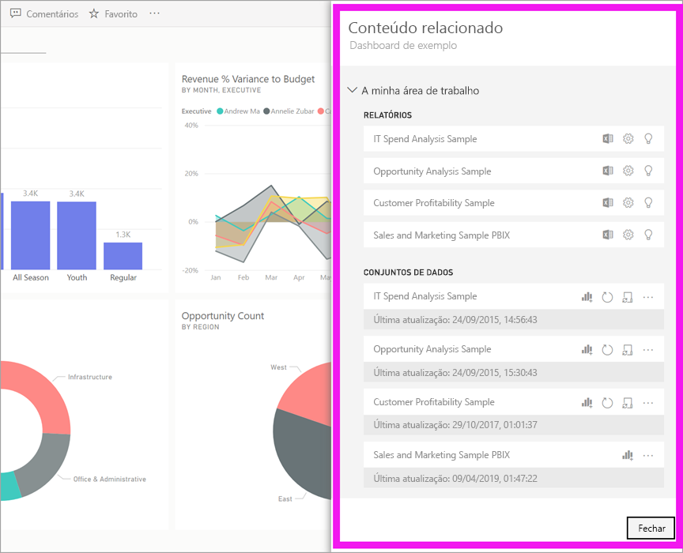
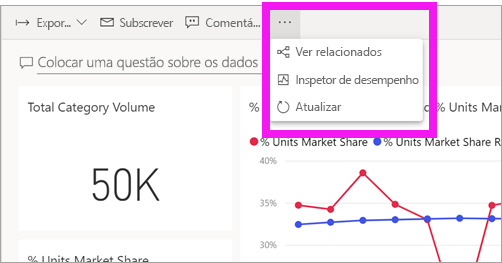
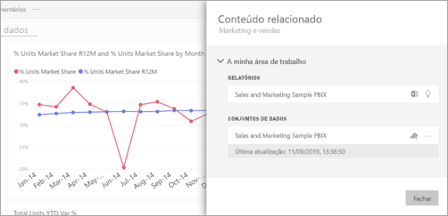
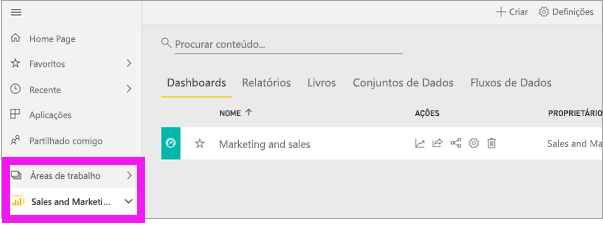
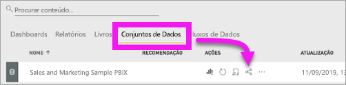
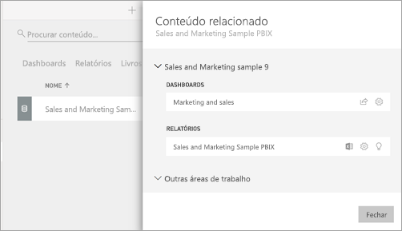

# Ver conteúdos relacionados no serviço Power BI

[!INCLUDE[consumer-appliesto-ynny](../includes/consumer-appliesto-ynny.md)]

[!INCLUDE [power-bi-service-new-look-include](../includes/power-bi-service-new-look-include.md)]

O painel **Conteúdo relacionado** mostra-lhe como os conteúdos de serviço do Power BI (dashboards, relatórios e conjuntos de dados) estão interligados. O painel **Conteúdos relacionados** também é uma plataforma de lançamento para ações. Aqui, pode efetuar tarefas como abrir um dashboard, abrir um relatório, gerar informações, analisar os dados no Excel e muito mais.  

No Power BI, os relatórios são criados com base em conjuntos de dados, os visuais de relatórios são afixados aos dashboards e os visuais dos dashboards são ligados aos relatórios. Mas como se pode saber que dashboards alojam visuais do seu relatório de Marketing? E como se localizam esses dashboards? O seu dashboard de Aquisição utiliza visuais de mais de um conjunto de dados? Se for esse o caso, que nome têm e como se podem abrir e editar? O seu conjunto de dados de RH está a ser utilizado em relatórios ou dashboards? Ou pode ser movido sem causar ligações quebradas? O painel **Conteúdo relacionado** pode responder a estas e outras perguntas.  Além de o painel apresentar os conteúdos relacionados, também lhe permite realizar ações sobre os conteúdos e navegar facilmente pelos conteúdos relacionados.

> [!NOTE]
> A funcionalidade de conteúdos relacionados não funciona em transmissão de conjuntos de dados.
> 
> 

## Ver conteúdos relacionados de um dashboard ou relatório
Veja o Will a visualizar conteúdos relacionados de um dashboard. Depois, siga as instruções passo a passo abaixo do vídeo para experimentar com a base de dados de exemplo Análise de Aprovisionamento.

<iframe width="560" height="315" src="https://www.youtube.com/embed/B2vd4MQrz4M#t=3m05s" frameborder="0" allowfullscreen></iframe>

Com um dashboard ou relatório aberto, selecione **Mais opções** (...) na barra de menus e selecione **Ver relacionados** na lista pendente.

É aberto o painel **Conteúdo relacionado**. Para um dashboard, mostra todos os relatórios que têm visualizações afixadas ao dashboard e os respetivos conjuntos de dados. Para este dashboard, há visualizações afixadas de apenas um relatório e esse relatório é baseado em apenas um conjunto de dados. 

A partir daqui, pode efetuar ações diretamente sobre os conteúdos relacionados.  Por exemplo, selecione um nome de relatório ou dashboard para abri-lo.  Para um relatório listado, selecione um ícone para [analisar no Excel](../collaborate-share/service-analyze-in-excel.md) ou [obter informações](end-user-insights.md). Para um conjunto de dados, pode ver a data e hora da última atualização, [analisar no Excel](../collaborate-share/service-analyze-in-excel.md) e [obter informações](end-user-insights.md).  

## Ver conteúdos relacionados de um conjunto de dados
Precisará, no mínimo, de permissões de *visualização* de um conjunto de dados para abrir o painel **Conteúdos relacionados**. Neste exemplo, vamos utilizar o [exemplo Análise de Aprovisionamento](../create-reports/sample-procurement.md).

No painel de navegação, localize o cabeçalho **Áreas de trabalho** e selecione uma área de trabalho na lista. Se tiver conteúdo numa área de trabalho, este será apresentado na tela à direita. 

Numa área de trabalho, selecione o separador **Conjuntos de Dados** e procure o ícone **Ver relacionados**.

Selecione o ícone para abrir o painel **Conteúdo relacionado**.

A partir daqui, pode efetuar ações diretamente sobre os conteúdos relacionados. Por exemplo, selecione um nome de dashboard ou relatório para abri-lo.  Para qualquer dashboard na lista, selecione um ícone para [partilhar o dashboard com outras pessoas](../collaborate-share/service-share-dashboards.md) ou para abrir a janela **Definições** do dashboard. Para um relatório, selecione um ícone para [analisar no Excel](../collaborate-share/service-analyze-in-excel.md), [mudar o nome](../create-reports/service-rename.md) ou [obter informações](end-user-insights.md).  

## Limitações e resolução de problemas
* Se não vir a opção "Ver relacionados", procure o ícone . Selecione o ícone para abrir o painel **Conteúdo relacionado**.
* Para abrir o Conteúdo relacionado de um relatório, precisa de estar na [Vista de leitura](end-user-reading-view.md).
* A funcionalidade Conteúdos relacionados não funciona em transmissão de conjuntos de dados.

## Próximos passos
* [Introdução ao serviço Power BI](../fundamentals/service-get-started.md)
* Mais perguntas? [Pergunte à Comunidade do Power BI](https://community.powerbi.com/)
