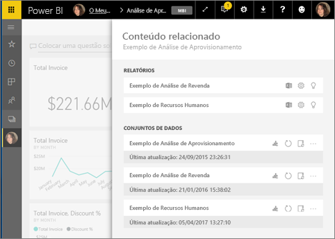
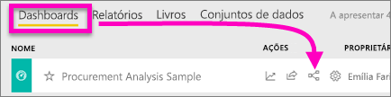
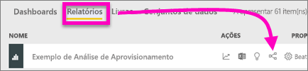
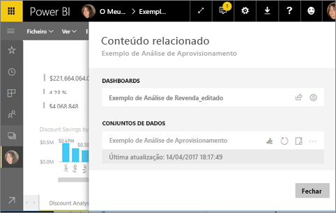
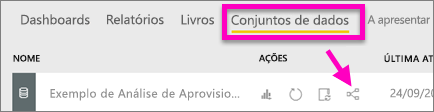
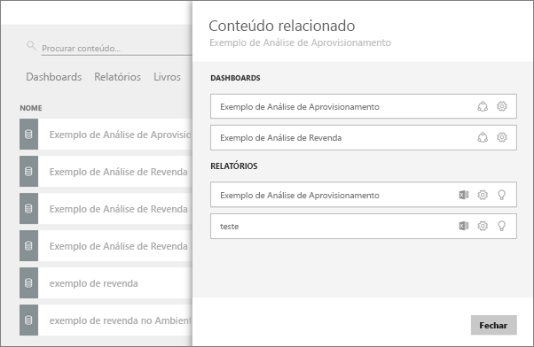

# Ver conteúdos relacionados no serviço Power BI
O painel **Conteúdo relacionado** mostra-lhe como os conteúdos de serviço do Power BI (dashboards, relatórios e conjuntos de dados) estão interligados. O painel Conteúdos relacionados também é uma plataforma de lançamento para ação. Aqui pode atualizar, mudar o nome, gerar informações e muito mais. Selecione um dashboard ou relatório relacionado, e este será aberto na sua área de trabalho do Power BI.   

No Power BI, os relatórios são criados com base em conjuntos de dados, os visuais de relatórios são afixados aos dashboards e os visuais dos dashboards são ligados aos relatórios. Mas como se pode saber que dashboards alojam visuais do seu relatório de Marketing? E como se localizam esses dashboards? O seu dashboard de Aquisição utiliza visuais de mais de um conjunto de dados? Se for esse o caso, que nome têm e como se podem abrir e editar? O seu conjunto de dados de RH está a ser utilizado em relatórios ou dashboards? Ou pode ser movido sem causar ligações quebradas? O painel **Conteúdo relacionado** pode responder a estas e outras perguntas.  Além de o painel apresentar os conteúdos relacionados, também lhe permite realizar ações sobre os conteúdos e navegar facilmente pelos conteúdos relacionados.

> [!NOTE]
> A funcionalidade de conteúdos relacionados não funciona em transmissão de conjuntos de dados.
> 
> 

## Ver conteúdos relacionados de um dashboard
Veja o Will a visualizar conteúdos relacionados de um dashboard. Depois, siga as instruções passo a passo abaixo do vídeo para experimentar com a base de dados de exemplo Análise de Aprovisionamento.

<iframe width="560" height="315" src="https://www.youtube.com/embed/B2vd4MQrz4M#t=3m05s" frameborder="0" allowfullscreen></iframe>

Precisará, no mínimo, de permissões de *visualização* de um dashboard para abrir o painel **Conteúdos relacionados**. Neste exemplo, vamos utilizar o [exemplo Análise de Aprovisionamento](../sample-procurement.md).

**Método 1**

Numa área de trabalho, selecione o separador **Dashboards** e, em seguida, selecione o ícone **Ver relacionados** .

 

**Método 2**

Com um dashboard aberto, selecione    na barra de menus superior.

É aberto o painel **Conteúdo relacionado**. Mostra todos os relatórios que têm visualizações afixadas ao dashboard e os respetivos conjuntos de dados. A partir deste dashboard, existem visualizações afixadas de três relatórios diferentes e estes relatórios baseiam-se em três conjuntos de dados diferentes.

A partir daqui, pode efetuar ações diretamente sobre os conteúdos relacionados.  Por exemplo, selecione um nome de relatório para abri-lo.  Para um relatório listado, selecione um ícone para [analisar no Excel](../service-analyze-in-excel.md), [mudar o nome](../service-rename.md) ou [obter informações](end-user-insights.md). Para um conjunto de dados, selecione um ícone para [criar um novo relatório](../service-report-create-new.md), [atualizar](../refresh-data.md), mudar o nome, [analisar no Excel](../service-analyze-in-excel.md), [obter informações](end-user-insights.md) ou abrir a janela **Definições** do conjunto de dados.  

## Ver conteúdos relacionados de um relatório
Precisará, no mínimo, de permissões de *visualização* de um relatório para abrir o painel **Conteúdos relacionados**. Neste exemplo, vamos utilizar o [exemplo Análise de Aprovisionamento](../sample-procurement.md).

**Método 1**

Numa área de trabalho, selecione o separador **Relatórios** e, em seguida, selecione o ícone **Ver relacionados** .

 

**Método 2**

Abra o relatório na [Vista de Leitura](end-user-reading-view.md) e selecione  na barra de menus superior.

É aberto o painel **Conteúdo relacionado**. Mostra o conjunto de dados associado e todos os dashboards que têm pelo menos um mosaico afixado do relatório. Para este relatório, existem visualizações afixadas a 2 dashboards diferentes.

A partir daqui, pode efetuar ações diretamente sobre os conteúdos relacionados.  Por exemplo, selecione um nome de dashboard para abri-lo.  Para qualquer dashboard na lista, selecione um ícone para [partilhar o dashboard com outras pessoas](../service-share-dashboards.md) ou para abrir a janela **Definições** do dashboard. Para o conjunto de dados, selecione um ícone para [criar um novo relatório](../service-report-create-new.md), [atualizar](../refresh-data.md), mudar o nome, [analisar no Excel](../service-analyze-in-excel.md), [obter informações](end-user-insights.md) ou abrir a janela **Definições** do conjunto de dados.  

## Ver conteúdos relacionados de um conjunto de dados
Precisará, no mínimo, de permissões de *visualização* de um conjunto de dados para abrir o painel **Conteúdos relacionados**. Neste exemplo, vamos utilizar o [exemplo Análise de Aprovisionamento](../sample-procurement.md).

Numa área de trabalho, selecione o separador **Conjuntos de Dados** e procure o ícone **Ver relacionados** .

Selecione o ícone para abrir o painel **Conteúdo relacionado**.

A partir daqui, pode efetuar ações diretamente sobre os conteúdos relacionados. Por exemplo, selecione um nome de dashboard ou relatório para abri-lo.  Para qualquer dashboard na lista, selecione um ícone para [partilhar o dashboard com outras pessoas](../service-share-dashboards.md) ou para abrir a janela **Definições** do dashboard. Para um relatório, selecione um ícone para [analisar no Excel](../service-analyze-in-excel.md), [mudar o nome](../service-rename.md) ou [obter informações](end-user-insights.md).  

## Limitações e resolução de problemas
* Se não vir a opção "Ver relacionados", procure o ícone . Selecione o ícone para abrir o painel **Conteúdo relacionado**.
* Para abrir o Conteúdo relacionado de um relatório, precisa de estar na [Vista de leitura](end-user-reading-view.md).
* A funcionalidade Conteúdos relacionados não funciona em transmissão de conjuntos de dados.

## Próximos passos
* [Introdução ao serviço Power BI](../service-get-started.md)
* Mais perguntas? [Pergunte à Comunidade do Power BI](http://community.powerbi.com/)

