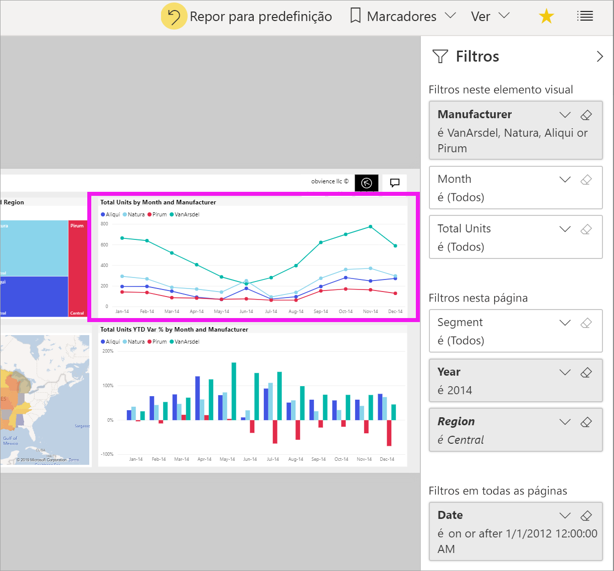
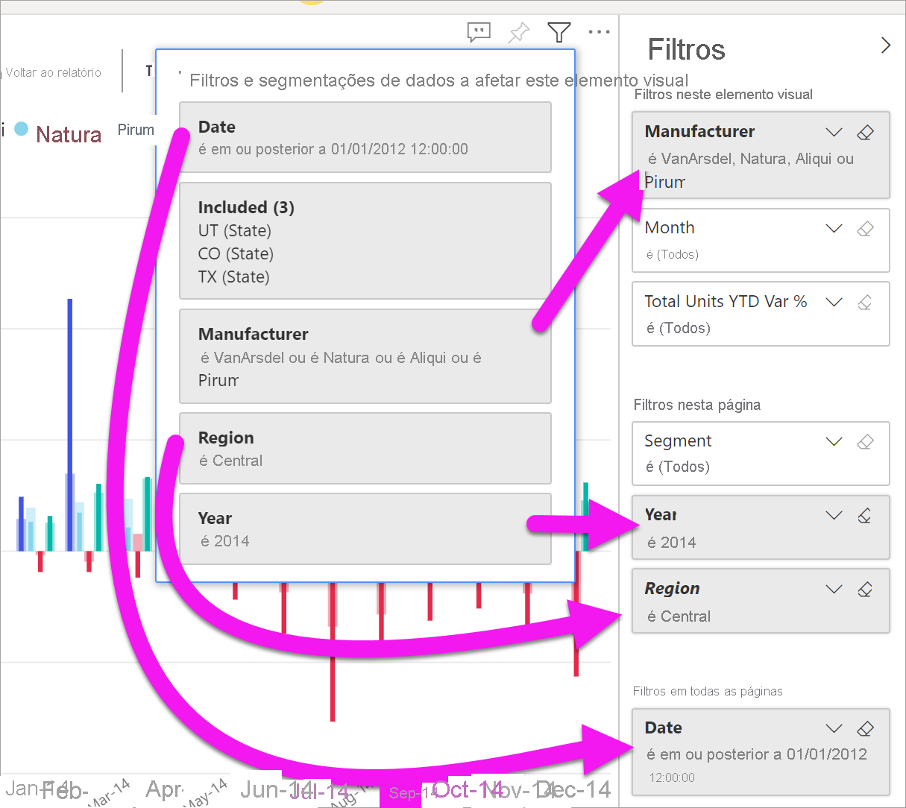
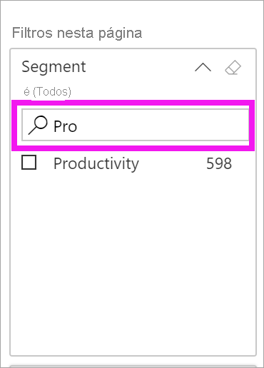
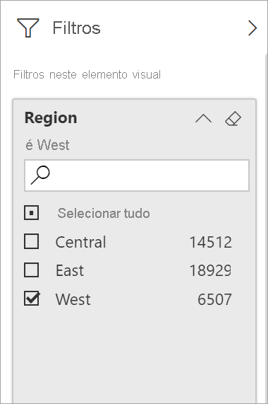
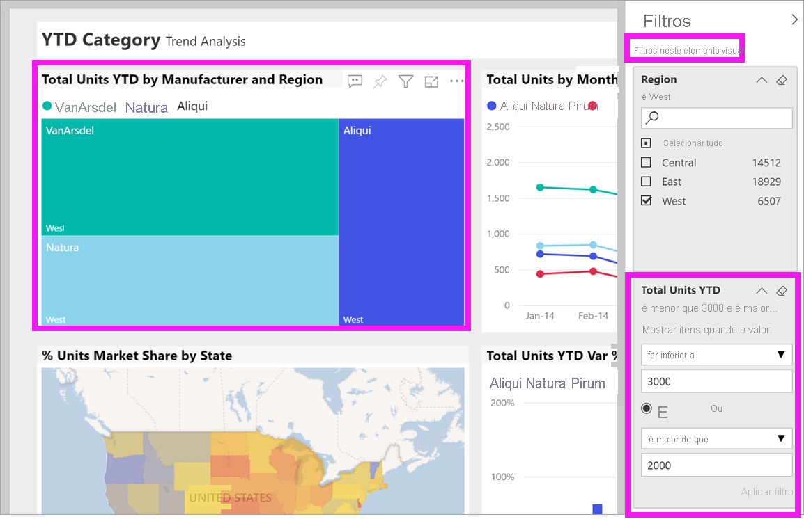
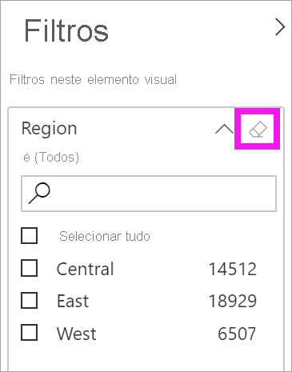

# Fazer uma visita do painel Filtros

Este artigo analisa o painel **Filtros** de relatórios no serviço Power BI. Utilize os filtros para descobrir novas informações nos seus dados.

Existem muitas formas diferentes de filtrar dados no Power BI. Para obter mais informações sobre os filtros, veja [Filtros e realces nos relatórios do Power BI](../power-bi-reports-filters-and-highlighting.md).

## Trabalhar com o painel Filtros

Quando um colega partilha um relatório consigo, verifique o painel **Filtros**. Por vezes, é encolhido ao longo da margem direita do relatório. Selecione-o para expandi-lo.

O painel **Filtros** contém filtros que o *estruturador* do relatório adicionou ao mesmo. Os *consumidores* podem interagir com os filtros existentes e guardar alterações, mas não podem adicionar novos filtros ao relatório. Por exemplo, na captura de ecrã acima, o estruturador adicionou três filtros de nível de página: O **Segmento é Todos**, o **Ano é 2014** e a **Região é Central**. Pode interagir com estes filtros e alterá-los, mas não pode adicionar um quarto filtro ao nível da página.

No serviço Power BI, todas as alterações efetuadas no painel **Filtros** são mantidas nos relatórios. O serviço aplica essas alterações na versão do relatório para dispositivos móveis.

Para repor o painel **Filtros** para as predefinições do designer, selecione **Repor predefinição** na barra de menus superior.

 

## Ver todos os filtros de uma página de relatórios

O painel **Filtros** apresenta todos os filtros que o estruturador adicionou ao relatório. O painel **Filtros** também é a área em que pode ver informações sobre os filtros e interagir com os mesmos. Guarde as alterações que efetuar ou utilize **Repor predefinição** para reverter para as definições originais dos filtros.

Se tiver alterações que pretende guardar, também pode criar um marcador pessoal. Para obter mais informações, veja [O que são os marcadores?](end-user-bookmarks.md).

O painel **Filtros** apresenta e gere vários tipos de filtros de relatórios: relatório, página de relatório e elemento visual.

Neste exemplo, selecionámos um elemento visual com três filtros. A página de relatórios também tem filtros, listados no cabeçalho **Filtros nesta página**. O relatório tem um filtro de **Data**.

Alguns filtros têm **(Todos)** junto aos mesmos. **(Todos)** significa que todos os valores são incluídos no filtro. Na captura de ecrã apresentada acima, **Segment (Todos)** (Segmento [Tudo]) indica que esta página de relatório inclui dados sobre todos os segmentos de produtos. 

Qualquer pessoa a ver este relatório pode interagir com estes filtros.

### Ver apenas estes filtros aplicados a um elemento visual

Para examinar mais detalhadamente os filtros aplicados a um elemento visual específico, paire o cursor sobre o elemento visual para revelar o ícone de filtro . Selecione este ícone de filtro para ver um menu de pop-up com todos os filtros, segmentações de dados, entre outros, que afetam este elemento visual. Os filtros no pop-up incluem os mesmos filtros apresentados no painel **Filtros**, além da filtragem adicional que afeta o elemento visual selecionado.

Eis os tipos de filtros que esta vista pode apresentar:

- Filtros básicos
- Segmentações
- Realce cruzado
- Filtragem cruzada
- Filtros avançados
- Filtros de itens principais
- Filtros de Data Relativa
- Segmentações de dados síncronas
- Filtros de Inclusão/Exclusão
- Filtros passados por um URL

Neste exemplo:
1. **Incluído** informa-nos que o elemento visual foi alvo de filtragem cruzada, o que significa que os Estados do Utah, Colorado e Texas foram selecionados num dos outros elementos visuais nesta página de relatório. Neste caso, é o mapa. A seleção desses três Estados fez com que os dados fossem eliminados para os outros Estados e não fossem apresentados no gráfico de barras selecionado.  

1. **Data** é um filtro aplicado a todas as páginas neste relatório e

1. **Região é Central** e **Ano é 2014** são os filtros aplicados a esta página de relatório e

4. **O Fabricante é VanArsdel, Natura, Aliqui ou Pirum** é um filtro aplicado a este elemento visual.

### Pesquisar num filtro

Por vezes, um filtro pode ter uma grande lista de valores. Utilize a caixa de pesquisa para procurar e selecionar o valor pretendido.

### Apresentar detalhes de filtros

Para compreender os filtros, observe os valores e números disponíveis.  Veja os detalhes do filtro ao pairar o rato e selecionar a seta junto ao nome do mesmo.
  

### Alterar as seleções de filtros

Uma forma de procurar informações de dados é interagir com os filtros. Pode alterar seleções de filtros com a seta pendente junto ao nome do campo.  Conforme o filtro e o tipo de dados filtrados pelo Power BI, as suas opções irão variar entre seleções simples de uma lista e a identificação de intervalos de datas ou números. No filtro avançado apresentado abaixo, alterámos o filtro **Total Units YTD** (Total de Unidades do Ano até à Data) no gráfico treemap para um valor entre 2000 e 3000. Tenha em atenção que esta alteração remove o fabricante Pirum do gráfico treemap.
  

> [!TIP]
> Para selecionar mais do que um valor de filtro de uma só vez, mantenha a tecla Ctrl premida. A maioria dos filtros suporta a seleção múltipla.

### Repor os filtros para a predefinição

Se quiser anular todas as alterações efetuadas aos filtros, selecione **Repor para predefinição** na barra de menus superior.  Esta seleção reverte os filtros para o seu estado original, conforme definido pelo estruturador do relatório.

### Limpar um filtro

Para repor um filtro para (Todos), desmarque-o ao selecionar o ícone de borracha junto ao nome do filtro.

  
<!--  too much detail for consumers

## Types of filters: text field filters
### List mode
Ticking a checkbox either selects or deselects the value. The **All** checkbox can be used to toggle the state of all checkboxes on or off. The checkboxes represent all the available values for that field.  As you adjust the filter, the restatement updates to reflect your choices. 

Note how the restatement now says "is Mar, Apr or May".

### Advanced mode
Select **Advanced Filtering** to switch to advanced mode. Use the dropdown controls and text boxes to identify which fields to include. By choosing between **And** and **Or**, you can build complex filter expressions. Select the **Apply Filter** button when you've set the values you want.  

## Types of filters: numeric field filters
### List mode
If the values are finite, selecting the field name displays a list.  See **Text field filters** &gt; **List mode** above for help using checkboxes.   

### Advanced mode
If the values are infinite or represent a range, selecting the field name opens the advanced filter mode. Use the dropdown and text boxes to specify a range of values that you want to see. 

By choosing between **And** and **Or**, you can build complex filter expressions. Select the **Apply Filter** button when you've set the values you want.

## Types of filters: date and time
### List mode
If the values are finite, selecting the field name displays a list.  See **Text field filters** &gt; **List mode** above for help using checkboxes.   

### Advanced mode
If the field values represent date or time, you can specify a start/end time when using Date/Time filters.  

-->

## Próximos passos

Saiba de que forma e por que motivo os [elementos visuais realizam filtragem cruzada e realce cruzado entre si numa página de relatório](end-user-interactions.md)