# Fazer uma visita do painel Filtros
Este artigo analisa o painel Filtros de relatórios no serviço Power BI.

Existem diversas formas de filtrar dados no Power BI e recomendamos que comece por ler [Sobre os filtros e o realce](../power-bi-reports-filters-and-highlighting.md).

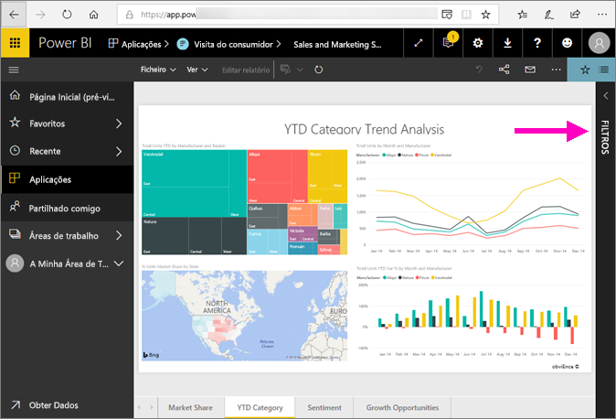

## Trabalhar com o painel Filtros
Quando um colega partilha um relatório consigo, verifique o painel **Filtros**. Por vezes, é encolhido ao longo da margem direita do relatório. Selecione-o para expandi-lo.   

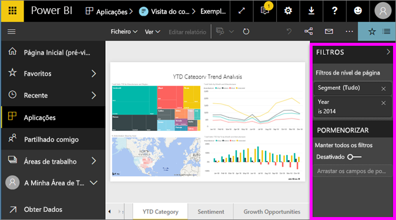

O painel Filtros contém filtros que foram adicionados ao relatório pelo *designer* do relatório. Os *consumidores* como você, podem interagir com os filtros e guardar as suas alterações, mas não podem adicionar novos filtros ao relatório. Por exemplo, na captura de ecrã acima, o estruturador adicionou dois filtros de nível de página: Segment (Segmento) e Year (Ano). Pode interagir com estes filtros e alterá-los, mas não pode adicionar um terceiro filtro de nível de página.

No serviço Power BI, os relatórios mantêm todas as alterações que fizer no painel Filtros e essas alterações transitam para a versão para dispositivos móveis do relatório. Para repor o painel Filtros para as predefinições do designer, selecione **Repor para predefinição** na barra de menus superior.     

## Abrir o painel Filtros
Quando um relatório está aberto, o painel Filtros é apresentado no lado direito da tela de relatórios. Se não vir o painel, selecione a seta no canto superior direito para expandi-la.  

Neste exemplo selecionámos um visual com 6 filtros. A página de relatórios também tem filtros, listados no cabeçalho **Filtros de nível de página**. Há um [Filtro de pormenorização](../power-bi-report-add-filter.md) e o relatório completo tem também um filtro: **FiscalYear** is 2013 or 2014 (Ano Fiscal é 2013 ou 2014).

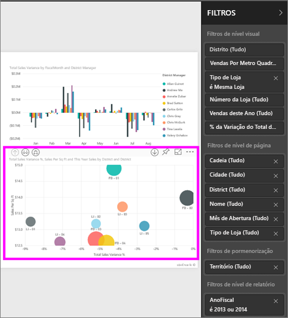

Alguns dos filtros têm a palavra **Tudo** junto aos mesmos, o que significa que todos os valores estão incluídos no filtro.  Por exemplo, na captura de ecrã acima, **Chain (All)** (Cadeia [Tudo]) indica-nos que esta página de relatório inclui dados sobre todas as cadeias de lojas.  Por outro lado, o filtro ao nível de relatório de **FiscalYear is 2013 or 2014** indica que o relatório inclui apenas dados correspondentes aos anos fiscais de 2013 e 2014.

Qualquer pessoa a ver este relatório pode interagir com estes filtros.

- Pesquise na página, no elemento visual, no relatório e nos filtros de pormenorização para localizar e selecionar o valor pretendido. 

    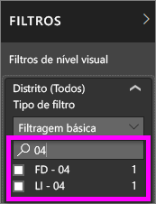

- Veja os detalhes do filtro ao pairar o rato e selecionar a seta junto ao filtro.
  
   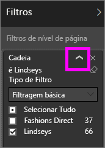
* Altere o filtro, por exemplo, altere **Lindseys** para **Fashions Direct**.
  
     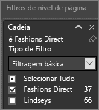

* Reponha os filtros para o seu estado original ao selecionar **Repor para predefinição** na barra de menus superior.    
    
    
* Elimine o filtro ao selecionar o **x** junto ao nome do filtro.
  
    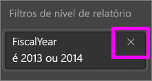

  Eliminar um filtro remove-o da lista, mas não elimina os dados do relatório.  Por exemplo, se eliminar **FiscalYear is 2013 or 2014** (Ano Fiscal é 2013 ou 2014), os dados do ano fiscal permanecerão no relatório, mas já não serão filtrados para mostrar apenas 2013 e 2014; irão mostrar todos os anos fiscais que os dados contêm.  No entanto, após eliminar o filtro, não poderá modificá-lo novamente, uma vez que foi removido da lista. Uma opção melhor é limpar o filtro ao selecionar o ícone da borracha .
  
  

## Limpar um filtro
 No modo de filtragem avançado ou básico, selecione o ícone da borracha   para limpar o filtro. 

## Tipos de filtros: filtros de campo de texto
### Modo de lista
Marcar uma caixa de verificação ou seleciona ou deseleciona o valor. A caixa de verificação **Tudo** pode ser utilizada para ativar ou desativar o estado de todas as caixas de verificação. As caixas de verificação representam todos os valores disponíveis para esse campo.  À medida que ajusta o filtro, a reformulação é ajustada para refletir as suas escolhas. 

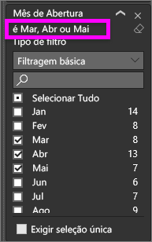

Observe como a reformulação agora indica "is Mar, Apr or May" (é Mar, Abr ou Mai).

### Modo avançado
Selecione **Filtragem Avançada** para mudar para o modo avançado. Utilize os controlos de lista pendente e as caixas de texto para identificar quais campos serão incluídos. Ao escolher entre **And** (E) e **Or** (Ou), pode criar expressões de filtros complexas. Selecione o botão **Aplicar Filtro** quando tiver definido os valores pretendidos.  

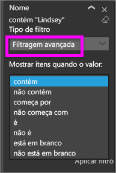

## Tipos de filtros: filtros de campo numérico
### Modo de lista
Se os valores forem finitos, selecionar o nome do campo apresenta uma lista.  Consulte **Filtros de campos de texto** &gt; **Modo de lista** acima para obter ajuda na utilização de caixas de verificação.   

### Modo avançado
Se os valores forem infinitos ou representarem um intervalo, selecionar o nome do campo abre o modo de filtro avançado. Utilize a lista pendente e as caixas de texto para especificar o intervalo de valores que pretende ver. 

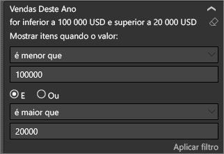

Ao escolher entre **And** (E) e **Or** (Ou), pode criar expressões de filtros complexas. Selecione o botão **Aplicar Filtro** quando tiver definido os valores pretendidos.

## Tipos de filtros: data e hora
### Modo de lista
Se os valores forem finitos, selecionar o nome do campo apresenta uma lista.  Consulte **Filtros de campos de texto** &gt; **Modo de lista** acima para obter ajuda na utilização de caixas de verificação.   

### Modo avançado
Se os valores de campo representarem a data ou hora, pode especificar uma hora de início/fim quando utilizar os filtros de Data/Hora.  

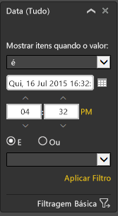

## Próximos passos
[Saiba como os elementos visuais de relatórios realizam filtragem cruzada e realce cruzado entre si numa página de relatório](end-user-interactions.md)