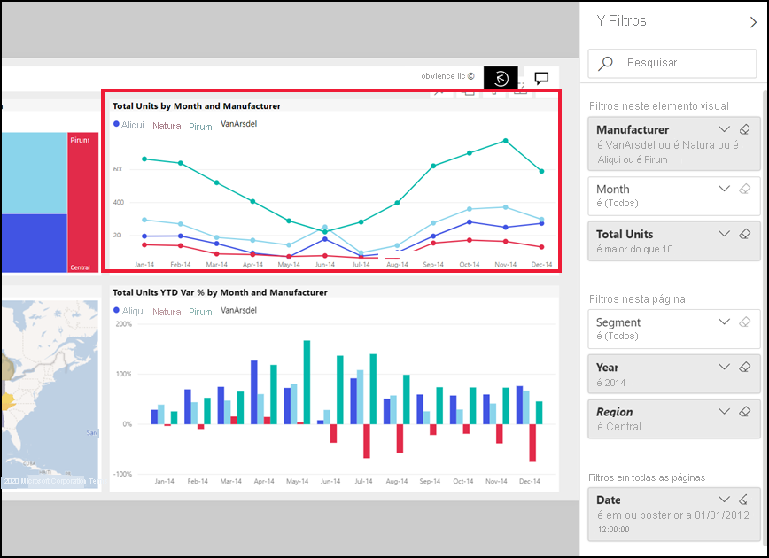

# Fazer uma visita do painel Filtros
Este artigo examina o painel de filtros de relatório no serviço Power BI. Utilize os filtros para descobrir novas informações nos seus dados.

Existem diversas formas de filtrar dados no Power BI e recomendamos que comece por ler [Sobre os filtros e o realce](../power-bi-reports-filters-and-highlighting.md).

## Trabalhar com o painel Filtros
Quando um colega partilha um relatório consigo, verifique o painel **Filtros**. Por vezes, é encolhido ao longo da margem direita do relatório. Selecione-o para expandi-lo.   

O painel Filtros contém filtros que foram adicionados ao relatório pelo *designer* do relatório. *Os consumidores* como, pode interagir com os filtros existentes e guarde as alterações, mas não é possível adicionar novos filtros ao relatório. Por exemplo, na captura de ecrã acima, o estruturador adicionou dois filtros de nível de página: Segmentar e em execução o ano. Pode interagir com estes filtros e alterá-los, mas não pode adicionar um terceiro filtro de nível de página.

No serviço Power BI, relatórios mantêm todas as alterações que fizer no painel de filtros e essas alterações transitam para a versão móvel do relatório. Para repor o painel Filtros para as predefinições do designer, selecione **Repor para predefinição** na barra de menus superior.  

   

## Ver todos os filtros para uma página de relatório
O painel filtros mostrará todos os filtros adicionados ao relatório, o *designer*. O painel filtros também é a área onde pode ver informações sobre os filtros e interagir com eles. Pode salvar as alterações depois de efetuar ou usarem **repor para predefinição** para reverter para as definições de filtro original.

Se existirem alterações que deseja salvar, também pode criar um indicador de pessoal.  Para obter mais informações, consulte [adicionar um marcador a um relatório](end-user-bookmarks.md).

Existem vários tipos de filtros de relatório que são apresentados e gerenciados a partir do painel filtros, das aplicadas a um elemento visual, a uma página de relatório e para todo o relatório.

Neste exemplo, selecionámos um visual com 2 filtros. A página de relatório também tem filtros, listados no **filtros nesta página** cabeçalho. E todo o relatório tem um filtro de data.

Alguns dos filtros têm a palavra **Tudo** junto aos mesmos, o que significa que todos os valores estão incluídos no filtro.  Por exemplo, **Segment(All)** na captura de ecrã acima indica-nos que esta página de relatório inclui dados sobre todos os segmentos de produto.  Por outro lado, o nível de página filtrar dos **região é oeste** nos informa que a página de relatório inclui apenas os dados para a região Oeste.

Qualquer pessoa a ver este relatório pode interagir com estes filtros.

### Ver apenas os filtros aplicados a um elemento visual
Para obter uma análise detalhada dos filtros aplicados a um elemento visual específico, passe o rato sobre o elemento visual para revelar o ícone de filtro . Selecione esse ícone de filtro para ver um pop-up com todos os filtros, segmentações de dados e assim por diante, afetar esse elemento visual. Os filtros no pop-up são os mesmos filtros apresentados no **filtros** painel. 

 
Aqui estão os tipos de filtros, que pode apresentar nesta vista:
- Filtros básicos
- Segmentações
- Realce cruzado
- Filtragem cruzada
- Filtros avançados
- Filtros de itens principais
- Filtros de Data Relativa
- Segmentações de dados síncronas
- Filtros de Inclusão/Exclusão
- Filtros passados por um URL

No exemplo, abaixo:
1. Podemos ver que o gráfico de colunas foi um filtro.
2. **Incluído** nos diz que o filtro cruzado se destina **segmento**, e três estão incluídas. 
3. Uma segmentação de dados foi aplicada ao **trimestre**.
4. **Região** é um filtro aplicado a essa página de relatório, e
5. **isVanArsdel** e **ano** são aplicados neste elemento visual.

### Pesquisar num filtro
Por vezes, um filtro pode ter uma longa lista de valores. Utilize a caixa de pesquisa para localizar e selecionar o valor desejado. 

### Detalhes do filtro de apresentação
Para compreender um filtro, dê uma olhada em contagens de valores disponíveis e.  Ver os detalhes do filtro ao pairar o rato e selecionar a seta junto ao nome do filtro. 
  

### Seleções de filtro de alteração
Uma forma de procurar informações de dados é para interagir com os filtros. Pode alterar as seleções de filtro com a seta da lista pendente junto ao nome do campo.  Dependendo do filtro e o tipo de dados que está a ser filtrados, suas opções recairá no intervalo entre as seleções simples de uma lista para identificar intervalos de datas ou números. O filtro avançado abaixo, Alterámos o filtro **Total de unidades de ano até à data** no treemap para ser entre 2000 e 3000. Tenha em atenção que esta ação remove Prirum do treemap. 
  

> [!TIP]
> Para selecionar mais do que um valor de filtro ao mesmo tempo, mantenha premida a tecla CTRL. A maioria dos filtros suportam seleção múltipla. 

### Repor filtro para predefinição
Se quiser sair todas as alterações efetuadas nos filtros, selecionados **repor para predefinição** barra de menus superior.  Isso é revertido os filtros para seu estado original, conforme definido pelo relatório *designer*. 

    
### Limpar um filtro
Se existe apenas um filtro que pretende definir como **(todos)** , limpe-o ao selecionar o ícone de borracha  junto ao nome do filtro.
  
<!--  too much detail for consumers

## Types of filters: text field filters
### List mode
Ticking a checkbox either selects or deselects the value. The **All** checkbox can be used to toggle the state of all checkboxes on or off. The checkboxes represent all the available values for that field.  As you adjust the filter, the restatement updates to reflect your choices. 

Note how the restatement now says "is Mar, Apr or May".

### Advanced mode
Select **Advanced Filtering** to switch to advanced mode. Use the dropdown controls and text boxes to identify which fields to include. By choosing between **And** and **Or**, you can build complex filter expressions. Select the **Apply Filter** button when you've set the values you want.  

## Types of filters: numeric field filters
### List mode
If the values are finite, selecting the field name displays a list.  See **Text field filters** &gt; **List mode** above for help using checkboxes.   

### Advanced mode
If the values are infinite or represent a range, selecting the field name opens the advanced filter mode. Use the dropdown and text boxes to specify a range of values that you want to see. 

By choosing between **And** and **Or**, you can build complex filter expressions. Select the **Apply Filter** button when you've set the values you want.

## Types of filters: date and time
### List mode
If the values are finite, selecting the field name displays a list.  See **Text field filters** &gt; **List mode** above for help using checkboxes.   

### Advanced mode
If the field values represent date or time, you can specify a start/end time when using Date/Time filters.  

-->

## Próximos passos
[Saiba como os elementos visuais de relatórios realizam filtragem cruzada e realce cruzado entre si numa página de relatório](end-user-interactions.md)