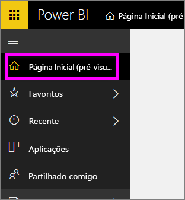
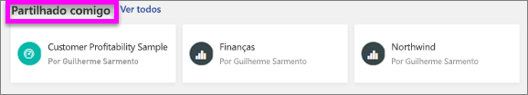
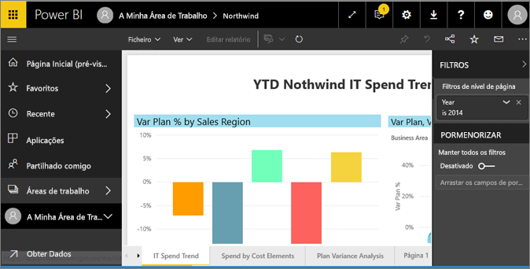
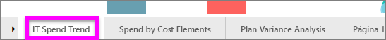
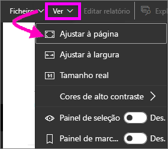
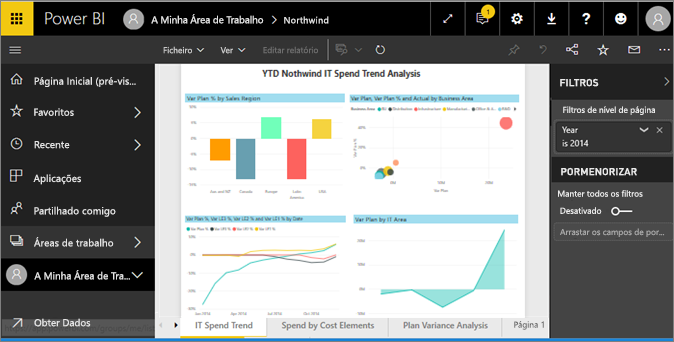
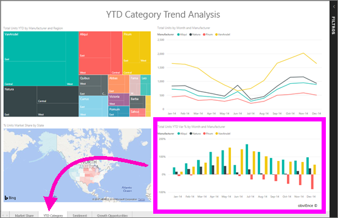

# Visualizar um relatório no serviço Power BI (app.powerbi.com)
Um relatório é uma ou mais páginas de elementos visuais. Os relatórios são criados pelos *designers de relatórios* do Power BI e [partilhados consigo diretamente](end-user-shared-with-me.md) ou como parte de uma [aplicação](end-user-apps.md). 

Existem várias formas diferentes de abrir um relatório e vamos mostrar-lhe duas delas: abrir a partir da página Base e abrir a partir de um dashboard. 

<!-- add art-->

## Abra um relatório a partir da sua página Base
Vamos abrir um relatório que foi partilhado consigo diretamente e, em seguida, abrir um relatório que foi partilhado como parte de uma aplicação.

   

### Abrir um relatório que tenha sido partilhado consigo
Os *designers* do Power BI podem partilhar um relatório diretamente consigo, ao clicar num botão **Partilhar** na sua barra superior de menu. O conteúdo que é partilhado desta maneira aparece no contentor **Partilhado comigo** na barra de navegação à esquerda e na secção **Partilhado comigo** da sua página Base.

1. Abrir o serviço Power BI (app.powerbi.com).

2. Na barra de navegação esquerda, selecione **Base (pré-visualização)** para abrir a sua página Base.  

   
   
3. Desloque para baixo até ver **Partilhado comigo**. Procure o ícone de relatório . Nesta captura de ecrã temos dois relatórios: *Financial* e *Northwind*. 
   
   

4. Basta selecionar um dos cartões de relatório para abrir o relatório.

   

5. Repare nos separadores na parte inferior. Cada separador representa uma *página* do relatório. Atualmente, temos a página *Tendência de gastos de TI* aberta. Selecione um separador diferente para abrir essa página de relatório. 

   

6. Neste momento, podemos ver apenas uma parte da página do relatório. Para alterar a apresentação (zoom) da página, selecione **Visualizar** > **Ajustar à página**.

   

   

### Abrir um relatório que faz parte de uma aplicação
Se tiver recebido aplicações de colegas ou do AppSource, essas aplicações estarão disponíveis na sua página Base e no contentor **Aplicações** na sua barra de navegação esquerda. Uma [aplicação](end-user-apps.md) é um grupo de dashboards e relatórios.

1. Regresse à página Base ao selecionar **Base (pré-visualização)** a partir da barra de navegação esquerda.

7. Desloque para baixo até ver **As Minhas Aplicações**.

   

8. Selecione uma das aplicações para a abrir. Consoante as opções definidas pela aplicação *designer*, a aplicação irá abrir um dashboard ou um relatório. Se, ao selecionar a aplicação:
    - o relatório for aberto, estará tudo pronto.
    - um dashboard for aberto, veja [Abrir um relatório a partir de um dashboard](#Open-a-report-from-a-dashboard), abaixo.

## Abrir um relatório a partir de um dashboard
Os relatórios podem ser abertos a partir de um dashboard. A maioria dos mosaicos do dashboard são *afixados* dos relatórios. Selecionar um mosaico abre o relatório que foi utilizado para criar o mosaico. 

1. A partir de um dashboard, selecione um mosaico. Neste exemplo, selecionámos o mosaico de gráfico de colunas "Total Units YTD...".

    

2.  O relatório associado é aberto. Repare que estamos na página "YTD Category". Esta é a página do relatório que contém o gráfico de colunas que selecionámos a partir do dashboard.

    

> [!NOTE]
> Nem todos os mosaicos levam a um relatório. Se selecionar um mosaico que tenha sido [criado com Perguntas e Respostas](../service-dashboard-pin-tile-from-q-and-a.md), o ecrã de Perguntas e Respostas irá abrir. Se selecionar um mosaico que tenha sido [criado com o widget **Adicionar mosaico** do dashboard](../service-dashboard-add-widget.md), irá abrir o assistente **Editar mosaico**.  

##  Mais formas de abrir um relatório
À medida que vai estando mais à vontade a navegar pelo serviço Power BI, irá descobrir fluxos de trabalho que funcionam melhor para si. Algumas outras formas de aceder a relatórios:
- No painel de navegação esquerdo com **Favoritos** e **Recentes**    
- Com a opção [Ver relacionados](end-user-related.md)    
- Numa mensagem de e-mail quando alguém [partilha consigo](../service-share-reports.md) ou quando [define um alerta](../service-set-data-alerts.md)    
- A partir de seu [Centro de notificações] (end-user-notification-center.md)    
- e muito mais

## Próximos passos
Existem [muitas maneiras de interagir com um relatório](end-user-reading-view.md).  Comece a explorá-las ao selecionar cada separador na parte inferior da tela do relatório.

