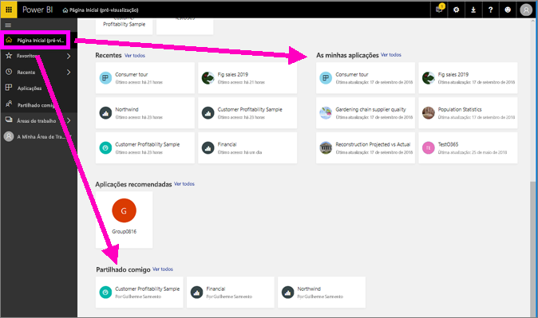
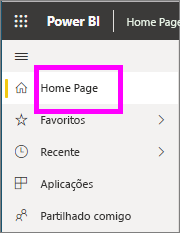
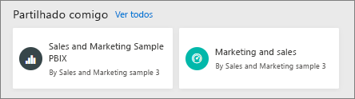
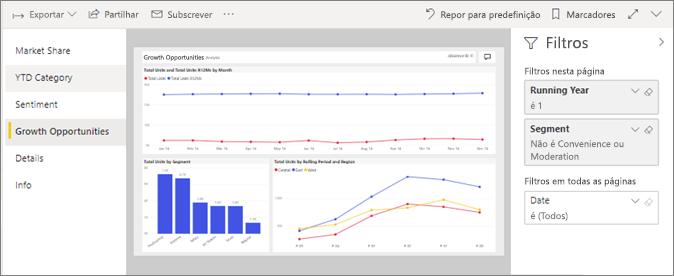
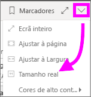
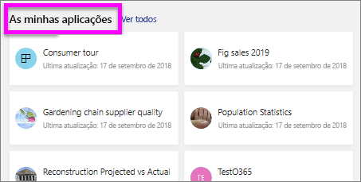
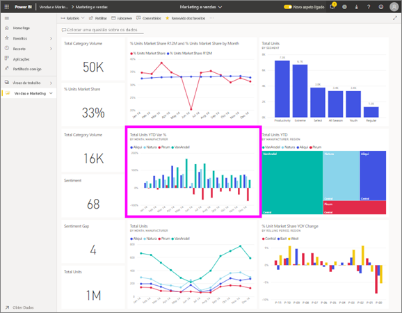

# Visualizar um relatório no serviço Power BI para *consumidores*
Um relatório é uma ou mais páginas de elementos visuais. Relatórios são criados pelo Power BI *designers* e [partilhado com *consumidores* diretamente](end-user-shared-with-me.md) ou como parte de um [aplicação](end-user-apps.md). 

Existem várias formas diferentes de abrir um relatório e vamos mostrar-lhe dois deles: Abra a partir de casa e abrir a partir de um dashboard. 

<!-- add art-->

## Abra um relatório do Power BI home page
Vamos abrir um relatório que foi partilhado consigo diretamente e, em seguida, abrir um relatório que foi partilhado como parte de uma aplicação.

   

### Abrir um relatório que tenha sido partilhado consigo
Power BI *designers* pode partilhar um relatório diretamente consigo. Conteúdo que é partilhado dessa maneira é exibido na **partilhado comigo** contentor na sua barra de navegação de barra e na **partilhado comigo** secção da sua tela Home.

1. Abra o serviço Power BI (app.powerbi.com).

2. Na barra de navegação, selecione **home page** para exibir a tela de página inicial.  

   
   
3. Desloque para baixo até ver **Partilhado comigo**. Procure o ícone de relatório . Nesta captura de ecrã nós temos um dashboard e um relatório com o nome *exemplo vendas e marketing*. 
   
   

4. Basta selecionar o relatório *cartão* para abrir o relatório.

   

5. Observe os separadores no lado esquerdo.  Cada separador representa uma *página* do relatório. Atualmente, temos a *oportunidades de crescimento* página aberta. Selecione o *YTD Category* separador para abrir essa página de relatório em vez disso. 

   

6. Neste momento, estamos vendo a página de relatório inteira. Para alterar a apresentação (zoom) da página, selecione o menu suspenso de vista do canto superior direito ( **>** ) e escolha **tamanho real**.

   

   

### Abrir um relatório que faz parte de uma aplicação
Se tiver recebido aplicações de colegas ou do AppSource, essas aplicações estão disponíveis a partir de casa e do **aplicações** contentor na sua barra de navegação. Uma [aplicação](end-user-apps.md) é um grupo de dashboards e relatórios.

1. Volte à página inicial selecionando **home page** a partir da barra de navegação.

7. Desloque para baixo até ver **As Minhas Aplicações**.

   

8. Selecione uma das aplicações para a abrir. Consoante as opções definidas pelo *estruturador* de aplicações, a aplicação abrirá um dashboard, um relatório ou uma lista de conteúdos da aplicação. Se, ao selecionar a aplicação:
    - o relatório for aberto, estará tudo pronto.
    - um dashboard for aberto, veja ***Abrir um relatório a partir de um dashboard***, abaixo.
    - for aberta a lista de conteúdos da aplicação, em **Relatórios**, selecione o relatório para o abrir.

## Abrir um relatório a partir de um dashboard
Os relatórios podem ser abertos a partir de um dashboard. A maioria dos mosaicos do dashboard são *afixados* dos relatórios. Selecionar um mosaico abre o relatório que foi utilizado para criar o mosaico. 

1. A partir de um dashboard, selecione um mosaico. Neste exemplo, selecionámos o mosaico de gráfico de colunas "Total Units YTD...".

    

2.  O relatório associado é aberto. Repare que estamos na página "YTD Category". Esta é a página do relatório que contém o gráfico de colunas que selecionámos a partir do dashboard.

    

> [!NOTE]
> Nem todos os mosaicos levam a um relatório. Se selecionar um mosaico que tenha sido [criado com Perguntas e Respostas](end-user-q-and-a.md), o ecrã de Perguntas e Respostas irá abrir. Se selecionar um mosaico que tenha sido [criado com o widget **Adicionar mosaico** do dashboard](../service-dashboard-add-widget.md), poderão ocorrer várias situações diferentes.  

##  Mais formas de abrir um relatório
À medida que obtém mais à vontade a navegar no serviço Power BI, irá descobrir fluxos de trabalho que funcionam melhor para si. Algumas outras formas de aceder a relatórios:
- Na navegação à barra usando **Favoritos** e **recentes**    
- Com a opção [Ver relacionados](end-user-related.md)    
- Numa mensagem de e-mail quando alguém [partilha consigo](../service-share-reports.md) ou quando [define um alerta](end-user-alerts.md)    
- A partir do [Centro de notificações](end-user-notification-center.md)    
- e muito mais

## Próximos passos
Existem [muitas maneiras de interagir com um relatório](end-user-reading-view.md).  Começar a explorar ao selecionar cada separador para o lado da tela do relatório.

