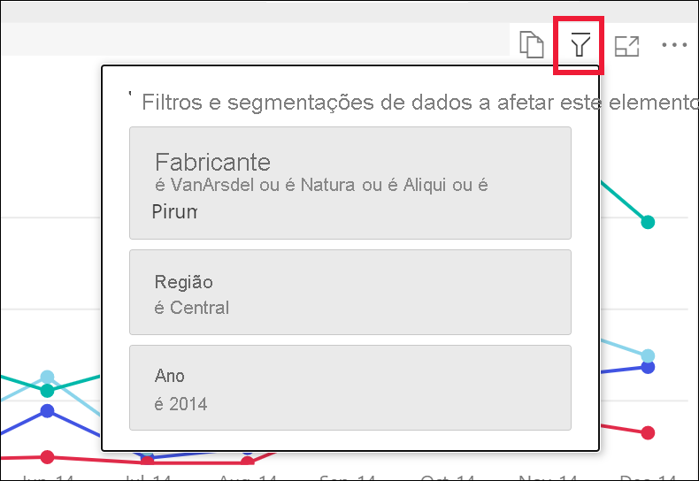
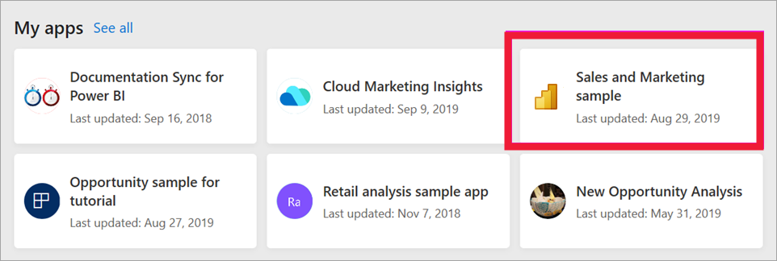

# Ver um relatório no serviço Power BI para *utilizadores empresariais*

[!INCLUDE[consumer-appliesto-yynn](../includes/consumer-appliesto-yynn.md)]

[!INCLUDE [power-bi-service-new-look-include](../includes/power-bi-service-new-look-include.md)]

Um relatório é uma ou mais páginas de elementos visuais. Os relatórios são criados pelos *designers* do Power BI e [partilhados com os *utilizadores empresariais diretamente*](end-user-shared-with-me.md) ou como parte de uma [aplicação](end-user-apps.md). Para abrir um relatório, precisará de uma licença do Power BI Pro ou que o relatório faça parte de uma área de trabalho armazenada numa capacidade Premium dedicada. [Saiba mais sobre licenças e subscrições](end-user-license.md)

Há muitas formas diferentes de abrir um relatório. Eis dois exemplos: abrir a partir da Home Page e abrir a partir de um dashboard. 

<!-- add art-->

## Abrir um relatório a partir da Home Page do Power BI
Vamos abrir um relatório que foi partilhado consigo diretamente e, em seguida, abrir um relatório que foi partilhado como parte de uma aplicação.

   

### Abrir um relatório que tenha sido partilhado diretamente consigo
Os *designers* do Power BI podem partilhar um relatório individual diretamente consigo através de uma ligação no e-mail ou ao adicioná-la automaticamente aos seus conteúdos do Power BI. Os relatórios que são partilhados desta forma aparecem no contentor **Partilhado comigo** no painel de navegação e na secção **Partilhado comigo** da tela Home Page.

1. Abra o serviço Power BI (app.powerbi.com).

2. No painel de navegação, selecione **Home Page** para visualizar a tela Home Page.  

   
   
3. Desloque para baixo até ver **Partilhado comigo** . Procure o ícone de relatório . Nesta captura de ecrã, temos um dashboard e um relatório. O relatório chama-se *Sales and marketing sample* . 
   
   

4. Basta selecionar o *cartão* de relatório para abrir o relatório.

   

5. Repare nos separadores à esquerda.  Cada separador representa uma *página* do relatório. Atualmente, temos a página *Oportunidade de Crescimento* aberta. Selecione o separador *YTD Category* para abrir a página de relatório. 

   

6. Expanda o painel **Filtros** no lado direito. Os filtros que foram aplicados a esta página de relatório ou a todo o relatório são apresentados aqui. Pode alterar estes filtros para ver o impacto nos elementos visuais e no relatório.

   

7. Apresente o menu de ações para um elemento visual. Passar o rato sobre um elemento visual do relatório revela as ações que pode realizar nesse elemento visual. Para ver os filtros aplicados a um elemento visual específico, selecione o ícone de filtro. Aqui, selecionamos o ícone de filtro para o gráfico de linhas *Unidades totais por mês e fabricante* .

   

6. Também pode alterar a apresentação da página do relatório. Neste momento, estamos a apresentar a página de relatório inteira. Para alterar a apresentação (zoom) da página, selecione **Vista** no menu de lista pendente no canto superior direito e selecione **Tamanho real** . Em seguida, mude para **Ajustar à largura** . Observe as diferenças que cada opção de vista faz à apresentação do relatório.

   

   

Há várias formas de interagir com um relatório para descobrir informações e tomar decisões empresariais.  Recorra ao índice que se encontra à esquerda para ler outros artigos sobre relatórios do Power BI. 

### Abrir um relatório que faz parte de uma aplicação
Se tiver recebido aplicações de colegas ou do AppSource, essas aplicações estarão disponíveis na Home Page e nos contentores **Aplicações** e **Partilhado comigo** no painel de navegação. Uma [aplicação](end-user-apps.md) é um conjunto de dashboards e relatórios que um *designer* do Power BI agrupou por si.

### Pré-requisitos
A abertura de uma aplicação requer uma licença do Power BI Pro ou que a área de trabalho da aplicação esteja armazenada na capacidade do Power BI Premium. [Saiba mais sobre licenças e subscrições](end-user-license.md)    
    
Para acompanhar, transfira a aplicação Vendas e Marketing.
1. No browser, navegue para appsource.microsoft.com.
1. Selecione a caixa de verificação **Power Platform** .
1. Procure “Vendas e Marketing” e selecione **Exemplo Microsoft – Vendas e Marketing** . Desloque-se para baixo para ver os resultados da pesquisa.
1. Selecione **Obter agora** > **Continuar** > **Instalar** para instalar a aplicação no Contentor de aplicações. 

Agora, pode abrir a aplicação a partir do contentor **Aplicações** ou a partir da **Home Page** .
1. Volte para a Home Page ao selecionar **Home Page** no painel de navegação.

7. Desloque para baixo até ver **As Minhas Aplicações** .

   

8. Selecione a nova aplicação *Sales and marketing* para a abrir. Consoante as opções definidas pela aplicação *designer* , a aplicação irá abrir um dashboard ou um relatório. Esta aplicação é aberta num dashboard.  

## Abrir um relatório num dashboard
Os relatórios podem ser abertos a partir de um dashboard. Na sua maioria, os [mosaicos](end-user-tiles.md) do dashboard são *afixados* a partir dos relatórios. Selecionar um mosaico abre o relatório que foi utilizado para criar o mosaico. 

1. No dashboard, selecione um mosaico. Neste exemplo, selecionámos o mosaico de gráfico de colunas *Total Units YTD...* .

    

2.  O relatório associado é aberto. Repare que estamos na página *YTD Category* . Esta é a página do relatório que contém o gráfico de colunas que selecionámos a partir do dashboard.

    

> [!NOTE]
> Nem todos os mosaicos levam a um relatório. Se selecionar um mosaico que tenha sido [criado com Perguntas e Respostas](end-user-q-and-a.md), o ecrã de Perguntas e Respostas irá abrir. Se selecionar um mosaico que tenha sido [criado com o widget **Adicionar mosaico** do dashboard](../create-reports/service-dashboard-add-widget.md), poderão ocorrer várias situações diferentes: um vídeo pode começar a ser reproduzido, um site pode ser aberto, entre outros.  

##  Mais formas de abrir um relatório
À medida que vai estando mais à vontade a navegar pelo serviço Power BI, irá descobrir fluxos de trabalho que funcionam melhor para si. Algumas outras formas de aceder a relatórios:
- No painel de navegação através de [Favoritos](end-user-favorite.md) e [Recentes](end-user-recent.md)    
- Com a opção [Ver relacionados](end-user-related.md)    
- Numa mensagem de e-mail quando alguém [partilha consigo](../collaborate-share/service-share-reports.md) ou quando [define um alerta](end-user-alerts.md)    
- A partir do [Centro de notificações](end-user-notification-center.md)    
- A partir de uma área de trabalho
- e muito mais

## Passos seguintes
[Abrir e ver um dashboard](end-user-dashboard-open.md)    
[Filtros do relatório](end-user-report-filter.md)

