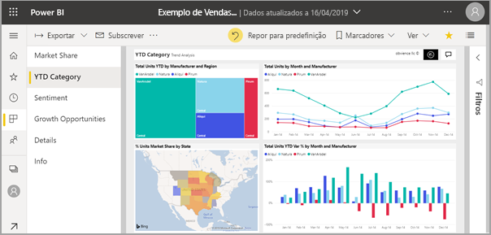
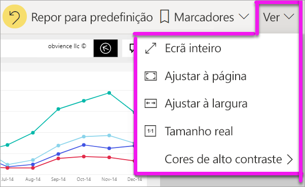
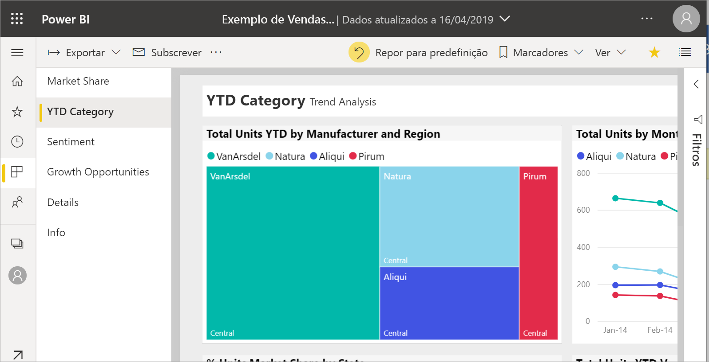
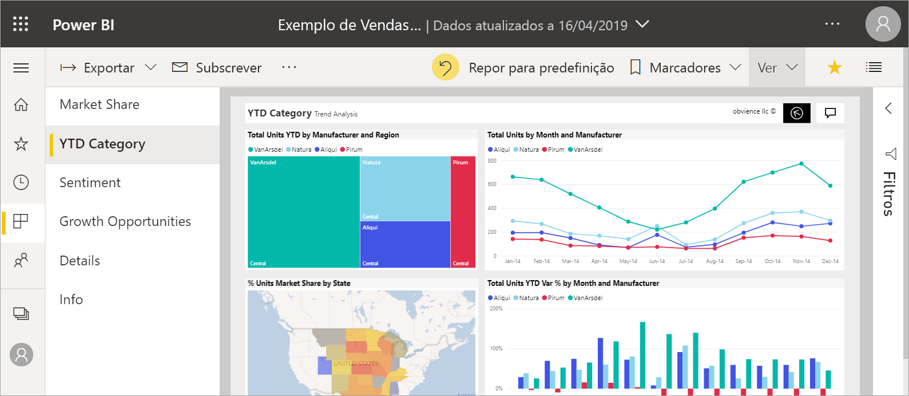
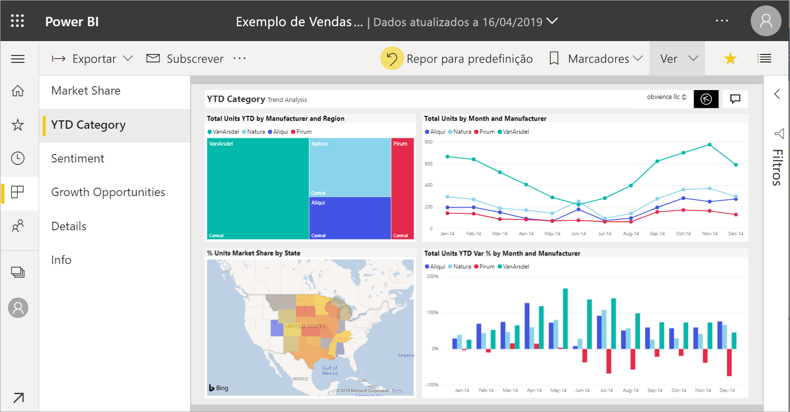
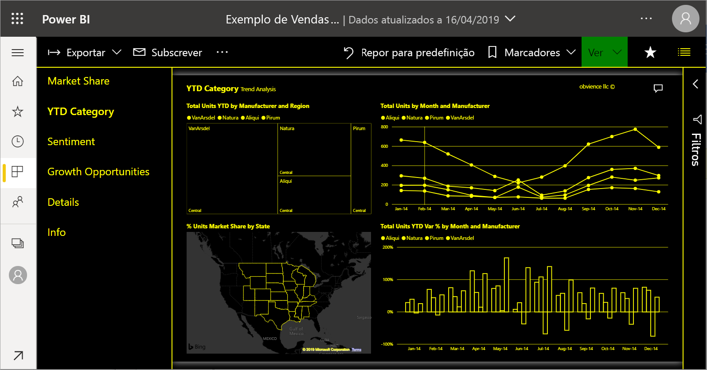
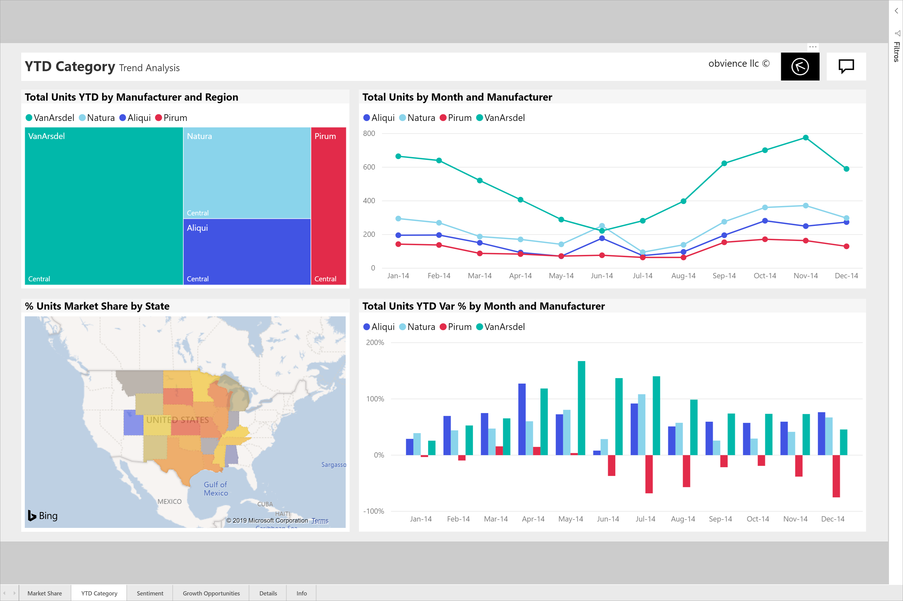

# Alterar a visualização de uma página de relatório

[!INCLUDE [power-bi-service-new-look-include](../includes/power-bi-service-new-look-include.md)]

As pessoas visualizam relatórios em múltiplos dispositivos diferentes, com diversos tamanhos de ecrã e proporções. Altere a visualização de uma página de relatório para ajustá-la às suas necessidades.

## Explorar o menu Ver

As opções no menu **Ver** dão-lhe flexibilidade para visualizar as páginas de relatórios no tamanho e largura que escolher:

- Imagine que está a visualizar um relatório num dispositivo pequeno e que é difícil ler os títulos e as legendas.  Selecione **Ver** > **Tamanho real** para aumentar o tamanho da página de relatório. Utilize as barras de deslocamento para ver mais partes do relatório.

    

- Outra opção é ajustar o relatório à largura do seu ecrã ao selecionar **Ajustar à largura**. Como esta opção só ajusta à largura e não à altura, poderá ter de continuar a utilizar a barra de deslocamento vertical.

  

- Se não quiser utilizar as barras de deslocamento, mas quiser otimizar o tamanho do seu ecrã, selecione **Ajustar à Página**.

   

- Também pode escolher uma de quatro **Cores de alto contraste**: Alto contraste n.º1, Alto contraste n.º2, Alto contraste preto e Alto contraste branco. É uma funcionalidade de acessibilidade que pode utilizar para que as pessoas com deficiências visuais possam ver os relatórios mais facilmente. O exemplo abaixo é um alto contraste n.º1. 

    

- A opção final, **Ecrã inteiro**, apresenta a sua página de relatório sem barras de menus e cabeçalhos. A opção Ecrã inteiro pode ser adequada para ecrãs pequenos em que é difícil ver os detalhes.  Também é uma opção adequada ao projetar páginas de relatórios em ecrãs grandes, para que as pessoas as vejam, mas não interajam.  

    

Quando sai do relatório, as definições do menu **Ver** não são guardadas, mas são revertidas para a predefinição. Se quiser guardar estas definições, utilize [marcadores](end-user-bookmarks.md).

## Próximos passos

* [ Fazer uma visita do painel Filtros](end-user-report-filter.md)