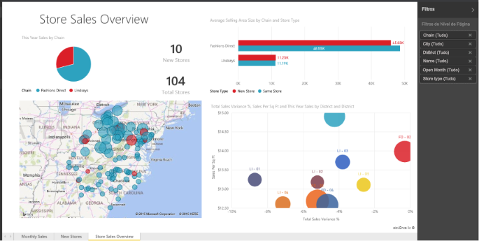

# Relatórios no Power BI
## O que é um relatório do Power BI?
Um ***relatório*** do Power BI é uma vista de várias perspetivas sobre um conjunto de dados, com visualizações que representam diferentes achados e informações desse conjunto de dados.  Um relatório pode ter uma única visualização ou páginas cheias de visualizações. Consoante o seu cargo, pode ser alguém que *cria* relatórios e/ou pode ser alguém que *consome* ou utiliza relatórios.

Este relatório tem 3 páginas (ou separadores) e estamos atualmente a ver a página Descrição Geral de Vendas da Loja. Nesta página, existem 6 visualizações diferentes e um título de página. As visualizações podem ser *afixadas* a dashboards e, quando a visualização afixada é adicionada, abre o relatório do qual foi afixada.

Se for um novo utilizador do Power BI, pode obter uma boa base de aprendizagem ao ler os [conceitos básicos do Power BI](end-user-basic-concepts.md)

Os relatórios são uma funcionalidade do serviço Power BI e do Power BI Desktop. A experiência de trabalhar com relatórios é quase idêntica. No entanto, em dispositivos móveis, não pode criar relatórios, mas pode [ver, partilhar e anotar relatórios](mobile/mobile-reports-in-the-mobile-apps.md).

## Vantagens dos relatórios
Os relatórios baseiam-se num único conjunto de dados. As visualizações num relatório representam, cada uma, um grupo de informações. As visualizações não são estáticas. Pode adicionar e remover dados, alterar os tipos de visualização e aplicar filtros e segmentações à medida que analisa os dados para descobrir informações e procurar respostas. Tal como um dashboard, mas mais ainda, um relatório é altamente interativo e personalizável e as visualizações atualizam à medida que os dados correspondentes mudam.

## Dashboards versus relatórios
Os [Dashboards](end-user-dashboards.md) costumam ser confundidos com os relatórios, pois também são telas preenchidas com visualizações. No entanto, existem algumas diferenças importantes.  

| **Capacidade** | **Dashboards** | **Relatórios** |
| --- | --- | --- |
| Páginas |Uma página |Uma ou mais páginas |
| Origens de dados |Um ou mais relatórios e um ou mais conjuntos de dados por dashboard |Um único conjunto de dados por relatório |
| Disponível no Power BI Desktop |Não |Sim, pode criar e ver relatórios no Desktop |
| Afixação |Pode afixar visualizações (mosaicos) existentes apenas do dashboard atual aos seus outros dashboards |Pode afixar visualizações (como mosaicos) aos seus dashboards. Pode afixar páginas de relatório inteiras aos seus dashboards. |
| Subscrição |Não pode subscrever um dashboard |Pode subscrever páginas de relatório |
| Filtragem |Não pode filtrar nem segmentar |Várias formas diferentes de filtrar, realçar e segmentar |
| Definir alertas |Pode criar alertas para que lhe seja enviado um e-mail quando são cumpridas determinadas condições |Não |
| Destaque |Pode definir um dashboard como o seu dashboard "em destaque" |Não pode criar um relatório em destaque |
| Consultas de linguagem natural |Disponível no dashboard |Não disponível nos relatórios |
| Pode alterar o tipo de visualização |Não. De facto, se um proprietário de relatório alterar o tipo de visualização no relatório, a visualização afixada no dashboard não é atualizada |Sim |
| Pode ver as tabelas e os campos de conjuntos de dados subjacentes |Não. Pode exportar dados mas não pode ver tabelas e campos no próprio dashboard. |Sim. Pode ver tabelas, campos e valores de conjuntos de dados. |
| Pode criar visualizações |Limitado a adicionar widgets ao dashboard através de "Adicionar mosaico" |Pode criar vários tipos diferentes de elementos visuais, adicionar elementos visuais personalizados, editar elementos visuais e muito mais com permissões de Edição |
| Personalização |Pode efetuar ações com visualizações (mosaicos) como mover e dispor, redimensionar, adicionar ligações, mudar o nome, eliminar e mostrar em ecrã inteiro. No entanto, os dados e as visualizações propriamente ditos são só de leitura. |Na Vista de leitura, pode publicar, incorporar, filtrar, exportar, transferir como .pbix, ver conteúdos relacionados, gerar códigos QR, analisar no Excel e muito mais.  Na Vista de edição, pode fazer tudo o que foi anteriormente mencionado e muito mais. |

## ***Criadores*** e ***consumidores*** de relatórios.
Consoante o seu cargo, pode ser uma pessoa que cria relatórios para sua utilização ou para partilhar com colegas. Quer saber como criar e partilhar relatórios. Também pode ser uma pessoa que recebe relatórios de terceiros. Quer saber como compreender e interagir com os relatórios.

Eis alguns tópicos, por cargo, que o ajudarão a começar.

### Se for criar e partilhar relatórios
* Comece por uma [apresentação do serviço Power BI](end-user-basic-concepts.md) para saber onde procurar relatórios e ferramentas de relatórios.
* Veja uma apresentação do [editor de relatórios](../service-the-report-editor-take-a-tour.md).
* Saiba como [criar um relatório a partir de um conjunto de dados](../service-report-create-new.md).
* [Saiba como utilizar filtros ao nível de visualização, página e relatório](end-user-report-filter.md)
* Saiba todas as diferentes formas de [partilhar um relatório com colegas](../service-share-dashboards.md).

### Se for receber e consumir relatórios
* Comece por uma [apresentação do serviço Power BI](end-user-basic-concepts.md) para saber onde procurar relatórios e ferramentas de relatórios.
* Saiba como [abrir um relatório](end-user-report-open.md) e todas as interações disponíveis na [Vista de leitura](end-user-reading-view.md).
* Conheça melhor os relatórios ao ver uma apresentação de um dos nossos [exemplos](../sample-tutorial-connect-to-the-samples.md).  
<!--* Don't need the report any more? You can [remove it](../service-delete.md).-->
* Para ver que conjunto de dados o relatório está a utilizar e que dashboards têm esta informação afixada do relatório, [veja os conteúdos relacionados](end-user-related.md).

> [!TIP]
> Se não encontrou aqui o que procurava, utilize o Índice à esquerda para procurar todos os tópicos de *relatórios*.
> 
> 

## Próximos passos
[O que é o Power BI?](../power-bi-overview.md) 

[Power BI - Conceitos Básicos](end-user-basic-concepts.md)

