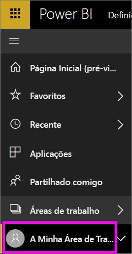
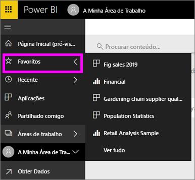

# Navegação: pesquisar, localizar e ordenar conteúdo no serviço Power BI
Existem várias formas de navegar no conteúdo no serviço Power BI. O conteúdo está organizado por tipos nas áreas de trabalhos: dashboards, relatórios, livros e conjuntos de dados.  O conteúdo também está organizado por utilização: favoritos, recentes, aplicações, partilhados comigo e em destaque. Para uma navegação num só local, a página Base organiza todo o conteúdo numa única página. Estes diferentes caminhos no conteúdo permitem-lhe localizar rapidamente o que precisa no serviço Power BI.  

## Navegação nas áreas de trabalho

Os *consumidores* do Power BI normalmente têm apenas uma área de trabalho: **A minha área de trabalho**. A **Minha área de trabalho** terá apenas conteúdo se já transferiu exemplos da Microsoft ou criou ou transferiu o seu próprio conteúdo.  

Dentro da **Minha área de trabalho**, o serviço Power BI separa o conteúdo por tipo: dashboards, relatórios, livros e conjuntos de dados. Verá esta organização quando seleciona uma área de trabalho. Neste exemplo, a **Minha área de trabalho** contém um dashboard, dois relatórios, nenhuma pasta de trabalho e dois conjuntos de dados.

________________________________________

## Navegação com a barra de navegação esquerda
A barra de navegação esquerda classifica o conteúdo de forma a que seja ainda mais fácil encontrar o que precisa, rapidamente.  

- O conteúdo partilhado consigo está disponível em **Partilhado comigo**.
- O último conteúdo visualizado está disponível em **Recente**. 
- As suas aplicações podem ser encontradas ao selecionar **Aplicações**.
- **Página Base** é uma vista de página única do conteúdo mais importante e de conteúdo sugerido e fontes de aprendizagem.

Além disso, pode sinalizar conteúdo como [favorito](end-user-favorite.md) e [em destaque](end-user-featured.md). Escolha o dashboard que espera ver com mais frequência e defina-o como o dashboard *em destaque*. Sempre que abrir o serviço Power BI, o dashboard em destaque será apresentado primeiro. Tem vários dashboards e aplicações que visita mais frequentemente? Se os definir como favoritos, estarão sempre disponíveis na barra de navegação esquerda.

.

## Considerações e resolução de problemas
* Para conjuntos de dados, a opção **Ordenar por** não está disponível por proprietário.

## Próximos passos
[Power BI - Conceitos Básicos](end-user-basic-concepts.md)

Mais perguntas? [Pergunte à Comunidade do Power BI](http://community.powerbi.com/)