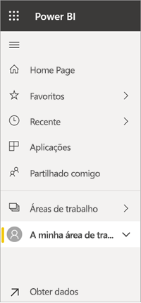

# Navegação: pesquisar, localizar e ordenar conteúdo no serviço Power BI

[!INCLUDE [power-bi-service-new-look-include](../includes/power-bi-service-new-look-include.md)]

Existem muitas formas de navegar até aos seus conteúdos no serviço Power BI. Os conteúdos estão organizados por tipos na área de trabalho: dashboards e relatórios.  O conteúdo também está organizado por utilização: favoritos, recentes, aplicações, partilhados comigo e em destaque. Para uma navegação num só local, a *Home Page* do Power BI organiza todos os conteúdos numa única página. Estes diferentes caminhos nos conteúdos permitem-lhe localizar rapidamente o que precisa no serviço Power BI.  

## Navegação nas áreas de trabalho

Os *consumidores* do Power BI normalmente têm apenas uma área de trabalho: **A minha área de trabalho**. **A minha área de trabalho** terá conteúdos se já tiver transferido exemplos da Microsoft, ou se já tiver criado ou transferido os seus próprios dashboards, relatórios ou aplicações.  

Dentro de **A minha área de trabalho**, o serviço Power BI separa os conteúdos por tipo: dashboards, relatórios, livros e conjuntos de dados. Verá esta organização quando seleciona uma área de trabalho. Neste exemplo, **A minha área de trabalho** contém um dashboard, um relatório, um conjunto de dados e nenhum livro.

________________________________________
## Navegação com o Campo de pesquisa
Utilize a vista de conteúdos **A minha área de trabalho** para pesquisar, filtrar e ordenar os seus conteúdos. No campo Procurar, escreva o nome completo ou parcial de um dashboard, relatório, livro ou de um proprietário.  

Se tiver poucos conteúdos, não é necessário procurar e ordenar.  Porém, quando tiver longas listas de dashboards e de relatórios, a função de procurar e ordenar será muito útil. Por exemplo, a lista de relatórios abaixo tem 83 itens. 

Também pode ordenar o conteúdo por nome ou proprietário. Repare na seta para cima à direita de **Nome**. Estamos a ordenar 83 itens alfabeticamente pelo nome, na ordem ascendente. Para alterar a sequência de ordenação para descendente, selecione **Nome**. A seta para cima altera-se para uma seta para baixo.

Nem todas as colunas podem ser ordenadas. Paire o cursor sobre os cabeçalhos de coluna para descobrir quais podem ser ordenados.

___________________________________________________________________
## Navegação com o painel de navegação
O painel de navegação classifica os conteúdos de forma a ajudá-lo a encontrar rapidamente o que precisa.  

- O conteúdo partilhado consigo está disponível em **Partilhado comigo**.
- O último conteúdo visualizado está disponível em **Recente**. 
- As suas aplicações podem ser encontradas ao selecionar **Aplicações**.
- **Página Base** é uma vista de página única do conteúdo mais importante e de conteúdo sugerido e fontes de aprendizagem.

Além disso, pode sinalizar conteúdo como [favorito](end-user-favorite.md) e [em destaque](end-user-featured.md). Escolha o dashboard ou o relatório que espera ver com mais frequência e defina-o como o conteúdo *em destaque*. Sempre que abrir o serviço Power BI, o dashboard em destaque será apresentado primeiro. Tem vários dashboards e aplicações que visita mais frequentemente? Se os definir como favoritos, estarão sempre disponíveis na barra de navegação esquerda.

.

## Considerações e resolução de problemas
* Para conjuntos de dados, a opção **Ordenar por** não está disponível por proprietário.

## Próximos passos
[Ordenar os elementos visuais em relatórios](end-user-change-sort.md)

Mais perguntas? [Pergunte à Comunidade do Power BI](http://community.powerbi.com/)
