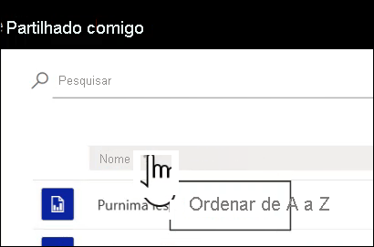
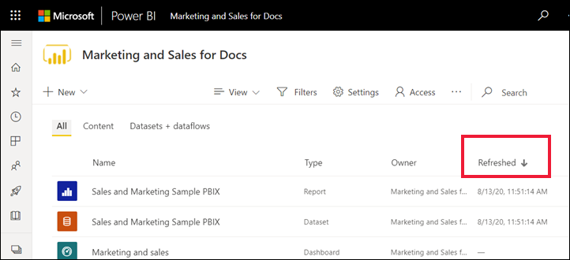

# Navegação para utilizadores comerciais do Power BI: pesquisa global

[!INCLUDE[consumer-appliesto-yyny](../includes/consumer-appliesto-yyny.md)]

[!INCLUDE [power-bi-service-new-look-include](../includes/power-bi-service-new-look-include.md)]

Enquanto tiver pouca experiência no serviço Power BI, disporá apenas de poucos conteúdos (dashboards, relatórios, aplicações). Mas à medida que os colegas começam a partilhar conteúdos consigo e começa a transferir aplicações, poderá acabar por ter longas listas de conteúdos. É nesse momento que irá perceber como é útil pesquisar e ordenar.

## Pesquisar conteúdos
 A pesquisa está disponível a partir de quase todas as partes do serviço Power BI. Basta procurar a caixa de pesquisa ou o ícone de pesquisa .

 No campo Pesquisa, escreva o nome completo ou parcial de um dashboard, relatório, livro, área de trabalho, aplicação ou proprietário. O Power BI pesquisa em todo o seu conteúdos. 

  

 Em algumas áreas do Power BI, como áreas de trabalho, encontrará dois campos de pesquisa diferentes. O campo de pesquisa na barra de menu pesquisa todo o seu conteúdo enquanto o campo de pesquisa na tela de área de trabalho pesquisa apenas nessa área de trabalho.

  

## Ordenar listas de conteúdos

Se tiver poucos conteúdos, poderá não ser necessário ordenar.  Mas quando tiver longas listas de dashboards e relatórios, a ordenação vai ajudá-lo a encontrar o que precisa. Por exemplo, esta lista de conteúdo **Partilhado comigo** tem 70 itens. 

Neste momento, esta lista de conteúdo está ordenada alfabeticamente pelo nome, de Z a A. Para alterar os critérios de ordenação, selecione a seta à direita de **Nome (A-Z)** .

A ordenação também está disponível nas áreas de trabalho. Neste exemplo, o conteúdo é ordenado por data de **Atualização**. Para definir critérios de ordenação para as áreas de trabalho, selecione os cabeçalhos de coluna e selecione novamente para alterar a direção da ordenação. 

Nem todas as colunas podem ser ordenadas. Paire o cursor sobre os cabeçalhos de coluna para descobrir quais podem ser ordenados.

## Filtrar listas de conteúdos
Outra forma de localizar conteúdos rapidamente é com os **Filtros** das listas de conteúdos. Visualize os filtros ao selecionar **Filtros** no canto superior direito. Os filtros disponíveis dependerão da sua localização no serviço Power BI.  O exemplo abaixo é de uma lista de conteúdos **Recente**.  Permite-lhe filtrar a lista por tipo de conteúdo.  Numa lista de conteúdo **Partilhado comigo**, os **Filtros** disponíveis incluem Proprietário, assim como o tipo de conteúdo.

## Próximos passos
[Ordenar os elementos visuais em relatórios](end-user-change-sort.md)

[Ordenar dados em elementos visuais](end-user-change-sort.md)

Mais perguntas? [Pergunte à Comunidade do Power BI](https://community.powerbi.com/)
